# COMP202 - Data Structures Study Guide

A concise, exam-oriented reference covering every data type from the course up to (but not including) Graphs. For each: definition, operations, Java implementation, complexity, use cases, and trade-offs.

## 1. Arrays

### Definition

An **array** is the most fundamental data structure in computer science: a fixed-size, contiguous block of memory that stores elements of the same type, indexed from `0` to `n-1`. "Contiguous" means the elements are stored in consecutive memory addresses - the address of element `i` is computed as `base_address + i × element_size`. This formula is why **random access** (jumping directly to any index) takes constant time: it is a single arithmetic calculation followed by a single memory access, regardless of the array's size.

Because the size of an array is fixed at creation time, it cannot grow or shrink. This is both its greatest strength (predictable memory layout) and its primary limitation (inflexibility).

### Key Operations

- **access(i)** - retrieve `A[i]` directly via address arithmetic.
- **set(i, x)** - write `x` into `A[i]` directly.
- **search(x)** - scan linearly for target `x`; no shortcut without sorting.
- **insert(i, x)** - place `x` at index `i`, shifting elements at indices `i` through `n-1` one position to the right.
- **remove(i)** - delete `A[i]`, shifting elements at indices `i+1` through `n-1` one position to the left.

### Time and Space Complexity

| Operation | Time | Why |
| :--- | :--- | :--- |
| access / set | O(1) | Address arithmetic: `base + i × size` is a single calculation regardless of `n`. |
| search | O(n) | Without any ordering guarantee, every element may need to be checked. |
| insert at end (if capacity) | O(1) | Simply write to `A[n]` - no shifting needed. |
| insert/remove at arbitrary `i` | O(n) | In the worst case (inserting at index 0), all `n` elements must be shifted by one position. On average, ~n/2 elements are shifted. |

**Space:** O(n) - the array itself occupies memory proportional to its capacity, with no additional per-element overhead.

### Use Cases

Lookup tables, matrix representations, buffers, foundation for ArrayList/Heap/Hashtable.

### Advantages

Fastest random access, cache-friendly (contiguous memory layout means sequential elements are loaded into CPU cache together), minimal memory overhead (no pointers or metadata per element).

### Drawbacks

Fixed size (must know capacity at creation), expensive insertions/removals at arbitrary positions (shifting), wasted space if over-allocated.

### Special Concept - Growable Arrays

Two resizing strategies when full:
- **Incremental (`+c`):** resize by a constant → O(n²) total for n pushes. Each resize copies all existing elements, and over n insertions, you resize ~n/c times, each costing O(n) - summing to O(n²).
- **Doubling (`×2`):** geometric growth → **O(n) total**, amortized **O(1)** per push. The total copy work across all resizes is `1 + 2 + 4 + ... + n ≈ 2n`, which is O(n). This is why `ArrayList` uses doubling.

### Array Memory Layout

The defining feature of an array is that its cells sit in one unbroken run of memory. If the array starts at memory address `base` and each element occupies `s` bytes, then element `i` lives at `base + i × s`. That single multiply-and-add is the *entire* cost of reaching any element, which is why access is O(1) no matter how large the array grows.

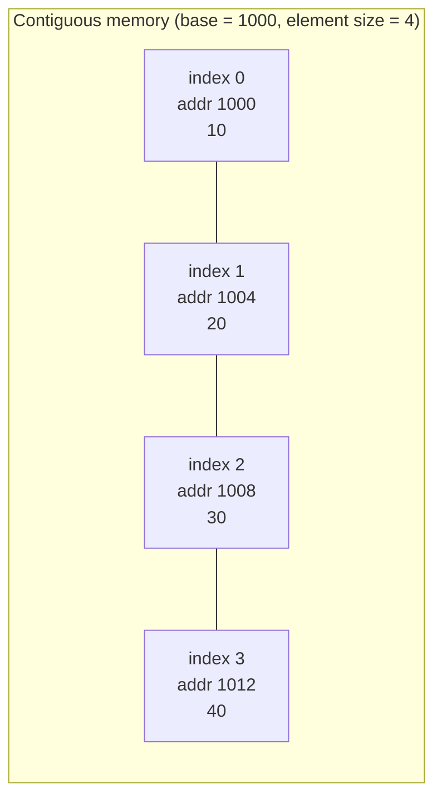

To reach index 2 the machine computes `1000 + 2 × 4 = 1008` and reads that address directly - it never walks past indices 0 and 1. Contrast this with a linked list, where reaching the third element *requires* hopping through the first two.

### Array Insertion Walkthrough

Insertion and removal are where arrays show their cost. Suppose `A = [10, 20, 30, 40]` with one spare slot, and we call `insert(1, 99)` (place `99` at index 1). Everything from index 1 onward must slide one cell to the right to open a gap, and we work from the back forward so we never overwrite a value we still need:

```text
start:        [10, 20, 30, 40,  _ ]
copy A[3]→A[4][10, 20, 30, 40, 40 ]
copy A[2]→A[3][10, 20, 30, 30, 40 ]
copy A[1]→A[2][10, 20, 20, 30, 40 ]
write 99→A[1] [10, 99, 20, 30, 40 ]
```

Four elements existed and three had to move, illustrating the worst case: inserting at index 0 would shift all `n`. Removal is the mirror image - to delete index 1 you slide indices 2..n−1 one cell left to close the gap, again O(n).

### When to Reach for a Plain Array

| Need | Plain array a good fit? | Reasoning |
| :--- | :---: | :--- |
| Fast random access by index | Yes | O(1) address arithmetic |
| Known, fixed number of elements | Yes | No resize ever needed |
| Frequent middle insert/remove | No | Every change shifts O(n) elements |
| Unknown / growing size | No | Fixed capacity; use an ArrayList |
| Tight memory, no per-element overhead | Yes | No pointers or metadata stored |


## 2. Singly Linked Lists

### Singly Linked Lists Definition

A **singly linked list** is a linear data structure composed of a chain of **nodes**, where each node stores two things: an element (the data) and a reference (`next` pointer) to the subsequent node. The list is accessed exclusively through a `head` reference pointing to the first node; the last node's `next` is `null`, signaling the end of the chain.

Unlike arrays, nodes are scattered throughout memory - they are **not contiguous**. This means there is no address arithmetic to jump to the i-th element; you must follow the chain of `next` pointers from the head, one hop at a time. However, this scattered allocation means the list can grow and shrink dynamically by simply creating or discarding individual nodes - no resizing or copying required.

```text
head → [A|•] → [B|•] → [C|•] → null
```

### Singly Linked Lists Key Operations

- **addFirst(e)** - create a new node pointing to the current head, then update head to the new node.
- **addLast(e)** - traverse from head to the last node, then attach a new node after it.
- **removeFirst()** - save head's element, advance head to `head.next`, return the saved element.
- **removeLast()** - requires traversing to the **second-to-last** node (since there's no backward pointer), then setting its `next` to `null`.
- **size / isEmpty / traversal** - walk the chain via `next` pointers.

### Java Implementation

```java
private static class Node<E> {
    E element;
    Node<E> next;
    Node(E e, Node<E> n) { element = e; next = n; }
}

private Node<E> head = null;
private int size = 0;

public void addFirst(E e) {
    head = new Node<>(e, head);
    size++;
}

public E removeFirst() {
    if (head == null) return null;
    E ans = head.element;
    head = head.next;
    size--;
    return ans;
}

public void addLast(E e) {
    if (head == null) { addFirst(e); return; }
    Node<E> walk = head;
    while (walk.next != null) walk = walk.next;
    walk.next = new Node<>(e, null);
    size++;
}
```

### Singly Linked Lists Time and Space Complexity

| Operation | Time | Why |
| :--- | :--- | :--- |
| addFirst / removeFirst | O(1) | Only the head pointer is updated - no traversal needed. |
| addLast (without tail pointer) | O(n) | Must walk through all `n` nodes to find the last one. |
| addLast (with tail pointer) | O(1) | A maintained `tail` reference gives direct access to the last node. |
| removeLast | O(n) | Even with a tail pointer, you must find the **predecessor** of the tail by traversing from head, because there is no backward pointer. |
| search / access by index | O(n) | No random access - must follow `next` pointers from head sequentially. |

**Space:** O(n) - each node stores one extra pointer (`next`), so total memory is `n × (element_size + pointer_size)`.

### Singly Linked Lists Use Cases

Stack/Queue implementation, undo chains, adjacency lists.

### Advantages vs Arrays

Dynamic size (grows/shrinks by individual nodes), O(1) head insert/remove (no shifting), no wasted capacity.

### Singly Linked Lists Drawbacks

No random access (must traverse sequentially), cache-unfriendly (nodes are scattered in memory), `removeLast` is O(n) because there is no backward pointer to find the predecessor, extra memory for one pointer per node.

### Special Concepts

- **Tail pointer** enables O(1) `addLast`, but `removeLast` still needs O(n) because after removing the tail, you need to update `tail` to its predecessor - and there's no `prev` pointer to find it.
- Serves as the backbone for stack (push/pop at head) and queue (enqueue at tail, dequeue at head) linked implementations.

### Singly Linked List Structure

Picture a treasure hunt where each clue only tells you where the *next* clue is. You must always start at the first clue (the `head`) and follow the trail forward; there is no way to jump to the middle and no way to walk backward.

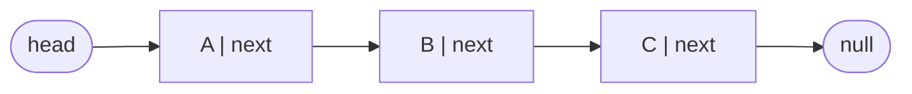

### Why removeLast Is O(n)

The asymmetry between the two ends is the single most important thing to understand about a singly linked list. Removing the *first* node is trivial: read its element, point `head` at `head.next`, done - O(1). Removing the *last* node is painful: to detach the tail you must set the **second-to-last** node's `next` to `null`, but the only way to find that predecessor is to walk the whole chain from the head, because nodes carry no `prev` pointer.

```text
remove last from:  head → A → B → C → null
walk to find C's predecessor (B):
  walk = A ... walk = B   (stop: walk.next.next == null)
set B.next = null:  head → A → B → null   (C is now unreachable)
```

Even adding a `tail` pointer does not save you: `tail` gives O(1) access to `C`, but after deleting `C` you still need to move `tail` back to `B`, and finding `B` again costs a full traversal. This is exactly the limitation that the doubly linked list removes.

### Singly Versus Doubly Linked Lists

| Capability | Singly linked | Doubly linked |
| :--- | :---: | :---: |
| Pointers per node | 1 (`next`) | 2 (`prev`, `next`) |
| addFirst / removeFirst | O(1) | O(1) |
| addLast (with tail) | O(1) | O(1) |
| removeLast | O(n) | O(1) |
| Remove a known middle node | O(n) | O(1) |
| Backward traversal | No | Yes |
| Memory overhead | Lower | Higher |


## 3. Doubly Linked Lists

### Doubly Linked Lists Definition

A **doubly linked list** extends the singly linked list by giving each node **two pointers**: `prev` (pointing to the preceding node) and `next` (pointing to the following node). This bidirectional linkage means you can traverse the list in both directions and, critically, you can remove any node in O(1) time if you already have a reference to it - something impossible in a singly linked list where you need to find the predecessor first.

In practice, doubly linked lists use **header and trailer sentinel nodes** - dummy nodes that bracket the real data. The header's `next` points to the first real element, and the trailer's `prev` points to the last. The sentinels themselves hold no data; they exist solely to eliminate null-checking edge cases at the boundaries of the list. With sentinels, every real node is guaranteed to have non-null `prev` and `next`, so insertions and deletions never need special logic for "is this the first or last node?"

```text
header ⇄ [A] ⇄ [B] ⇄ [C] ⇄ trailer
```

### Key Operations (all O(1) given a node reference)

- **addFirst / addLast / addBetween / addBefore / addAfter**
- **removeFirst / removeLast / remove(node)**
- Traversal in both directions via `next`/`prev`.

### Doubly Linked Lists Java Implementation

```java
private static class Node<E> {
    E element; Node<E> prev, next;
    Node(E e, Node<E> p, Node<E> n) { element = e; prev = p; next = n; }
}

private Node<E> header, trailer;  // sentinels
// constructor: header = new Node<>(null,null,null);
//              trailer = new Node<>(null,header,null);
//              header.next = trailer;

private void addBetween(E e, Node<E> pred, Node<E> succ) {
    Node<E> newest = new Node<>(e, pred, succ);
    pred.next = newest;
    succ.prev = newest;
    size++;
}

private E remove(Node<E> node) {
    node.prev.next = node.next;
    node.next.prev = node.prev;
    size--;
    return node.element;
}
```

### Doubly Linked Lists Time and Space Complexity

| Operation | Time | Why |
| :--- | :--- | :--- |
| addFirst / addLast | O(1) | Insert between header/trailer and the first/last node - just rewire 4 pointers. |
| addBetween / addBefore / addAfter | O(1) | Given predecessor and successor references, creating and linking a new node is pointer arithmetic only. |
| remove(node) | O(1) | With both `prev` and `next` available, you simply bypass the node: `node.prev.next = node.next` and `node.next.prev = node.prev`. |
| search / access by index | O(n) | Still no random access - must traverse from header or trailer. |

**Space:** O(n) with ~2 pointers overhead per node (roughly double the pointer overhead of a singly linked list).

### Doubly Linked Lists Use Cases

Deques, LRU caches, text editors (cursor movement in both directions), backbone of `PositionalList` and `java.util.LinkedList`.

### Advantages vs Singly Linked

O(1) `removeLast` (the `prev` pointer provides direct access to the predecessor), bidirectional traversal, simpler insertion/deletion with a known node reference.

### Doubly Linked Lists Drawbacks

Higher memory overhead (two pointers per node instead of one), slightly more pointer bookkeeping on each insert/remove (4 pointer updates instead of 2).

### Special Concept - Sentinels

Header/trailer dummy nodes remove "is this the first/last?" checks. Every real node is guaranteed non-null `prev` and `next`, so one `addBetween` method handles every insertion case uniformly. This eliminates a whole class of null-pointer bugs.

### Doubly Linked List Structure with Sentinels

The `header` and `trailer` are dummy nodes that hold no data. They guarantee that *every real node has a real node on both sides*, so insertion and deletion never hit a `null` edge case.

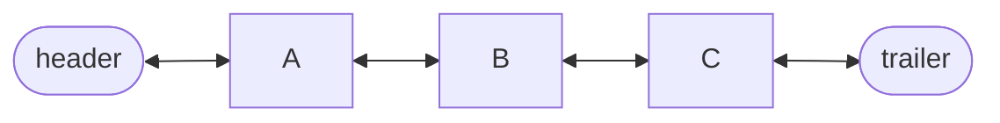

### Removing a Node in O(1)

Because each node knows both its neighbors, deleting a node you already hold a reference to is just two pointer rewrites - no traversal. Suppose we remove node `B` from `header ⇄ A ⇄ B ⇄ C ⇄ trailer`:

```text
before:  A.next → B,  B.next → C,  C.prev → B,  B.prev → A
step 1:  B.prev.next = B.next   means   A.next → C
step 2:  B.next.prev = B.prev   means   C.prev → A
after:   header ⇄ A ⇄ C ⇄ trailer    (B is bypassed, garbage-collected)
```

`B` itself is untouched and simply becomes unreachable. This O(1) "splice it out" move is impossible in a singly linked list, where you would first have to traverse from the head to find `A`.

### Insertion Walkthrough (addBetween)

Inserting `X` between `A` and `C` mirrors the same idea: create the node already pointing at its future neighbors, then fix the neighbors to point back at it.

```text
addBetween(X, A, C):
  newest = node(X) with prev=A, next=C
  A.next = newest      header ⇄ A ⇄ X ... C ⇄ trailer
  C.prev = newest      header ⇄ A ⇄ X ⇄ C ⇄ trailer
```


## 4. ArrayList (Dynamic Array)

### ArrayList (Dynamic Array) Definition

An **ArrayList** (also called a **dynamic array**) implements the **List ADT** on top of a resizable array. It stores `n` elements at indices `[0, n-1]` in a backing array whose capacity may be larger than `n`. When the number of elements reaches the backing array's capacity, the ArrayList allocates a **new, larger array** (typically double the size), copies all existing elements into it, and discards the old array. This gives the ArrayList the random-access speed of a plain array while allowing it to grow dynamically.

The key insight is that although an individual resize operation is expensive (O(n) to copy everything), resizes happen so infrequently (capacity doubles each time) that the cost, **amortized** over all insertions, is O(1) per insertion.

### ArrayList (Dynamic Array) Key Operations

- **get(i) / set(i, e)** - direct indexing into the backing array.
- **add(i, e)** - shift elements right to make room, possibly triggering a resize.
- **add(e)** - append at the end (no shifting, possible resize).
- **remove(i)** - shift elements left to fill the gap.
- **size / isEmpty**.

### Java Implementation (Doubling)

```java
private E[] data;
private int size = 0;

public void add(int i, E e) {
    if (size == data.length) resize(2 * data.length);  // doubling
    for (int k = size - 1; k >= i; k--) data[k+1] = data[k];
    data[i] = e;
    size++;
}

public E remove(int i) {
    E ans = data[i];
    for (int k = i; k < size - 1; k++) data[k] = data[k+1];
    data[--size] = null;
    return ans;
}

@SuppressWarnings("unchecked")
private void resize(int cap) {
    E[] temp = (E[]) new Object[cap];
    for (int k = 0; k < size; k++) temp[k] = data[k];
    data = temp;
}
```

### ArrayList (Dynamic Array) Time and Space Complexity

| Operation | Time | Why |
| :--- | :--- | :--- |
| get / set | O(1) | Direct index into the backing array - same as a plain array. |
| add at end (doubling) | O(1) amortized | Most appends just write to `data[size]`. Resizes (copying all n elements) happen only when capacity is full, and because capacity doubles, the total copy cost across n insertions is O(n), giving O(1) per insertion amortized. |
| add at end (incremental +c) | O(n) amortized | Resizes happen every `c` insertions, each copying all existing elements. Over n insertions, total copy cost is O(n²), so per-insertion cost is O(n). |
| add(i, e) / remove(i) | O(n) | Elements after index `i` must be shifted right (insert) or left (remove). Worst case is index 0, shifting all n elements. |

**Space:** O(n) - though the backing array may have unused capacity (up to ~2× the number of stored elements with doubling).

### Amortized Analysis Sketch

With doubling, across `n` pushes, the total copy work is `1 + 2 + 4 + ... + n = 2n − 1 = O(n)`, so per-push cost is O(1). With incremental growth by `c`, you perform `n/c` resizes, each copying O(n) elements, giving O(n²/c) = O(n²) total.

### ArrayList (Dynamic Array) Use Cases

Default "list" when random access and appending matter more than middle-insertion. Used as `java.util.ArrayList`.

### ArrayList (Dynamic Array) Advantages

O(1) random access; amortized O(1) append; cache-friendly (contiguous memory); simple API.

### ArrayList (Dynamic Array) Drawbacks

O(n) arbitrary-position insert/remove (shifting); occasional resize cost spikes (though amortized away); some unused space from over-allocation.

### Doubling Walkthrough

The magic of doubling is best seen as a trace. Start with capacity 1 and append elements one at a time. A resize fires only when the array is full, and each resize copies everything currently stored. Watch how rarely the expensive copies happen:

| Append # | Capacity before | Resize? | Elements copied this step |
| ---: | ---: | :---: | ---: |
| 1 | 1 | no | 0 |
| 2 | 1 | yes → 2 | 1 |
| 3 | 2 | yes → 4 | 2 |
| 4 | 4 | no | 0 |
| 5 | 4 | yes → 8 | 4 |
| 6–8 | 8 | no | 0 |
| 9 | 8 | yes → 16 | 8 |

Across the first 9 appends the total copy work is `1 + 2 + 4 + 8 = 15`, which is less than `2 × 9`. In general the copies sum to `1 + 2 + 4 + ... + n ≈ 2n`, so the *total* cost of `n` appends is O(n) and the **amortized** cost per append is O(1) - even though any single append might occasionally cost O(n).

### Growth Strategy Comparison

| Strategy | Resize frequency | Copy work over n appends | Amortized cost per append |
| :--- | :--- | ---: | :---: |
| Incremental (`+c`) | every `c` appends | O(n²) | O(n) |
| Doubling (`×2`) | when full (geometric) | O(n) | O(1) |

The lesson generalizes far beyond ArrayList: any time you grow a buffer, grow it *multiplicatively* (double), never *additively* (add a constant), or you pay a quadratic penalty.


## 5. Positional List

### Positional List Definition

A **Positional List** is a list ADT where elements are referenced by **Positions** - opaque tokens that represent a location in the list - rather than by integer indices. A `Position<E>` is an abstract handle that remains valid even as other elements are inserted or removed elsewhere in the list; it is invalidated only when the specific element it refers to is removed.

The motivation is simple: in an index-based list, inserting an element at position 3 silently shifts every element after it - any variable holding index 5 now refers to a different element. Positions don't suffer from this: a position always refers to the same element regardless of what happens around it. This makes positions ideal for iterators, cursors in text editors, or any scenario where you need a stable, long-lived reference to a specific location.

### Why Positions Over Indices?

Indices shift whenever you insert/delete anywhere before them. Positions don't - they act like pointers into the list structure. This makes them ideal for iterators, cursors in editors, and any pointer-like reference you want to keep live across structural modifications.

### Key Operations (all O(1))

`first()`, `last()`, `before(p)`, `after(p)`, `addFirst(e)`, `addLast(e)`, `addBefore(p, e)`, `addAfter(p, e)`, `set(p, e)`, `remove(p)`.

### Positional List Java Implementation

Built on a **doubly linked list with sentinels** where each internal `Node` implements the `Position` interface (so the node *is* the position).

```java
public interface Position<E> { E getElement() throws IllegalStateException; }

// Node implements Position; getElement() throws if node has been removed.
private Node<E> validate(Position<E> p) {
    if (!(p instanceof Node)) throw new IllegalArgumentException("Invalid p");
    Node<E> node = (Node<E>) p;
    if (node.next == null) throw new IllegalArgumentException("p is no longer in the list");
    return node;
}
```

### Positional List Time and Space Complexity

| Operation | Time | Why |
| :--- | :--- | :--- |
| first / last / before / after | O(1) | Direct pointer traversal - follow one `next` or `prev` link. |
| addBefore / addAfter / addFirst / addLast | O(1) | Built on the doubly linked list's `addBetween` - just pointer rewiring. |
| set(p, e) / remove(p) | O(1) | Direct access to the node via the position token - no searching needed. |
| find by value (not a standard op) | O(n) | Without an index or hash, you must traverse the list linearly. |

**Space:** O(n). Each node carries two pointers (`prev`, `next`) plus the element.

### Positional List Use Cases

Text editors (cursor/bookmarks), stable iterators that survive structural changes, undo/redo systems, the natural replacement for indices when you need references that don't become stale.

### Positional List Advantages

O(1) insert/remove anywhere given a position; positions never shift and remain valid across modifications.

### Positional List Drawbacks

No random access by index (to reach the k-th element, you must traverse from the head/tail); extra pointer memory per node; cache-unfriendly due to non-contiguous node allocation.

### Why a Position Beats an Index

Imagine a text editor where a bookmark points at the word "graph" sitting at index 5. Now the user types a new word at the start of the document. With **indices**, every later element shifts: "graph" is now at index 6, but your bookmark still says 5 and silently points at the wrong word. With **positions**, the bookmark is a handle to the node itself, so it keeps pointing at "graph" no matter how much text is added or removed before it.

```text
indices:    insert at front  →  every later index is now wrong (off by one)
positions:  insert at front  →  every existing position still valid, points to same element
```

A position is invalidated only when *its own* element is removed - never by changes elsewhere.

### Index Versus Position

| Property | Index-based list | Positional list |
| :--- | :---: | :---: |
| Reference to an element | Integer `i` | Opaque `Position` token |
| Stays valid after inserts elsewhere | No (shifts) | Yes |
| Random access to k-th element | O(1) (array) | O(n) (traverse) |
| Insert/remove at a held location | O(n) (shift) | O(1) (pointer rewire) |
| Natural use | Numeric indexing, math | Cursors, iterators, bookmarks |


## 6. Stack

### Stack Definition

A **Stack** is a **LIFO** (Last-In, First-Out) collection - the most recently added element is the first one to be removed. All insertions and removals happen at a single end called the **top**. You can think of it like a stack of plates: you can only add or remove the plate on the very top.

The stack is one of the simplest and most widely used abstract data types. Despite its simplicity (it supports only `push`, `pop`, and `peek`), it is foundational to computing - function call execution itself relies on a stack (the "call stack"), and many algorithms convert recursion into an explicit stack.

### Stack Key Operations (all O(1))

- **push(e)** - add element to the top.
- **pop()** - remove and return the top element (null or exception if empty).
- **top() / peek()** - inspect the top element without removing it.
- **size / isEmpty**.

### Java Implementation - Array-Based

```java
public class ArrayStack<E> {
    private E[] S;
    private int t = -1;  // index of top

    @SuppressWarnings("unchecked")
    public ArrayStack(int capacity) { S = (E[]) new Object[capacity]; }

    public void push(E e) {
        if (t == S.length - 1) throw new IllegalStateException("Stack full");
        S[++t] = e;
    }
    public E pop() {
        if (t < 0) return null;
        E e = S[t]; S[t--] = null; return e;
    }
    public E top() { return t < 0 ? null : S[t]; }
    public int size() { return t + 1; }
    public boolean isEmpty() { return t < 0; }
}
```

### Java Implementation - Linked

```java
public class LinkedStack<E> {
    private SinglyLinkedList<E> list = new SinglyLinkedList<>(); // assumes a singly linked list
    public void push(E e) { list.addFirst(e); }
    public E pop() { return list.removeFirst(); }
    public E top() { return list.first(); }
    public int size() { return list.size(); }
    public boolean isEmpty() { return list.isEmpty(); }
}
```

Use a singly linked list; `push` = `addFirst`, `pop` = `removeFirst` - both O(1). Grows dynamically without any capacity limit (other than available heap memory).

### Stack Time and Space Complexity

| Operation | Time | Why |
| :--- | :--- | :--- |
| push | O(1) | Array: increment index and write. Linked: create node and update head pointer. |
| pop | O(1) | Array: read and decrement index. Linked: save head's data and advance head. |
| top / peek | O(1) | Simply read `S[t]` (array) or `head.element` (linked) - no modification. |
| size / isEmpty | O(1) | Maintained as a counter or computed from the top index. |

**Space:** O(n). Array version has fixed capacity; linked version uses per-node pointer overhead.

### Stack Use Cases

Function call stack, undo/redo, browser back button, matching parentheses/HTML tags, postfix expression evaluation, reversing a sequence, DFS traversal (explicit stack replaces recursion).

### Advantages / Drawbacks

**Array:** compact, cache-friendly, fixed capacity → `FullStackException`.
**Linked:** grows dynamically, no overflow (until heap exhaustion), but pointer overhead and worse cache behavior.

### LIFO Behavior

A stack only ever touches its top. The last thing pushed is the first thing popped - like a spring-loaded plate dispenser in a cafeteria.

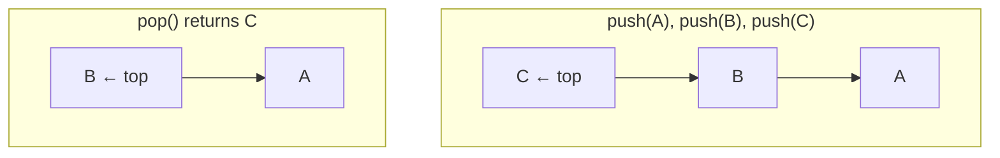

### Worked Example: Balanced Parentheses

The canonical stack application is checking whether brackets are balanced, e.g. `{[()]}`. Scan left to right: push every opening bracket; on a closing bracket, pop and check it matches. If the stack is empty at the end (and never mismatched), the string is balanced.

```text
input:  { [ ( ) ] }
read {  push {        stack: [ {        ]
read [  push [        stack: [ { [      ]
read (  push (        stack: [ { [ (    ]
read )  pop ( ✓ match stack: [ { [      ]
read ]  pop [ ✓ match stack: [ {        ]
read }  pop { ✓ match stack: [          ]
end: stack empty  →  BALANCED
```

If we had read `{ ] }`, the first closing `]` would pop `{`, which does not match, so we would immediately report **unbalanced**. This same push/pop discipline powers undo stacks, the function call stack, and converting recursion into iteration.


## 7. Queue

### Queue Definition

A **Queue** is a **FIFO** (First-In, First-Out) collection - elements enter at the **rear** and leave at the **front**, like a line of people waiting. The first person to join the line is the first to be served.

Queues are essential for any scenario involving fairness or order-preservation: process scheduling, print spooling, breadth-first search, and producer-consumer buffering. The key design challenge is implementing FIFO behavior efficiently on a fixed-size array, which is solved by the **circular array** technique.

### Queue Key Operations (all O(1))

- **enqueue(e)** - add element to the rear.
- **dequeue()** - remove and return the front element (null or exception if empty).
- **first() / peek()** - inspect the front element without removing it.
- **size / isEmpty**.

### Java Implementation - Circular Array

The key trick: use modular arithmetic so the queue wraps around the array, avoiding the need to shift elements on every dequeue.

```java
private E[] Q;
private int f = 0;   // index of front
private int sz = 0;  // number of elements

public void enqueue(E e) {
    if (sz == Q.length) throw new IllegalStateException("Queue full");
    int r = (f + sz) % Q.length;   // rear index
    Q[r] = e;
    sz++;
}

public E dequeue() {
    if (sz == 0) return null;
    E ans = Q[f];
    Q[f] = null;
    f = (f + 1) % Q.length;
    sz--;
    return ans;
}

public E first()   { return sz == 0 ? null : Q[f]; }
public int size()  { return sz; }
public boolean isEmpty() { return sz == 0; }
```

A naïve left-to-right array would force O(n) shifting on every `dequeue` (to move all remaining elements towards index 0); the **wrap-around** avoids this entirely.

### Queue Java Implementation - Linked

```java
public class LinkedQueue<E> {
    // Singly linked list with both head and tail pointers
    private SinglyLinkedList<E> list = new SinglyLinkedList<>();
    public void enqueue(E e) { list.addLast(e); }
    public E dequeue() { return list.removeFirst(); }
    public E first() { return list.first(); }
    public int size() { return list.size(); }
    public boolean isEmpty() { return list.isEmpty(); }
}
```

Singly linked list with both `head` and `tail` pointers: `enqueue` = append at tail (O(1) with tail pointer), `dequeue` = remove from head (O(1)). Note: `removeFirst` is used for dequeue (not `removeLast`), which is why a singly linked list suffices - no backward pointer needed.

### Queue Time and Space Complexity

| Operation | Time | Why |
| :--- | :--- | :--- |
| enqueue | O(1) | Circular array: compute rear index with modular arithmetic and write. Linked: append at tail pointer. |
| dequeue | O(1) | Circular array: read and advance front index with modular arithmetic. Linked: advance head pointer. |
| first / peek | O(1) | Read `Q[f]` or `head.element` directly. |
| size / isEmpty | O(1) | Maintained as a counter. |

**Space:** O(n) - circular array has fixed capacity; linked list has per-node pointer overhead.

### Queue Use Cases

Printer queues, CPU scheduling (Round-Robin), BFS, buffer between producer/consumer, level-order tree traversal, simulation of waiting lines.

### Queue Advantages / Drawbacks

Circular array: O(1) ops, no shifting, but fixed capacity. Linked: dynamic size, extra pointer overhead.

### Note - Deque (Double-Ended Queue)

Supports `addFirst / addLast / removeFirst / removeLast / first / last` - all O(1) on a doubly linked list. A deque generalizes both stacks and queues: you can use it as either. (The Ch06 slides focus on Stack/Queue; Deque is a natural extension.)

### The Circular Array Trick

The clever idea behind an array-backed queue is to let the front and rear *wrap around* the ends of the array using modular arithmetic, so no element is ever physically shifted. The array behaves as if its last cell were glued to its first.

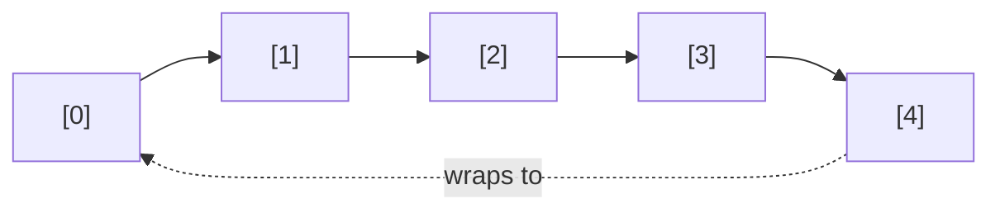

The rear index is computed as `(f + sz) mod N` and the front advances as `(f + 1) mod N`. Two indices (`f` for front, `sz` for size) fully describe the queue's state.

### Wrap-Around Walkthrough

Take an array of capacity `N = 5`, starting empty with `f = 0, sz = 0`. Follow a sequence of operations and watch the rear wrap past the end:

```text
op            f  sz  rear=(f+sz)%5  array (· = empty)
enqueue A     0  1   0              [A · · · ·]
enqueue B     0  2   1              [A B · · ·]
enqueue C     0  3   2              [A B C · ·]
dequeue→A     1  2   3              [· B C · ·]
dequeue→B     2  1   4              [· · C · ·]
enqueue D     2  2   1              [· · C D ·]
enqueue E     2  3   2              [· · C D E]
enqueue F     2  4   3              [F · C D E]   ← rear wrapped to index 3? no: (2+3)%5=0 → F at [0]
```

The key line is the last one: with `f = 2` and three elements already stored, the next rear index is `(2 + 3) mod 5 = 0`, so `F` lands in cell `[0]` even though we are still adding to the "rear." Without wrap-around, a dequeue would force every remaining element to shuffle toward index 0, making each dequeue O(n); the modular trick keeps both ends O(1).


## 8. Priority Queue

### Priority Queue Definition

A **Priority Queue (PQ)** is a collection of **entries `(key, value)`** where retrieval is governed by **priority** (defined by the key), not by insertion order. The key represents the priority; the value is the associated payload. The entry with the **smallest key** (highest priority, in a min-PQ) is always the one accessible for removal.

Unlike a stack (LIFO) or queue (FIFO), a priority queue imposes no ordering based on when elements arrived - it always serves the most "urgent" element first. This makes it the ideal structure for any scenario where tasks or events have varying importance: process scheduling, event-driven simulation, shortest-path algorithms, etc.

### Priority Queue Key Operations

- **insert(k, v)** - add a new entry with key `k` and value `v`.
- **removeMin()** - remove and return the entry with the smallest key.
- **min()** - inspect the minimum-key entry without removing it.
- **size / isEmpty**.
- Uses an **`Entry<K, V>`** abstraction: `getKey()`, `getValue()`.

### Java Implementation - Unsorted List

```java
public void insert(K k, V v) { data.addLast(new MapEntry<>(k, v)); }  // O(1)

public Entry<K,V> removeMin() {
    if (data.isEmpty()) return null;
    Position<Entry<K,V>> bestPos = data.first();
    for (Position<Entry<K,V>> p : data.positions()) {
        if (comp.compare(p.getElement().getKey(), bestPos.getElement().getKey()) < 0) {
            bestPos = p;
        }
    }
    return data.remove(bestPos); // O(n)
}
```

### Java Implementation - Sorted List

```java
// Assuming a PositionalList (doubly-linked) backing structure
private PositionalList<Entry<K,V>> data = new LinkedPositionalList<>();

public void insert(K k, V v) {
    Entry<K,V> newest = new MapEntry<>(k, v);
    Position<Entry<K,V>> walk = data.last();
    // Traverse backward across larger keys
    while (walk != null && comp.compare(newest.getKey(), walk.getElement().getKey()) < 0) {
        walk = data.before(walk);
    }
    if (walk == null) data.addFirst(newest);
    else data.addAfter(walk, newest);
}

public Entry<K,V> removeMin() {
    if (data.isEmpty()) return null;
    return data.remove(data.first()); // O(1) removal of the lowest key
}
```

`insert` walks to the correct position to maintain sorted order - **O(n)** because it may need to scan all existing entries. `removeMin` just removes the first element - **O(1)** because the minimum is always at the front.

### Complexity Comparison

| Implementation | insert | removeMin | min | Why |
| :--- | :--- | :--- | :--- | :--- |
| Unsorted list | O(1) | O(n) | O(n) | Insert just appends (no ordering maintained). Finding min requires scanning every element. |
| Sorted list | O(n) | O(1) | O(1) | Insert must find the correct position to maintain order (linear scan). Min is always at the front. |
| **Heap** | **O(log n)** | **O(log n)** | **O(1)** | The heap's tree shape has height O(log n), and both insert/remove traverse at most one root-to-leaf path. Min is always at the root. |

Space O(n) in all cases.

### Priority Queue Use Cases

Event-driven simulation, OS process scheduling, ER triage, Dijkstra / Prim, Huffman coding, top-k selection.

### Priority Queue Advantages / Drawbacks

- Unsorted list: cheap insert, expensive min-extraction - good when insertions dominate and removals are rare.
- Sorted list: opposite trade-off - good when you frequently need the min but rarely insert.
- **Heap balances both** - O(log n) for each, making it the default choice for general use.

### Priority Queue Special Concepts

- **Comparator / Comparable.** A `Comparator<K>` defines a **total order** on keys. A total order must be **antisymmetric** (if `a ≤ b` and `b ≤ a`, then `a = b`), **transitive** (if `a ≤ b` and `b ≤ c`, then `a ≤ c`), and **total** (for any `a, b`, either `a ≤ b` or `b ≤ a`). These properties are required for the priority queue to behave correctly - without them, the notion of "smallest key" is undefined.
- **PQ-Sort:** insert all `n` elements, then `removeMin` `n` times → sorted output.
  - Unsorted PQ ⇒ **Selection Sort** (O(n²)): each `removeMin` scans the unsorted list.
  - Sorted PQ ⇒ **Insertion Sort** (O(n²)): each `insert` finds the correct sorted position.
  - Heap PQ ⇒ **Heap Sort** (O(n log n)): each operation is O(log n).

### PQ-Sort Walkthrough

PQ-Sort is a beautiful unifying idea: *any* priority queue gives you a sorting algorithm. Insert all elements, then repeatedly `removeMin` - the removals come out in sorted order. What sort you get depends only on which PQ you used. Sorting `[3, 1, 2]` with an **unsorted-list PQ** (which makes each `removeMin` scan for the minimum) literally performs selection sort:

```text
phase 1 - insert all (each O(1)):   PQ = [3, 1, 2]
phase 2 - removeMin repeatedly:
  scan [3,1,2] → min is 1, remove   output: [1]      PQ = [3, 2]
  scan [3,2]   → min is 2, remove   output: [1,2]    PQ = [3]
  scan [3]     → min is 3, remove   output: [1,2,3]  PQ = []
```

Each `removeMin` scans the remaining elements, giving the familiar O(n²) of selection sort. Swap in a **sorted-list PQ** and the work moves to the insert phase (each insert finds its sorted spot), producing insertion sort - still O(n²). Swap in a **heap** and both phases cost O(log n) per element, producing heap sort at O(n log n).

### What Determines the Sort

| Backing PQ | Expensive phase | Resulting sort | Total time |
| :--- | :--- | :--- | :---: |
| Unsorted list | removeMin (find min) | Selection sort | O(n²) |
| Sorted list | insert (find position) | Insertion sort | O(n²) |
| Heap | both, but only O(log n) each | Heap sort | O(n log n) |


## 9. Tree

### Tree Definition

A **Tree** is a hierarchical (non-linear) data structure where elements are organized in a parent-child relationship. Unlike linear structures (arrays, linked lists), trees model **one-to-many** relationships: a single parent can have multiple children, but each child has exactly one parent (except the **root**, which has no parent).

Key terminology:
- **Root:** the unique top-level node with no parent. Every tree has exactly one root.
- **Internal node:** a node with ≥ 1 child.
- **External node / leaf:** a node with 0 children (the "endpoints" of the tree).
- **Depth(v):** the number of ancestors of node `v` (equivalently, the number of edges on the path from the root to `v`). The root has depth 0.
- **Height(T):** the maximum depth of any leaf in tree `T`. An empty tree has height 0 (or -1, depending on convention); a single-node tree has height 0.
- **Subtree rooted at v:** the tree consisting of `v` and all its descendants.

**Binary Tree:** a tree where each node has **at most 2 children**, distinguished as **left** and **right**. This left/right distinction is what makes binary trees "ordered" - it matters which child is which.

**Binary Search Tree (BST):** a binary tree with the **BST property**: for every node `v`, all keys in the left subtree are **less than** `key(v)`, and all keys in the right subtree are **greater than** `key(v)`. This structural invariant enables efficient searching by eliminating half the remaining nodes at each step.

### Tree Key Operations

`root()`, `parent(p)`, `children(p)`, `numChildren(p)`, `isInternal(p)`, `isExternal(p)`, `isRoot(p)`, `size()`, `isEmpty()`, `height(p)`, `depth(p)`. BST adds `get(k)`, `put(k, v)`, `remove(k)`.

### Tree Java Implementation

### General tree (linked)
```java
class Node<E> { E element; Node<E> parent; List<Node<E>> children; }
```

### Binary tree (linked)
```java
class Node<E> { E element; Node<E> parent, left, right; }
```

**Binary tree (array):** Store node at index `i`; `left(i) = 2i+1`, `right(i) = 2i+2`, `parent(i) = (i-1)/2`. Efficient for **complete** trees (used by heaps); wasteful for sparse/unbalanced ones because missing nodes leave gaps in the array.

### BST search
```java
Node<K,V> treeSearch(K k, Node<K,V> v) {
    if (v == null) return null;          // key not found
    int cmp = k.compareTo(v.key);
    if (cmp == 0) return v;
    return cmp < 0 ? treeSearch(k, v.left) : treeSearch(k, v.right);
}
```
**BST insert:** run `treeSearch`; if not found, attach new leaf where the search fell off (at the null position where the search terminated).

### Tree Time and Space Complexity

| Operation | Complexity | Why |
| :--- | :--- | :--- |
| root / parent / left / right | O(1) | Direct pointer access - each node stores references to parent and children. |
| children(p) | O(c_p) | Must enumerate all children of node `p`; `c_p` is the number of children. |
| depth(v) | O(d_v) | Walk from `v` to the root, following `parent` pointers - the number of steps equals the depth. |
| height(T) | O(n) | Must visit every node to find the deepest leaf (recursive: each node's height = 1 + max child height). |
| BST `get / put / remove` | O(h): O(log n) balanced, O(n) worst | Each operation follows one root-to-leaf path. In a balanced tree, `h = O(log n)`; in a degenerate tree (every node has one child), `h = n − 1`. |

**Space:** O(n) - one node per element, each with a constant number of pointers.

### Traversals - In Detail

**(a) Preorder - Root → Left → Right.** Visit the node *before* recursing into its children.
```java
void preOrder(Node<E> v) {
    if (v == null) return;
    visit(v);
    preOrder(v.left);
    preOrder(v.right);
}
```
Uses: print outline/document structure, serialize a tree (the preorder sequence + structure info can reconstruct the tree), copy tree, prefix notation of expressions.

**(b) Postorder - Left → Right → Root.** Visit the node *after* recursing into its children.
```java
void postOrder(Node<E> v) {
    if (v == null) return;
    postOrder(v.left);
    postOrder(v.right);
    visit(v);
}
```
Uses: compute subtree size/height (you need children's results first), evaluate expression trees (compute operands before applying operator), delete tree safely (delete children before parent), postfix notation.

### (c) Inorder - Left → Root → Right (binary trees only)
```java
void inOrder(Node<E> v) {
    if (v == null) return;
    inOrder(v.left);
    visit(v);
    inOrder(v.right);
}
```
Uses: print BST keys in **sorted order** - this is the BST's defining benefit. Inorder traversal of a BST visits keys in ascending order because: all left-subtree keys (visited first) are smaller, then the current key, then all right-subtree keys (visited last) which are larger.

**(d) Level-order (BFS).** Uses a queue, not recursion.
```java
void levelOrder(Node<E> root) {
    Queue<Node<E>> q = new LinkedList<>();
    if (root != null) q.add(root);
    while (!q.isEmpty()) {
        Node<E> v = q.remove();
        visit(v);
        if (v.left  != null) q.add(v.left);
        if (v.right != null) q.add(v.right);
    }
}
```
Uses: shortest path in unweighted graphs/trees, layer-by-layer printing, finding the minimum-depth leaf.

### Traversal complexities
- **Time:** All traversals are **O(n)** - each node is visited exactly once.
- **Space:** Recursive traversals (pre/in/post) use **O(h)** stack space, where `h` is the height of the tree (each recursive call adds one frame, and the maximum nesting depth equals the height). Level-order uses **O(w)** queue space, where `w` is the **maximum width** (the largest number of nodes at any single level). For a complete binary tree, `w` can be up to `n/2` (the last level), making this O(n) in the worst case.

### Tree Use Cases

File systems, HTML/XML DOM, expression trees, BSTs for ordered data, decision trees, compiler syntax trees.

### Tree Advantages / Drawbacks

Natural for hierarchical data; balanced BST gives O(log n) search/insert/remove. But an **unbalanced BST degrades to O(n)** - a sequence of sorted insertions produces a linear chain. This motivates self-balancing variants (AVL, Red-Black, 2-4 trees; covered more deeply later).

### Tree Special Concepts

- **Euler tour:** generic framework unifying pre/in/post orders. A single walk around the tree touching each node up to three times (left visit = preorder, bottom visit = inorder, right visit = postorder).
- **Proper (full) binary tree:** every internal node has exactly 2 children. Property: `# leaves = # internal nodes + 1`.
- **Complete binary tree:** every level is completely filled except possibly the last, which fills left-to-right. This is the shape used by heaps; it guarantees height `⌊log₂ n⌋`.
- **Why inorder is for binary trees only:** inorder requires visiting the left subtree, then the node, then the right subtree - this "left vs right" distinction is only meaningful when there are exactly two distinguished children. For a general tree with an arbitrary number of children, there is no natural point to visit the parent "between" the children.

### Tree Structure Diagram

The following binary search tree stores the keys `8, 3, 10, 1, 6, 14, 4, 7, 13`. Notice the BST property holds at every node: everything to the left is smaller, everything to the right is larger.

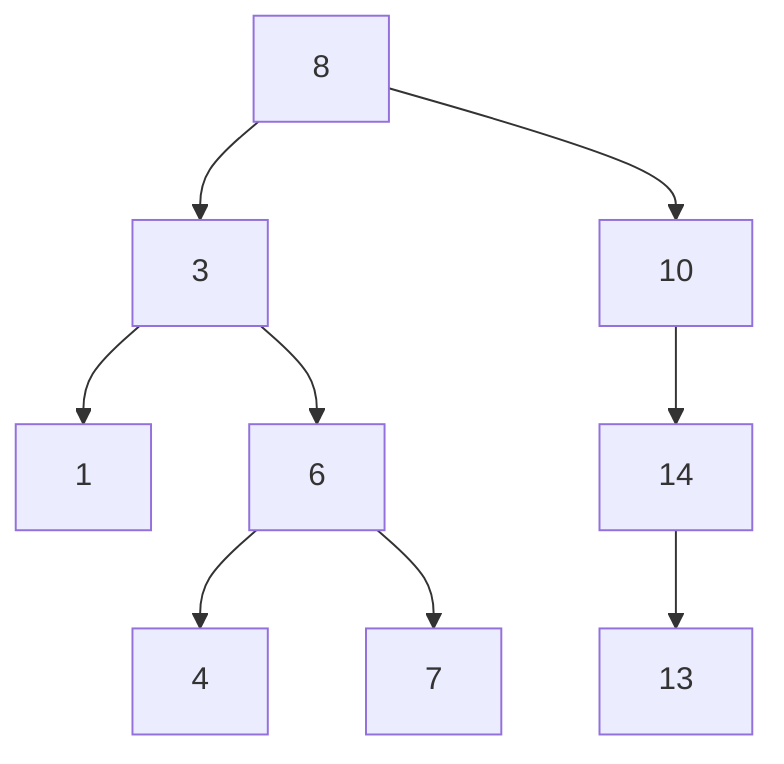

Node `10` has only a right child (`14`); its left slot is empty, which is allowed - a BST node may have zero, one, or two children.

Node `8` is the **root** (depth 0). Nodes `1, 4, 7, 13` are **leaves** (external nodes). The **height** of this tree is 3 (the longest root-to-leaf path, e.g. `8 → 3 → 6 → 4`). Node `3` is an **internal node** whose subtree contains `{3, 1, 6, 4, 7}`.

### Tree Traversal Walkthrough

Using the tree above, here is exactly what each traversal prints. Trace these by hand once and the patterns will stick.

| Traversal | Order rule | Output on the example tree |
| :--- | :--- | :--- |
| Preorder | Root, Left, Right | `8, 3, 1, 6, 4, 7, 10, 14, 13` |
| Inorder | Left, Root, Right | `1, 3, 4, 6, 7, 8, 10, 13, 14` |
| Postorder | Left, Right, Root | `1, 4, 7, 6, 3, 13, 14, 10, 8` |
| Level-order | Top to bottom, left to right | `8, 3, 10, 1, 6, 14, 4, 7, 13` |

The crucial observation: the **inorder** output is fully **sorted** (`1, 3, 4, 6, 7, 8, 10, 13, 14`). That is not a coincidence - it is the BST property in action, and it is the reason BSTs are used to keep ordered data.

### BST Search Path

Searching for key `7` in the example tree follows one root-to-leaf path, discarding half the tree at each step:

```text
Start at root 8.   7 < 8  → go LEFT  to 3.
At 3.              7 > 3  → go RIGHT to 6.
At 6.              7 > 6  → go RIGHT to 7.
At 7.              7 == 7 → FOUND. (3 comparisons)
```

Searching for an absent key like `5` ends when we fall off the tree:

```text
Start at root 8.   5 < 8  → go LEFT  to 3.
At 3.              5 > 3  → go RIGHT to 6.
At 6.              5 < 6  → go LEFT  to 4.
At 4.              5 > 4  → go RIGHT to null → NOT FOUND.
```

The number of comparisons equals the depth reached, which is why a **balanced** tree (height `O(log n)`) gives fast `O(log n)` search while a **degenerate** tree (height `n−1`) collapses to `O(n)`.

### Balanced Versus Degenerate BST

| Property | Balanced BST | Degenerate BST (sorted inserts) |
| :--- | :--- | :--- |
| Shape | Bushy, height `≈ log₂ n` | Linear chain, height `n − 1` |
| search / insert / remove | O(log n) | O(n) |
| Example insert order | `8, 3, 10, 1, 6, 14` | `1, 3, 6, 8, 10, 14` |
| Fix | Self-balancing (AVL, Red-Black, 2-4) | n/a - this is the problem to avoid |


## 10. Heap

### Heap Definition

A **binary heap** is a specialized binary tree that satisfies two invariants simultaneously:

1. **Heap-order property (min-heap):** for every non-root node `v`, `key(parent(v)) ≤ key(v)`. This means the smallest key percolates up to the root - the root always holds the global minimum. Note: unlike a BST, there is **no ordering constraint between siblings or between left and right subtrees**. The left child may be larger or smaller than the right child.

2. **Complete binary tree shape:** every level is completely filled except possibly the last, which fills strictly left-to-right. This shape constraint guarantees the height is exactly `⌊log₂ n⌋`, which is what makes heap operations O(log n).

**Contrast with BST:** a BST enforces a global ordering (left < parent < right at every level), enabling sorted traversal but not guaranteeing shape. A heap enforces shape and parent-child ordering only, giving O(1) access to the minimum but no sorted traversal capability.

### Heap Key Operations

- **insert(entry)** - append the new entry at the **next available position** (the leftmost open spot on the last level, maintaining completeness), then **up-heap (sift-up)** to restore heap-order by repeatedly swapping the entry with its parent while it is smaller.
- **removeMin()** - return the root (the minimum), replace the root with the **last entry** (rightmost on the last level), then **down-heap (sift-down)** to restore heap-order by repeatedly swapping with the smaller child.
- **min()** - O(1) peek at root.
- **heapify(array)** - build a heap from an unordered array in **O(n)** using bottom-up down-heap calls.
- Helpers: **upheap / sift-up**, **downheap / sift-down**.

### Array-Based Heap (the common form)

For node at index `i`: left = `2i+1`, right = `2i+2`, parent = `(i-1)/2`. The complete tree shape means no gaps in the array - indices `0` through `n-1` are all occupied.

```java
private List<Entry<K,V>> heap = new ArrayList<>();
private Comparator<K> comp;

public Entry<K,V> insert(K k, V v) {
    Entry<K,V> e = new MapEntry<>(k, v);
    heap.add(e);
    upheap(heap.size() - 1);
    return e;
}

private void upheap(int j) {
    while (j > 0) {
        int p = (j - 1) / 2;
        if (comp.compare(heap.get(j).getKey(), heap.get(p).getKey()) >= 0) break;
        swap(j, p);
        j = p;
    }
}

public Entry<K,V> removeMin() {
    if (heap.isEmpty()) return null;
    Entry<K,V> ans = heap.get(0);
    Entry<K,V> last = heap.remove(heap.size() - 1);
    if (!heap.isEmpty()) {
        heap.set(0, last);
        downheap(0);
    }
    return ans;
}

private void downheap(int j) {
    int n = heap.size();
    while (2*j + 1 < n) {
        int left = 2*j + 1, right = 2*j + 2, small = left;
        if (right < n && comp.compare(heap.get(right).getKey(), heap.get(left).getKey()) < 0)
            small = right;
        if (comp.compare(heap.get(j).getKey(), heap.get(small).getKey()) <= 0) break;
        swap(j, small);
        j = small;
    }
}

// Bottom-up heap construction - O(n)
private void heapify() {
    for (int i = (heap.size() - 2) / 2; i >= 0; i--) downheap(i);
}
```

### Heap Time and Space Complexity

| Operation | Complexity | Why |
| :--- | :--- | :--- |
| min | O(1) | The minimum is always at the root (index 0) - just read it. |
| insert | O(log n) | The new entry may need to up-heap from the last level to the root - at most `h = ⌊log₂ n⌋` swaps. |
| removeMin | O(log n) | The replacement entry at the root may need to down-heap from the root to a leaf - at most `h` swaps. |
| upheap / downheap | O(log n) | Both traverse at most one root-to-leaf path, whose length is bounded by the tree height `h = O(log n)`. |
| **heapify (bottom-up)** | **O(n)** | Not O(n log n) as one might expect. Most nodes are near the leaves and require very few swaps: leaf nodes need 0 swaps, their parents need ≤ 1 swap, etc. The total work is Σ over all nodes of (height of that node), which sums to O(n) by the geometric series convergence. |

**Space:** O(n); **no pointer overhead** in array form - parent/child relationships are implicit via index arithmetic.

### Heap Sort

1. `heapify` the input → O(n).
2. Repeatedly `removeMax` (for max-heap) and place the extracted element at the end of the array → n × O(log n).

**Total: O(n log n)**. Can be **in-place** with O(1) extra space (use a max-heap, extract elements from the back of the array).

### Heap Use Cases

Priority queue implementation (the standard backing structure), Heap Sort, Dijkstra / Prim, top-k selection (use a min-heap of size k), **running median** (min-heap + max-heap), event simulation, Huffman coding.

### Heap Advantages / Drawbacks

O(log n) for both `insert` and `removeMin` (beats both list-based PQs). Array form is cache-friendly and pointer-free. Downsides: no efficient sorted iteration (unlike BST); higher constant factors than `QuickSort` in practice for sorting; not stable (equal-priority elements may not preserve insertion order).

### Heap Special Concepts

- **Last-node trick:** `insert` places the new entry at the end of the array (the unique correct spot for a complete tree), then up-heaps. `removeMin` swaps root with last, removes last, then down-heaps. This maintains the complete tree shape invariant.
- **Min-heap vs max-heap:** same algorithms, reversed comparison. Min-heap has the smallest key at the root; max-heap has the largest.
- **Height is O(log n)** because a complete binary tree with n nodes has height `⌊log₂ n⌋` - each level doubles the number of nodes, so `log₂ n` levels are needed to hold `n` nodes.

### Heap Structure Diagram

A min-heap holding `4, 5, 6, 15, 9, 7, 20, 16, 25` looks like this as a tree. Read top-down: every parent is ≤ both of its children, but siblings have no required order.

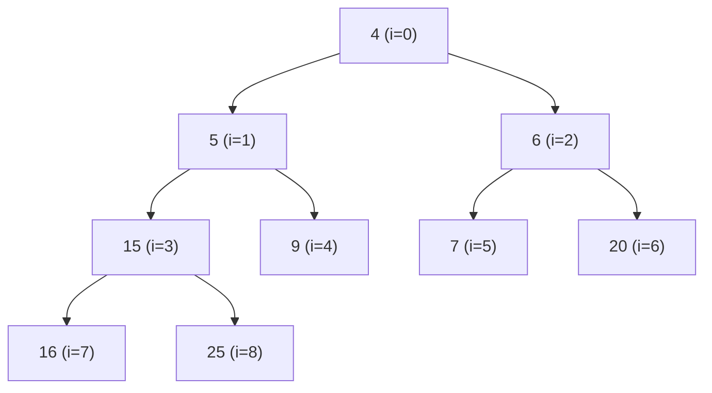

The same heap lives in a flat array with no pointers; the tree edges are computed from indices.

| Index `i` | 0 | 1 | 2 | 3 | 4 | 5 | 6 | 7 | 8 |
| :--- | :-- | :-- | :-- | :-- | :-- | :-- | :-- | :-- | :-- |
| Value | 4 | 5 | 6 | 15 | 9 | 7 | 20 | 16 | 25 |
| Parent `(i−1)/2` | – | 0 | 0 | 1 | 1 | 2 | 2 | 3 | 3 |
| Left `2i+1` | 1 | 3 | 5 | 7 | – | – | – | – | – |
| Right `2i+2` | 2 | 4 | 6 | 8 | – | – | – | – | – |

For example, the node at `i=1` (value `5`) has parent at index `0` (value `4`, and `4 ≤ 5` ✓) and children at indices `3` and `4` (values `15` and `9`, both ≥ `5` ✓).

### Heap Insert (Sift-Up) Walkthrough

Insert key `2` into the heap above. The new entry goes to the next free slot (index 9), then up-heaps until heap-order is restored.

```text
Append 2 at index 9.   Parent of 9 is (9-1)/2 = 4 (value 9).
  2 < 9  → swap.  2 moves to index 4, 9 moves to index 9.
Now 2 at index 4.      Parent of 4 is (4-1)/2 = 1 (value 5).
  2 < 5  → swap.  2 moves to index 1.
Now 2 at index 1.      Parent of 1 is (1-1)/2 = 0 (value 4).
  2 < 4  → swap.  2 moves to index 0 (the root).
Index 0 reached → stop.  New minimum is 2.   (3 swaps = O(log n))
```

### Heap removeMin (Sift-Down) Walkthrough

Starting from the original heap (root `4`), `removeMin()` returns `4`, moves the last entry `25` to the root, then down-heaps by swapping with the **smaller** child each step.

```text
Remove root 4. Move last entry 25 → index 0.   Array root is now 25.
At index 0 (25). Children: i=1 (5), i=2 (6). Smaller is 5.
  25 > 5  → swap with index 1.  25 moves to index 1.
At index 1 (25). Children: i=3 (15), i=4 (9). Smaller is 9.
  25 > 9  → swap with index 4.  25 moves to index 4.
At index 4 (25). Children: 2*4+1 = 9 ≥ size → no children (leaf).
  Stop.   Returned minimum: 4.   (2 swaps = O(log n))
```

### Heap Build (Heapify) Walkthrough

Bottom-up `heapify` turns an unordered array into a heap in `O(n)`. Start at the **last internal node** and down-heap each node moving toward the root. Take input `[5, 9, 3, 8, 1, 4]` (indices 0–5); the last internal node is `(6−2)/2 = 2`.

```text
i=2 (value 3): children 7(idx5) → 3 ≤ 4, no swap.
i=1 (value 9): children 8(idx3), 1(idx4); smaller is 1. 9 > 1 → swap. Array: [5,1,3,8,9,4]
i=0 (value 5): children 1(idx1), 3(idx2); smaller is 1. 5 > 1 → swap. Now 5 at idx1.
   At idx1 (5): children 8(idx3), 9(idx4); smaller 8. 5 ≤ 8 → stop.
Final heap array: [1, 5, 3, 8, 9, 4]   (root = 1 = global minimum ✓)
```

### Heap Versus BST

| Property | Binary Heap | Binary Search Tree |
| :--- | :--- | :--- |
| Ordering | Parent vs child only | Full left < node < right ordering |
| Find minimum | O(1) (always the root) | O(log n) (walk left spine) |
| Sorted iteration | Not supported | O(n) inorder traversal |
| Shape guarantee | Always complete → height `⌊log₂ n⌋` | None unless self-balancing |
| Storage | Flat array, no pointers | Linked nodes with pointers |
| Best for | Priority queues, top-k, scheduling | Ordered lookups, range queries |


## 11. Map

### Map Definition

A **Map ADT** (also known as an associative array, symbol table, or dictionary in common usage) stores **entries `(key, value)`** with the constraint that **keys must be unique** - each key maps to at most one value. You retrieve, update, or delete values by providing their associated key.

The uniqueness constraint is what distinguishes a Map from a Multimap or Dictionary ADT: calling `get(k)` is always unambiguous because there is at most one entry with key `k`. If you call `put(k, v)` with a key that already exists, the old value is **overwritten** (not duplicated).

Maps are arguably the most frequently used data structure in software engineering. They provide the abstraction of "looking something up by name" - symbol tables in compilers, caches, configuration stores, and database indices are all maps at their core.

### Map Key Operations

- **get(k)** - return the value associated with key `k`, or null if absent.
- **put(k, v)** - insert the entry `(k, v)`, or overwrite the existing value for key `k`; return the old value or null.
- **remove(k)** - remove the entry with key `k` and return its value, or null if absent.
- **size / isEmpty / entrySet / keySet / values**.

### Java Implementation - Unsorted List Map

```java
public V get(K key) {
    for (Entry<K,V> e : entries)
        if (e.getKey().equals(key)) return e.getValue();
    return null;
}

public V put(K key, V value) {
    for (Entry<K,V> e : entries)
        if (e.getKey().equals(key)) {
            V old = e.getValue();
            ((MapEntry<K,V>)e).setValue(value);
            return old;
        }
    entries.add(new MapEntry<>(key, value));
    return null;
}
```

### Java Implementation - Sorted Search Table (Array-Based)

```java
private ArrayList<MapEntry<K,V>> table = new ArrayList<>();

// Returns index of key, or the index where it should be inserted
private int findIndex(K key) {
    int low = 0, high = table.size() - 1;
    while (low <= high) {
        int mid = (low + high) / 2;
        int comp = key.compareTo(table.get(mid).getKey());
        if (comp == 0) return mid;     // found
        else if (comp < 0) high = mid - 1;
        else low = mid + 1;
    }
    return low; // not found, insertion point
}

public V get(K key) {
    int j = findIndex(key);
    if (j == table.size() || key.compareTo(table.get(j).getKey()) != 0) return null;
    return table.get(j).getValue();
}
```

Other implementations: **sorted search table** (binary search on a sorted array), **hashtable**, **balanced BST**, **skip list**.

### Map Time and Space Complexity

| Implementation | get / put / remove | Why |
| :--- | :--- | :--- |
| Unsorted list | O(n) | Every operation must scan the list linearly to find the key - no ordering to exploit. |
| Sorted search table | O(log n) search, O(n) modify | Binary search finds the key in O(log n), but inserting/removing requires shifting array elements. |
| **Hashtable** | **O(1) average, O(n) worst** | Hash function maps keys to array indices in O(1). Worst-case O(n) occurs when all keys collide into the same bucket. |
| Balanced BST | O(log n) | The balanced tree height is O(log n), and every operation traverses one root-to-leaf path. |

**Space:** O(n).

### Map Use Cases

Symbol tables (compilers), caches (URL → page), DB indices, frequency counters, config systems, any "look up a value by key" problem.

### Map Advantages / Drawbacks

Natural key/value semantics; hash-backed maps give near-O(1) access. Drawbacks: no inherent ordering unless using a sorted implementation (sorted table or BST); worst-case O(n) for hashtables if hash function is poor.

### Map Special Concepts

- **`Entry<K, V>`** abstraction: `getKey()`, `getValue()`, `setValue()`.
- **Unique keys required** so that `get(k)` is unambiguous. Need duplicates? Use a **Multimap** or **Dictionary** ADT.
- Map, Set, Dictionary are siblings: Set = keys only (no values); Dictionary = may allow duplicate keys; Multimap = one key → many values.

### Map put/get Walkthrough

A Map enforces unique keys; a second `put` on an existing key **overwrites** rather than adds. Trace a word-frequency counter processing the stream `cat, dog, cat, bird, cat`:

```text
put("cat", 1)        Map: {cat=1}                  (new key)
put("dog", 1)        Map: {cat=1, dog=1}           (new key)
put("cat", 2)        Map: {cat=2, dog=1}           (overwrite, not duplicate)
put("bird", 1)       Map: {cat=2, dog=1, bird=1}   (new key)
put("cat", 3)        Map: {cat=3, dog=1, bird=1}   (overwrite)
get("cat") → 3       get("fish") → null (absent)
```

Because keys are unique, `get("cat")` is unambiguous - there is exactly one entry to return. Contrast this with a Multimap, where `cat` could map to several values at once.

### Map Implementation Trade-offs

| Implementation | get | put | Ordered keys? | When to choose |
| :--- | :--- | :--- | :--- | :--- |
| Unsorted list | O(n) | O(n) | No | Tiny maps; simplicity over speed |
| Sorted search table | O(log n) | O(n) | Yes | Read-heavy, rarely modified, need range queries |
| Hashtable | O(1) avg | O(1) avg | No | Default choice for fast key lookup |
| Balanced BST | O(log n) | O(log n) | Yes | Need fast lookup AND sorted iteration |


## 12. Hashtable

### Hashtable Definition

A **Hashtable** is a concrete implementation of the Map ADT that achieves **O(1) average-case** performance for `get`, `put`, and `remove`. It works by storing entries in a **bucket array** `A` of size `N` and using a **hash function** `h: Keys → [0, N−1]` to compute an array index for each key. Instead of searching for a key, you *compute* where it should be - this is the fundamental insight that makes hashing fast.

The trade-off is that the hash function may map different keys to the same index (a **collision**), requiring a collision-resolution strategy. The performance guarantee is average-case only - in the worst case (all keys collide), performance degrades to O(n).

### Hash Functions (Two Stages)

**Stage 1 - Hash code** `h₁(k)`: keys → integers. Examples: memory address, integer cast, component sum (for `long`, `double`), **polynomial accumulation** (strings): `p(z) = a₀ + a₁z + a₂z² + ...` where each `aᵢ` is the character code and `z` is a constant (commonly 31 or 33).

**Stage 2 - Compression** `h₂(y)`: integer → `[0, N-1]`:
- **Division:** `y mod N` (use **prime `N`** to spread keys well - primes avoid patterns with common factors).
- **MAD (Multiply-Add-Divide):** `((a·y + b) mod p) mod N`, with random `a, b`, `p` prime, `a mod p ≠ 0`. Provides stronger, more uniform distribution than simple division.

A good hash function is **fast** (constant time to compute), **deterministic** (same key always produces the same hash), and **uniformly distributing** (spreading distinct keys evenly across `[0, N-1]` to minimize collisions).

### Collision Handling

Collisions occur when `h(k₁) = h(k₂)` for distinct keys `k₁ ≠ k₂`. Two main strategies:

### (a) Separate Chaining

Each bucket holds a small list/map (called a "chain") of all entries that hashed to that index.

```java
public V get(K key) {
    List<MapEntry<K,V>> chain = table[hash(key)];
    if (chain == null) return null;
    for (MapEntry<K,V> e : chain)
        if (e.getKey().equals(key)) return e.getValue();
    return null;
}

public V put(K key, V value) {
    int i = hash(key);
    if (table[i] == null) table[i] = new ArrayList<>();
    for (MapEntry<K,V> e : table[i])
        if (e.getKey().equals(key)) return e.setValue(value);
    table[i].add(new MapEntry<>(key, value));
    size++;
    return null;
}
```

**Pros:** Simple; deletion is trivial (just remove from the chain); tolerates load factor λ > 1.

**Cons:** Pointer overhead (each chain is a separate list); poor cache locality (chains are scattered in memory).

### (b) Open Addressing - Linear Probing

All entries live directly in the bucket array (no separate lists). On collision, probe the **next** slots: `A[(i+1) mod N], A[(i+2) mod N], ...` until finding the key, an empty cell (key not found), or exhausting the table.

```java
private int findSlot(K key) {
    int N = table.length;
    int i = hash(key), firstDefunct = -1;
    for (int j = 0; j < N; j++) {
        if (table[i] == null)
            return firstDefunct >= 0 ? firstDefunct : -(i+1); // not found
        if (table[i] == DEFUNCT) {
            if (firstDefunct < 0) firstDefunct = i;
        } else if (table[i].getKey().equals(key)) {
            return i; // found
        }
        i = (i + 1) % N;
    }
    return firstDefunct >= 0 ? firstDefunct : -1;
}
```

**Primary clustering:** contiguous runs of filled cells grow and merge, forming long clusters that slow future probes. The longer a cluster, the more likely a new key hashes into it and extends it further.
**Deletion:** don't leave a `null` - it would break later probe sequences (a search would stop at the null, missing entries that were placed beyond it). Use a **tombstone (`DEFUNCT`)** marker; searches skip over it, inserts may overwrite it.

**Pros:** Cache-friendly (sequential memory access), no pointer overhead.

**Cons:** Clustering degrades performance, needs tombstones (which can accumulate and slow probing), load factor must stay well below 1.

### (c) Quadratic Probing

Probe `A[(h(k) + j²) mod N]` for `j = 0, 1, 2, ...`. Reduces primary clustering because colliding keys jump to non-contiguous slots. However, keys that hash to the **same initial slot** still follow the identical probe sequence - this is called **secondary clustering**. Requires `N` prime and `λ < 0.5` to guarantee that a free cell is found.

### (d) Double Hashing

Use a **secondary hash function** `d(k)` as the step size: probe `A[(h(k) + j · d(k)) mod N]`. A common choice: `d(k) = q − (k mod q)` with `q` prime, `q < N`. Because different keys get different step sizes, their probe sequences diverge - this avoids both primary and secondary clustering.
`d(k)` must be nonzero and ideally coprime to `N` (guaranteed if `N` is prime) so the full table is probed.

### Load Factor and Rehashing

**Load factor** `λ = n/N` (number of entries / table capacity).

| Scheme | Typical threshold |
| :--- | :--- |
| Separate chaining | λ ≤ ~0.9 |
| Linear probing | λ ≤ ~0.5–0.75 |
| Double hashing | λ ≤ ~0.75 |

When exceeded, **rehash**: allocate a new (typically doubled and kept prime) table and reinsert every entry. This is O(n) per rehash, but amortized O(1) per insertion if you double the table size each time (same argument as ArrayList doubling).

### Hashtable Time and Space Complexity

| | Average | Worst | Why |
| :--- | :--- | :--- | :--- |
| get / put / remove | **O(1)** | O(n) | Average: hash computation + constant expected probing (with good hash and low λ). Worst: all keys hash to the same slot, degenerating to a linear scan of a list or a full probe sequence. |
| space | O(N + n) | - | The bucket array occupies O(N) space, plus O(n) for the entries themselves. With rehashing, N = O(n). |

### Hashtable Use Cases

Compiler symbol tables, caches, DB indices, DNS, spell-checking, frequency counting, set membership, backing store for `HashSet` and `HashMap`.

### Hashtable Advantages / Drawbacks

| Scheme | + | − |
| :--- | :--- | :--- |
| Chaining | simple, high λ ok, easy delete | pointer overhead, cache-unfriendly |
| Linear probing | cache-friendly, no pointers | primary clustering, tombstones needed |
| Double hashing | no clustering | two hash computations, more complex |

### Hashtable Special Concepts

- **`hashCode() / equals()` contract:** if `a.equals(b)`, then `a.hashCode() == b.hashCode()`. Violating this breaks hashtables - two "equal" keys could hash to different buckets, so `get` wouldn't find an entry that `put` stored.
- **Rehashing** is triggered by load factor exceeding the threshold - or by tombstone buildup that degrades probing performance.
- **Bad hash functions** (constant, poorly mixed, or not utilizing all key bits) collapse performance to O(n) by concentrating entries in a few buckets.

### Hashtable Separate-Chaining Diagram

Insert keys with `h(k) = k mod 7` into a 7-bucket table: `15, 22, 8, 36, 11`. Compute each index, then place the entry; collisions extend a bucket's chain.

```text
h(15) = 15 mod 7 = 1
h(22) = 22 mod 7 = 1   ← collides with 15
h(8)  =  8 mod 7 = 1   ← collides again
h(36) = 36 mod 7 = 1   ← collides again
h(11) = 11 mod 7 = 4
```

The resulting table - bucket 1 holds a four-element chain, bucket 4 holds one entry, the rest are empty:

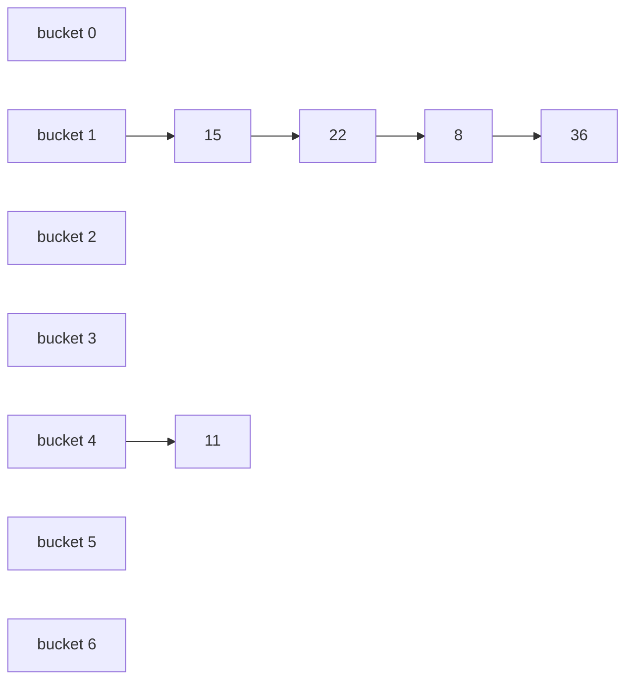

This is a worst-case-leaning example: a poor key set (all `≡ 1 mod 7`) piles into one bucket, so `get(36)` must walk the whole chain - O(n) behaviour. A good hash and a low load factor keep chains length ~1, giving O(1) average.

### Hashtable Linear-Probing Walkthrough

Same keys, same `h(k) = k mod 7`, but **open addressing** with linear probing. Entries live directly in the array; on collision we step to the next slot `(i+1) mod 7`.

```text
put 15 → slot 1 (empty)            → [_, 15, _, _, _, _, _]
put 22 → slot 1 full → try 2 (free)→ [_, 15, 22, _, _, _, _]
put 8  → slot 1 full → 2 full → 3  → [_, 15, 22, 8, _, _, _]
put 36 → slot 1,2,3 full → 4 free  → [_, 15, 22, 8, 36, _, _]
put 11 → slot 4 full → 5 free      → [_, 15, 22, 8, 36, 11, _]
```

Notice `11` wanted slot 4 but found it taken by `36` (which had itself been displaced) - this is **primary clustering**: one long run of filled cells forces later keys to probe further, lengthening the run.

### Hashtable Collision Strategy Comparison

| Strategy | Where entries live | Probe sequence | Main weakness |
| :--- | :--- | :--- | :--- |
| Separate chaining | In per-bucket lists | n/a (follow the chain) | Pointer overhead, cache misses |
| Linear probing | In the array itself | `i, i+1, i+2, …` | Primary clustering |
| Quadratic probing | In the array itself | `i, i+1, i+4, i+9, …` | Secondary clustering |
| Double hashing | In the array itself | `i, i+d(k), i+2d(k), …` | Two hash computations |


## 13. Set

### Set Definition

A **Set** is an unordered collection of **unique elements** - it models the mathematical concept of a set. Conceptually, a set is a Map that stores only keys (with no associated values, or equivalently, with a dummy value). The defining property is **uniqueness**: adding an element that is already present has no effect.

Sets answer the fundamental question: "Is this element present?" They provide no ordering, no indexing, and no duplicates.

### Set Key Operations

- **add(e)** - insert element if absent; do nothing if already present.
- **remove(e)** - delete element if present.
- **contains(e)** - membership test: is `e` in the set?
- **size / isEmpty**.
- Set-algebra: **union** (A ∪ B), **intersection** (A ∩ B), **difference** (A \ B).

### Java Implementation - Map-Backed (HashSet / TreeSet)

```java
public class MapSet<E> {
    // Underlying map (e.g., HashMap) with dummy values
    private Map<E, Object> map = new HashMap<>();
    private static final Object PRESENT = new Object();

    public boolean add(E e) { return map.put(e, PRESENT) == null; }
    public boolean remove(E e) { return map.remove(e) != null; }
    public boolean contains(E e) { return map.containsKey(e); }
    public int size() { return map.size(); }
}
```

`HashSet` wraps a `HashMap` (element = key, dummy constant = value); `TreeSet` wraps a Red-Black tree (a balanced BST). All set operations are forwarded to the underlying map's key operations.

### Java Implementation - List-Backed (Unsorted Array)

```java
public class ListSet<E> {
    private ArrayList<E> list = new ArrayList<>();

    public boolean add(E e) {
        if (contains(e)) return false; // Enforce uniqueness
        list.add(e);
        return true;
    }
    public boolean remove(E e) { return list.remove(e); }
    public boolean contains(E e) { return list.contains(e); }
}
```

The List-backed Set checks every element on `add` to ensure uniqueness, resulting in O(n) additions.

### Set Time and Space Complexity

| Implementation | add / remove / contains | Why |
| :--- | :--- | :--- |
| HashSet | O(1) average | Delegates to HashMap - hash computation + constant expected probing. |
| TreeSet | O(log n) | Delegates to Red-Black tree - operations traverse a balanced tree of height O(log n). |

**Space:** O(n).

### Set Use Cases

De-duplication, membership queries, mathematical set operations, uniqueness constraints, graph algorithms (visited-node tracking).

### Set Advantages / Drawbacks

Use a Set when you only care about presence/absence. If you need associated values → Map. If you need duplicates → Multiset/Bag. If you need insertion order → `LinkedHashSet`. `TreeSet` provides sorted iteration; `HashSet` does not.

### Special Concepts - Set Operations on Sorted Sets (Generic Merge)

Two-pointer linear sweep through two sorted sets A, B:
- **Union:** Compare current elements. Emit the smaller element and advance its pointer. If elements are equal, emit one and advance both pointers.
- **Intersection:** Compare current elements. If they are equal, emit the element and advance both. Otherwise, advance the pointer of the smaller element (do not emit).
- **Difference (A \ B):** Compare current elements. If A's element is strictly smaller, emit it and advance A. If B's element is smaller, advance B. If they are equal, advance both (do not emit).

All run in **O(|A| + |B|)** on sorted sets. Hash-based sets achieve the same expected time on average.

**Set vs Multiset (Bag):** a set stores each element at most once; a multiset tracks multiplicities (e.g., `{a, a, b}` has `a` with count 2).

### Set Operations Worked Example

Let `A = {1, 3, 5, 7}` and `B = {3, 4, 5, 6}`. The three set-algebra operations produce:

| Operation | Definition | Result |
| :--- | :--- | :--- |
| Union `A ∪ B` | in A **or** B | `{1, 3, 4, 5, 6, 7}` |
| Intersection `A ∩ B` | in A **and** B | `{3, 5}` |
| Difference `A \ B` | in A **but not** B | `{1, 7}` |

Using the two-pointer merge on the sorted sets, intersection runs like this (`i` scans A, `j` scans B):

```text
A=[1,3,5,7]  B=[3,4,5,6]
i=0(1), j=0(3): 1 < 3 → advance i
i=1(3), j=0(3): equal   → emit 3, advance both
i=2(5), j=1(4): 5 > 4   → advance j
i=2(5), j=2(5): equal   → emit 5, advance both
i=3(7), j=3(6): 7 > 6   → advance j → B exhausted, stop
Intersection = {3, 5}   (linear O(|A|+|B|))
```

### Set Implementation Comparison

| Implementation | Backing structure | add/remove/contains | Iteration order |
| :--- | :--- | :--- | :--- |
| HashSet | Hashtable | O(1) average | Unspecified |
| LinkedHashSet | Hashtable + linked list | O(1) average | Insertion order |
| TreeSet | Red-Black tree | O(log n) | Sorted by key |


## 14. Multimap

### Multimap Definition

A **Multimap** is a generalization of the Map ADT that allows **multiple values to be associated with the same key**. In a standard Map, `put(k, v)` would overwrite any existing value for key `k`; in a Multimap, `put(k, v)` **adds** a new `(k, v)` entry alongside any existing entries with the same key.

Conceptually, `Multimap<K, V> ≈ Map<K, Collection<V>>`, but a Multimap provides a cleaner API with built-in collection management - you don't have to manually check for null, create empty lists, or remove empty collections.

### Multimap Key Operations

- **put(k, v)** - add the entry `(k, v)`. Does **not** overwrite existing values for `k`; adds alongside them.
- **get(k)** - return the **collection** of all values associated with key `k` (empty collection if key absent).
- **remove(k, v)** - remove one specific `(k, v)` pair.
- **removeAll(k)** - remove every entry with key `k`.
- **entries() / keys() / keySet()**.

### Multimap Java Implementation

```java
private Map<K, List<V>> data = new HashMap<>();

public void put(K key, V value) {
    data.computeIfAbsent(key, k -> new ArrayList<>()).add(value);
}

public List<V> get(K key) {
    return data.getOrDefault(key, Collections.emptyList());
}

public boolean remove(K key, V value) {
    List<V> list = data.get(key);
    if (list == null) return false;
    boolean ok = list.remove(value);
    if (list.isEmpty()) data.remove(key);
    return ok;
}
```

### Multimap Time and Space Complexity

| Operation | Time | Why |
| :--- | :--- | :--- |
| put(k, v) | O(1) average | HashMap lookup for the key's bucket is O(1); appending to the value list is O(1). |
| get(k) | O(1) average | HashMap lookup returns the value list directly. (Iterating the returned list is O(s) where s = number of values.) |
| remove(k, v) | O(s) average | HashMap lookup is O(1), but finding and removing `v` from the value list requires O(s) scanning, where `s` is the number of values for key `k`. |

**Space:** O(n) across all entries (sum of all key-value pairs stored).

### Multimap Use Cases

Grouping (students by major), **inverted indexes** (word → documents), **graph adjacency lists** (vertex → neighbors), phone directory (name → numbers), book indexes (term → page numbers).

### Multimap Advantages / Drawbacks

Cleaner API than manual `Map<K, List<V>>`: no null-check boilerplate, no forgetting to create an empty list. Slight memory overhead from maintaining a list even when a key has just one value.

### Special Concept - Multimap vs Multiset

- **Multimap:** key → many values (structured one-to-many relationship).
- **Multiset (Bag):** element → frequency count (just tracks how many times each element appears, with no associated values).

### Multimap Grouping Walkthrough

A Multimap shines at grouping. Suppose we group students by major from the stream `(CS, Ann), (Math, Bob), (CS, Cara), (CS, Dan), (Math, Eve)`. Each `put` **appends** rather than overwrites:

```text
put(CS,   Ann)   {CS=[Ann]}
put(Math, Bob)   {CS=[Ann], Math=[Bob]}
put(CS,   Cara)  {CS=[Ann, Cara], Math=[Bob]}
put(CS,   Dan)   {CS=[Ann, Cara, Dan], Math=[Bob]}
put(Math, Eve)   {CS=[Ann, Cara, Dan], Math=[Bob, Eve]}
get(CS) → [Ann, Cara, Dan]      get(Physics) → [] (empty, not null)
```

Compare with a plain Map: `put(CS, Cara)` would have **destroyed** `Ann`. The Multimap keeps both because the value for a key is a whole collection.

### Multimap Versus Map

| Aspect | Map | Multimap |
| :--- | :--- | :--- |
| Keys per value | One value per key | Many values per key |
| `put` on existing key | Overwrites old value | Adds alongside old values |
| `get(k)` returns | A single value (or null) | A collection (possibly empty) |
| Model | `K → V` | `K → Collection<V>` |
| Typical use | Caches, symbol tables | Adjacency lists, inverted indexes |


## 15. Dictionary

### Dictionary Definition

A **Dictionary ADT** is a searchable collection of key-value entries that **permits multiple entries with the same key**. While the term "dictionary" is used colloquially (and in Python) as a synonym for "map," the course distinguishes them: a Map enforces unique keys, whereas a Dictionary allows duplicate keys.

In practice, a Dictionary is functionally equivalent to a **Multimap** - both allow multiple entries per key. The distinction is largely historical/terminological and varies across textbooks.

### Dictionary Key Operations

- **find(k)** - return **a single** entry with key `k` (or null if none exist).
- **findAll(k)** - return **all** entries with key `k`.
- **insert(k, v)** - add a new entry `(k, v)`. Duplicate keys are permitted - this never overwrites.
- **remove(e)** - remove a specific entry `e` (not by key alone, since the key may not be unique).

### Java Implementation - Unordered Dictionary (List-based)

```java
private List<Entry<K,V>> data = new ArrayList<>();

public Entry<K,V> find(K key) {
    for (Entry<K,V> e : data)
        if (e.getKey().equals(key)) return e;
    return null;
}

public Iterable<Entry<K,V>> findAll(K key) {
    List<Entry<K,V>> matches = new ArrayList<>();
    for (Entry<K,V> e : data)
        if (e.getKey().equals(key)) matches.add(e);
    return matches;
}

public void insert(K key, V value) {
    data.add(new MapEntry<>(key, value)); // Duplicates are allowed
}
```

- **Unordered (hashtable-backed):** O(1) average find/insert/remove. Effectively a multimap built on a hashtable where each bucket can hold multiple entries with the same key.
- **Ordered (sorted search table):** entries kept sorted by key; `find` is O(log n) via binary search, `findAll(k)` is O(log n + s) where `s` is the number of matches (binary search to find one, then scan adjacent entries). Insert/remove cost O(n) from shifting.

### Dictionary Time and Space Complexity

| Implementation | find | findAll | insert | remove | Why |
| :--- | :--- | :--- | :--- | :--- | :--- |
| Unordered (hash) | O(1) avg | O(1 + s) avg | O(1) avg | O(1) avg | Hash function maps to the bucket in O(1); scanning within a bucket is proportional to entries there. `s` is the number of entries with that key. |
| Ordered (sorted table) | O(log n) | O(log n + s) | O(n) | O(n) | Binary search locates the key in O(log n). Insert/remove require shifting array elements to maintain sorted order. |

**Space:** O(n).

### Dictionary Use Cases

Language dictionaries (word → many definitions), bibliographic records, DNS when multiple IPs per domain, phone books (multiple numbers per person), database records with repeated keys.

### Advantages vs Map

Natively supports one-to-many key-value relationships without requiring the caller to manage collections of values.

### Dictionary Special Concepts

- **Ordered vs unordered:** ordered dictionaries support **range queries** (`findAll keys in [a, b]`) and sorted traversal; unordered prioritize raw speed.
- **Dictionary ≈ Multimap** in modern terminology - the ADT concepts overlap heavily.
- **Note on naming:** Java's `java.util.Dictionary` is an obsolete abstract class from Java 1.0 - modern code uses `Map` / `HashMap`. The ADT term still appears in textbooks (including this course's).

### Dictionary Duplicate-Key Walkthrough

The defining feature of a Dictionary is that `insert` **never overwrites** - duplicate keys coexist. Trace a phone book that allows several numbers per person:

```text
insert("Ann",  "555-1000")   entries: [(Ann,555-1000)]
insert("Bob",  "555-2000")   entries: [(Ann,555-1000), (Bob,555-2000)]
insert("Ann",  "555-3000")   entries: [(Ann,555-1000), (Bob,555-2000), (Ann,555-3000)]
find("Ann")    → (Ann, 555-1000)            one matching entry
findAll("Ann") → [555-1000, 555-3000]       every matching entry
remove((Ann,555-1000))  → entries: [(Bob,555-2000), (Ann,555-3000)]
```

`find` returns just one match; `findAll` returns them all. Removal targets a **specific entry**, not a key, because the key alone is ambiguous when duplicates exist.

### Map Versus Dictionary Versus Multimap

| ADT | Duplicate keys? | Lookup returns | Mental model |
| :--- | :--- | :--- | :--- |
| Map | No (keys unique) | One value | `K → V` |
| Dictionary | Yes | `find` → one entry; `findAll` → all | searchable bag of `(K,V)` entries |
| Multimap | Yes (grouped) | A collection of values | `K → Collection<V>` |

Dictionary and Multimap both store many entries per key; the difference is mostly API shape - a Dictionary exposes flat `(K,V)` entries you search, while a Multimap groups values into a collection per key.

## 16. Graphs - Comprehensive Study Notes

These notes are written so that you can learn the entire graph chapter from scratch using only this document. Every concept is built up from intuition first, then formalized, and almost every algorithm comes with runnable Java code and a worked example. The source is Goodrich, Tamassia & Goldwasser, *Data Structures and Algorithms in Java*, 6th edition, Chapter 14, as used in COMP202 (Prof. Dr. Alptekin Küpçü).

### What Is a Graph?

A **graph** is one of the most general and powerful data structures in computer science. Whenever you have a set of *things* and some notion of *connection* between pairs of those things, you have a graph. Cities connected by roads, web pages connected by hyperlinks, people connected by friendships, tasks connected by "must happen before" relationships - all of these are graphs.

Formally, a graph is a pair $G = (V, E)$ where:

- $V$ is a set of **vertices** (also called *nodes*). A vertex represents one of the "things."
- $E$ is a collection of **edges**. Each edge is a pair of vertices and represents a connection between two things.

Both vertices and edges are *positions* that can store elements. For example, in a flight network a vertex stores an airport's three-letter code (like `ORD` or `LAX`), and an edge stores information about the flight route between two airports, such as the mileage.

Think of the difference between a graph and the trees you studied earlier. A tree is a very restricted kind of graph: it has no cycles and a clear parent-child hierarchy. A general graph has none of those restrictions - any vertex can connect to any other vertex, connections can form loops, and there is no inherent "root." This freedom is exactly what makes graphs able to model the messy, interconnected real world.

Here is a small undirected graph drawn with Mermaid, modeling airports and routes:

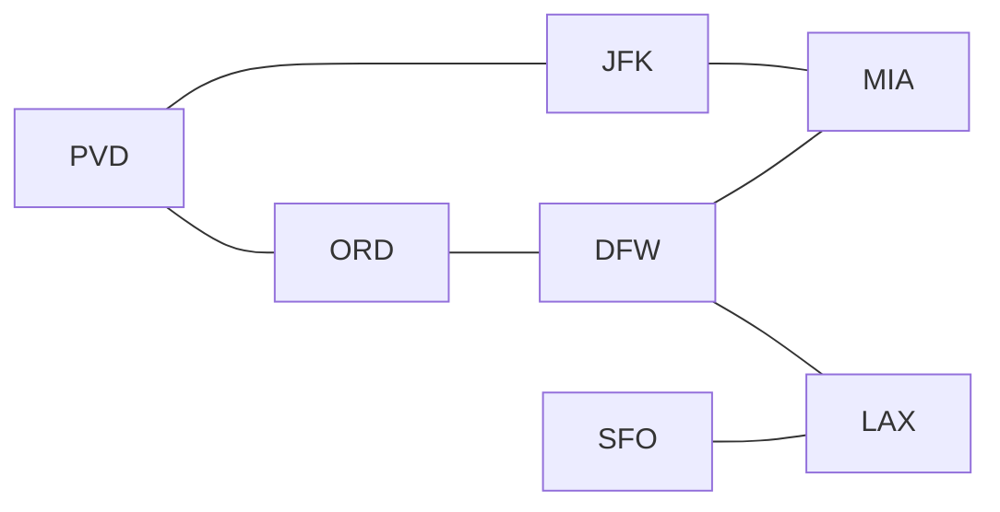

#### Where Graphs Show Up

Graphs are everywhere in computing, which is why this chapter matters far beyond any single exam. A few representative domains:

- **Electronic circuits:** printed circuit boards and integrated circuits are graphs of components and wires.
- **Transportation networks:** highway networks and flight networks where vertices are locations and edges are connections.
- **Computer networks:** local area networks, the Internet, and the Web (pages and hyperlinks).
- **Databases:** entity-relationship diagrams describing how data tables relate.

### Graph Terminology

Before we can reason about graphs precisely, we need a shared vocabulary. This section is essentially a dictionary; read it once now and refer back to it whenever a term feels fuzzy.

#### Edge Types and Graph Types

An edge can carry a direction or not, and this distinction shapes everything else.

A **directed edge** is an *ordered* pair $(u, v)$. The first vertex $u$ is the **origin** and the second vertex $v$ is the **destination**. A one-way flight from `ORD` to `PVD` is a directed edge: it lets you go one way but not the other.

An **undirected edge** is an *unordered* pair $(u, v)$ - the connection works in both directions equally. A general "route exists between these two airports" relationship is undirected.

These extend to whole graphs:

- A **directed graph** (or **digraph**) is one in which all edges are directed. Example: a network of one-way streets.
- An **undirected graph** is one in which all edges are undirected. Example: a symmetric flight-route network.

#### Vertices and Edges Relationships

Using a single richer example graph (vertices $U, V, W, X, Y, Z$ with edges $a, b, c, d, e, f, g, h, i, j$), the standard terms are:

- **End vertices (endpoints)** of an edge are the two vertices it connects. If edge $a$ connects $U$ and $V$, then $U$ and $V$ are the endpoints of $a$.
- An edge is **incident** on a vertex if that vertex is one of its endpoints. Edges $a$, $d$, and $b$ are incident on $V$.
- Two vertices are **adjacent** if an edge connects them. $U$ and $V$ are adjacent.
- The **degree** of a vertex is the number of edges incident on it, written $\deg(v)$. If vertex $X$ has five incident edges, then $\deg(X) = 5$.
- **Parallel edges** (or *multiple edges*) are two or more edges that share the same pair of endpoints. Edges $h$ and $i$ might both connect the same two vertices.
- A **self-loop** is an edge whose two endpoints are the *same* vertex. Edge $j$ from a vertex back to itself is a self-loop.

A graph with no parallel edges and no self-loops is called a **simple graph**. Most of our complexity bounds assume simple graphs.

#### Paths and Cycles

A **path** is a sequence of alternating vertices and edges that starts at a vertex and ends at a vertex, where each edge is preceded and followed by its two endpoints. Intuitively, a path is a walk through the graph following edges.

A **simple path** is a path in which all vertices and all edges are distinct - you never reuse a vertex or an edge.

For example, in our six-vertex graph, $P_1 = (V, b, X, h, Z)$ is a simple path: start at $V$, take edge $b$ to $X$, take edge $h$ to $Z$, with no repeats. By contrast, $P_2 = (U, c, W, e, X, g, Y, f, W, d, V)$ is a path that is **not simple** because the vertex $W$ appears twice.

A **cycle** is a circular sequence of alternating vertices and edges, where again each edge is preceded and followed by its endpoints, but now the sequence loops back to where it began.

A **simple cycle** is a cycle in which all vertices and all edges are distinct (except that the start and end vertex coincide, which is what makes it a cycle).

For instance, $C_1 = (V, b, X, g, Y, f, W, c, U, a, V)$ is a simple cycle, while $C_2 = (U, c, W, e, X, g, Y, f, W, d, V, a, U)$ is a cycle that is not simple because $W$ repeats.

#### Quick Reference of Terms

| Term | Meaning | Example |
| :--- | :--- | :--- |
| Endpoints | The two vertices of an edge | $U, V$ are endpoints of edge $a$ |
| Incident | Edge touches a vertex | $a, d, b$ incident on $V$ |
| Adjacent | Two vertices joined by an edge | $U$ and $V$ |
| Degree | Count of incident edges | $\deg(X) = 5$ |
| Parallel edges | Same endpoints, different edges | $h, i$ |
| Self-loop | Edge from a vertex to itself | $j$ |
| Simple path | No repeated vertices or edges | $P_1$ |
| Simple cycle | Closed walk, no repeats | $C_1$ |

### Counting Properties of Graphs

A few simple counting facts about graphs come up constantly in analysis. Let $n$ be the number of vertices and $m$ the number of edges.

#### The Handshaking Lemma

$$\sum_{v \in V} \deg(v) = 2m$$

This says the sum of all vertex degrees equals twice the number of edges. The reasoning is beautifully simple: when you sum degrees over all vertices, **each edge is counted exactly twice**, once for each of its two endpoints. It is called the "handshaking lemma" because if every edge is a handshake between two people, the total number of hands shaken (counting each person's involvement) is twice the number of handshakes.

This identity is why so many graph algorithms run in $O(n + m)$ time: iterating over every vertex and, for each, over its incident edges, touches each edge twice, giving $O(m)$ total edge work plus $O(n)$ vertex work.

#### Bound on the Number of Edges

In an undirected simple graph (no self-loops, no parallel edges):

$$m \le \frac{n(n-1)}{2}$$

The reasoning: each vertex can be adjacent to at most the other $n - 1$ vertices, so $\deg(v) \le n - 1$ for every vertex. Summing gives $\sum \deg(v) \le n(n-1)$, and since that sum equals $2m$, we get $m \le n(n-1)/2$.

For a **directed** simple graph the bound doubles, because each ordered pair $(u, v)$ and $(v, u)$ can both exist as separate edges:

$$m \le n(n-1)$$

A graph where $m$ is close to its maximum (proportional to $n^2$) is called **dense**; one where $m$ is closer to $n$ is called **sparse**. This distinction decides which graph representation you should choose, as we will see.

#### Worked Counting Example

Take a graph with $n = 4$ vertices, all mutually connected, where every vertex has degree $3$. Then $\sum \deg(v) = 4 \times 3 = 12$, so by the handshaking lemma $m = 12 / 2 = 6$. And indeed $n(n-1)/2 = 4 \cdot 3 / 2 = 6$, so this graph is the maximally connected (complete) simple graph on four vertices.

### The Graph Abstract Data Type

Before choosing a concrete representation, we describe the **Graph ADT** - the set of operations a graph should support, independent of how it is implemented. Vertices and edges are *positions* that store elements.

The operations fall into three groups.

The **accessor methods** read structural information:

- `endVertices(e)` returns an array of the two end vertices of edge `e`.
- `opposite(v, e)` returns the vertex on edge `e` opposite to `v` (the other endpoint).
- `areAdjacent(v, w)` returns true if and only if `v` and `w` are adjacent.
- `replace(v, x)` replaces the element stored at vertex `v` with `x`.
- `replace(e, x)` replaces the element stored at edge `e` with `x`.

The **update methods** modify the graph:

- `insertVertex(o)` inserts a new vertex storing element `o`.
- `insertEdge(v, w, o)` inserts a new edge $(v, w)$ storing element `o`.
- `removeVertex(v)` removes vertex `v` and all its incident edges.
- `removeEdge(e)` removes edge `e`.

The **iterable collection methods** let you traverse:

- `incidentEdges(v)` yields all edges incident on `v`.
- `vertices()` yields all vertices.
- `edges()` yields all edges.

Here is a Java interface capturing this ADT. We use generic type parameters `V` for the element stored at a vertex and `E` for the element stored at an edge.

```java
public interface Graph<V, E> {
    int numVertices();
    int numEdges();
    Iterable<Vertex<V>> vertices();
    Iterable<Edge<E>> edges();

    // Returns the edge from u to v, or null if they are not adjacent.
    Edge<E> getEdge(Vertex<V> u, Vertex<V> v);

    // The two endpoints of edge e, with [0] = origin for directed graphs.
    Vertex<V>[] endVertices(Edge<E> e);

    // The vertex opposite v across edge e.
    Vertex<V> opposite(Vertex<V> v, Edge<E> e) throws IllegalArgumentException;

    int outDegree(Vertex<V> v);
    int inDegree(Vertex<V> v);
    Iterable<Edge<E>> outgoingEdges(Vertex<V> v);
    Iterable<Edge<E>> incomingEdges(Vertex<V> v);

    Vertex<V> insertVertex(V element);
    Edge<E> insertEdge(Vertex<V> u, Vertex<V> v, E element) throws IllegalArgumentException;
    void removeVertex(Vertex<V> v);
    void removeEdge(Edge<E> e);
}

interface Vertex<V> {
    V getElement();
}

interface Edge<E> {
    E getElement();
}
```

For an undirected graph the in- and out-variants coincide, so `outgoingEdges` and `incomingEdges` simply return the same incident edges.

### Graph Representations

The ADT says *what* operations exist; the representation decides *how fast* they run and *how much memory* they cost. There are three classic representations, and choosing among them is one of the most practical decisions in graph programming.

#### Edge List Structure

The **edge list** is the simplest representation. You keep:

- A **vertex sequence**: a list of all vertex objects. Each vertex object stores its element and a reference to its position in the vertex sequence.
- An **edge sequence**: a list of all edge objects. Each edge object stores its element, references to its two endpoint vertex objects (origin and destination), and a reference to its position in the edge sequence.

The vertex and edge objects know almost nothing about each other's *neighborhoods*. To answer "is `v` adjacent to `w`?" you must scan the entire edge list, which is $O(m)$.

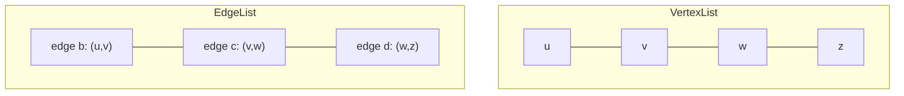

The edge list is space-efficient at $O(n + m)$ and makes inserting a vertex or edge $O(1)$, but it is slow for any neighborhood query.

#### Adjacency List Structure

The **adjacency list** augments the edge list with, for each vertex, an **incidence sequence**: a list of references to the edge objects incident on that vertex. Edge objects are *augmented* to also hold references to their positions in the incidence sequences of both endpoints, so that removing an edge can update both endpoints' lists in $O(1)$.

This is the workhorse representation for **sparse** graphs. The key win is that `incidentEdges(v)` runs in $O(\deg(v))$ time - you only touch the edges that actually touch `v`, instead of scanning all $m$ edges.

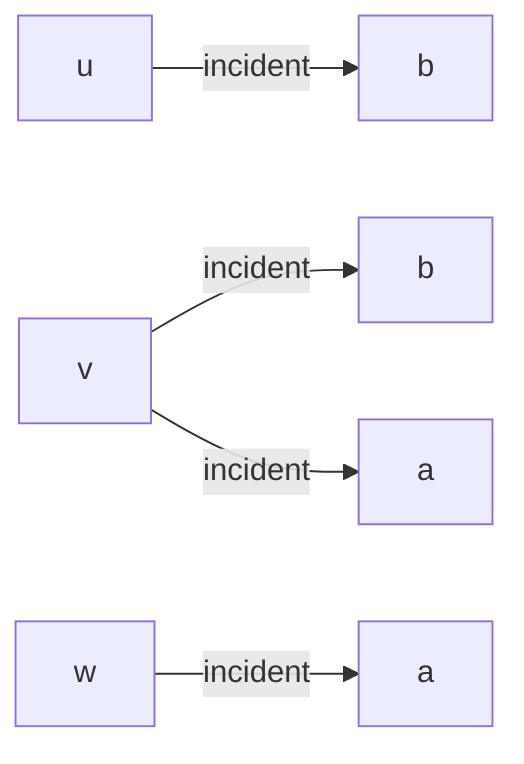

Total space is $O(n + m)$. To test `areAdjacent(v, w)`, you scan the shorter of the two incidence lists, giving $O(\min(\deg(v), \deg(w)))$.

A simple concrete Java skeleton using maps and lists for an adjacency-list graph looks like this:

```java
import java.util.*;

public class AdjacencyListGraph<V, E> {
    // Each vertex maps to a list of its incident edges.
    private final Map<V, List<EdgeRec<V, E>>> adj = new HashMap<>();

    private static class EdgeRec<V, E> {
        V from, to;
        E element;
        EdgeRec(V from, V to, E element) {
            this.from = from; this.to = to; this.element = element;
        }
    }

    public void insertVertex(V v) {
        adj.putIfAbsent(v, new ArrayList<>());
    }

    public void insertEdge(V u, V v, E element) {
        insertVertex(u);
        insertVertex(v);
        EdgeRec<V, E> e = new EdgeRec<>(u, v, element);
        adj.get(u).add(e);
        adj.get(v).add(e); // omit this line for a directed graph
    }

    public List<EdgeRec<V, E>> incidentEdges(V v) {
        return adj.getOrDefault(v, Collections.emptyList());
    }

    public boolean areAdjacent(V v, V w) {
        for (EdgeRec<V, E> e : incidentEdges(v))
            if (e.to.equals(w) || e.from.equals(w)) return true;
        return false;
    }
}
```

#### Adjacency Matrix Structure

The **adjacency matrix** augments the edge list with vertex objects that carry an integer **index** $0, 1, \dots, n-1$, plus a 2D array $A$ of size $n \times n$. Cell $A[i][j]$ holds a reference to the edge object connecting vertex $i$ to vertex $j$, or `null` if they are not adjacent. The "old-fashioned" version simply stores $1$ for an edge and $0$ for no edge.

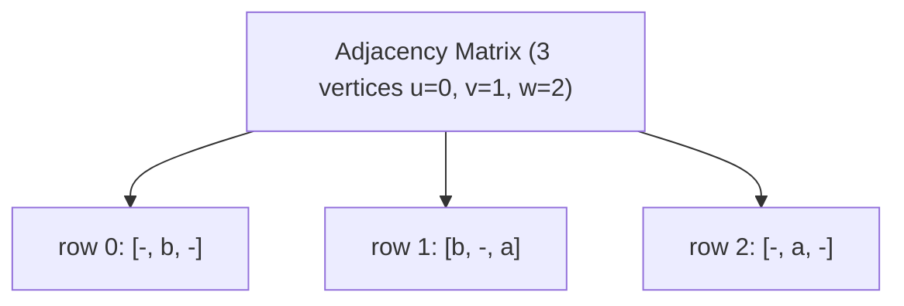

The matrix makes `areAdjacent(v, w)` a single array lookup: $O(1)$. The price is space: the matrix always uses $O(n^2)$ memory regardless of how few edges exist, which is wasteful for sparse graphs. Inserting or removing a vertex is also expensive ($O(n^2)$) because the whole matrix must be resized. This representation shines for **dense** graphs and for algorithms (like Floyd-Warshall) that naturally want $O(1)$ adjacency tests.

```java
public class AdjacencyMatrixGraph {
    private final int n;
    private final int[][] a; // 1 if edge present, 0 otherwise

    public AdjacencyMatrixGraph(int numVertices) {
        n = numVertices;
        a = new int[n][n];
    }

    public void insertEdge(int u, int v) {
        a[u][v] = 1;
        a[v][u] = 1; // omit for a directed graph
    }

    public boolean areAdjacent(int u, int v) {
        return a[u][v] == 1; // O(1) lookup
    }
}
```

#### Performance Comparison

This table summarizes the asymptotic costs (assuming $n$ vertices, $m$ edges, no parallel edges, no self-loops). It is one of the most exam-relevant tables in the whole chapter.

| Operation | Edge List | Adjacency List | Adjacency Matrix |
| :--- | :---: | :---: | :---: |
| Space | $n + m$ | $n + m$ | $n^2$ |
| `incidentEdges(v)` | $m$ | $\deg(v)$ | $n$ |
| `areAdjacent(v, w)` | $m$ | $\min(\deg(v), \deg(w))$ | $1$ |
| `insertVertex(o)` | $1$ | $1$ | $n^2$ |
| `insertEdge(v, w, o)` | $1$ | $1$ | $1$ |
| `removeVertex(v)` | $m$ | $\deg(v)$ | $n^2$ |
| `removeEdge(e)` | $1$ | $1$ | $1$ |

The headline takeaway: use the **adjacency list** for sparse graphs (most real-world graphs) and the **adjacency matrix** when the graph is dense or you need constant-time adjacency tests.

### Subgraphs, Connectivity, Trees, and Forests

These structural definitions underpin the traversal algorithms in the next sections, so it pays to nail them down first.

A **subgraph** $S$ of a graph $G$ is a graph whose vertices form a subset of $G$'s vertices and whose edges form a subset of $G$'s edges (with both endpoints of each chosen edge also present). A **spanning subgraph** of $G$ is a subgraph that contains *all* of $G$'s vertices (but possibly only some edges).

A graph is **connected** if there is a path between every pair of vertices. If a graph is not connected, it splits into **connected components** - each component is a maximal connected subgraph, meaning you cannot add any more vertices to it while keeping it connected.

A **(free) tree** is an undirected graph $T$ that is connected and has no cycles. Be careful: this is different from a *rooted* tree from earlier chapters - a free tree has no designated root and no parent-child direction. A **forest** is an undirected graph with no cycles; its connected components are exactly the trees that make it up.

A **spanning tree** of a connected graph is a spanning subgraph that is a (free) tree. A spanning tree is *not unique* unless the graph is itself a tree. Spanning trees matter for the design of communication networks: they connect every node using the fewest possible edges ($n - 1$ edges for $n$ vertices). A **spanning forest** is a spanning subgraph that is a forest.

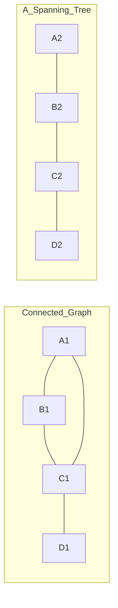

### Breadth-First Search

**Breadth-first search (BFS)** is a general technique for traversing a graph. The intuition is that of an expanding ripple: starting from a source vertex `s`, you first visit everything one step away, then everything two steps away, then three steps, and so on. You explore the graph in *layers* of increasing distance from the source.

#### What BFS Computes

A BFS traversal of a graph $G$ visits all vertices and edges of $G$, determines whether $G$ is connected, computes its connected components, and computes a spanning forest of $G$. It runs in $O(n + m)$ time when the graph uses an adjacency list. BFS can be extended to solve further problems, most importantly finding a path with the **minimum number of edges** between two vertices, and detecting a simple cycle.

#### BFS Pseudocode

BFS labels each vertex `UNEXPLORED` or `VISITED`, and each edge `UNEXPLORED`, `DISCOVERY`, or `CROSS`. A **discovery edge** is one used to reach a brand-new vertex; a **cross edge** connects two vertices already discovered (it would create a cycle within or across layers).

```text
Algorithm BFS(G):
    for all vertices u in G.vertices():
        setLabel(u, UNEXPLORED)
    for all edges e in G.edges():
        setLabel(e, UNEXPLORED)
    for all vertices v in G.vertices():
        if getLabel(v) = UNEXPLORED:
            BFS(G, v)            // start a new component

Algorithm BFS(G, s):
    L[0] = new empty sequence
    L[0].addLast(s)
    setLabel(s, VISITED)
    i = 0
    while not L[i].isEmpty():
        L[i+1] = new empty sequence
        for all v in L[i].elements():
            for all e in G.incidentEdges(v):
                if getLabel(e) = UNEXPLORED:
                    w = opposite(v, e)
                    if getLabel(w) = UNEXPLORED:
                        setLabel(e, DISCOVERY)
                        setLabel(w, VISITED)
                        L[i+1].addLast(w)
                    else:
                        setLabel(e, CROSS)
        i = i + 1
```

Reading it line by line: we begin by marking everything unexplored. The outer `BFS(G)` loop restarts the search from any still-unexplored vertex, so disconnected components each get their own BFS tree. Inside `BFS(G, s)`, the sequence `L[i]` holds exactly the vertices at distance `i` from `s`. For each vertex in the current layer we examine its incident edges: an edge leading to an unexplored vertex becomes a discovery edge and that vertex joins the next layer; an edge leading to an already-visited vertex is a cross edge.

#### BFS in Java

In practice BFS is implemented with a FIFO **queue** rather than explicit layer lists; the queue naturally produces the same layer-by-layer order.

```java
import java.util.*;

public class BFSExample {
    // Returns the BFS visitation order starting from source.
    public static <V> List<V> bfs(Map<V, List<V>> adj, V source) {
        List<V> order = new ArrayList<>();
        Set<V> visited = new HashSet<>();
        Queue<V> queue = new LinkedList<>();

        visited.add(source);
        queue.add(source);

        while (!queue.isEmpty()) {
            V v = queue.poll();        // remove from front (FIFO)
            order.add(v);
            for (V w : adj.getOrDefault(v, List.of())) {
                if (!visited.contains(w)) {
                    visited.add(w);    // mark before enqueue to avoid duplicates
                    queue.add(w);
                }
            }
        }
        return order;
    }

    public static void main(String[] args) {
        Map<String, List<String>> adj = new HashMap<>();
        adj.put("A", List.of("B", "C"));
        adj.put("B", List.of("A", "D", "E"));
        adj.put("C", List.of("A", "F"));
        adj.put("D", List.of("B"));
        adj.put("E", List.of("B", "F"));
        adj.put("F", List.of("C", "E"));
        System.out.println(bfs(adj, "A")); // e.g. [A, B, C, D, E, F]
    }
}
```

To recover the *shortest-edge-count path* to a vertex, store a `parent` map: when you discover `w` from `v`, set `parent[w] = v`. Afterward, walk parents from the target back to the source and reverse the list.

#### BFS Worked Example

Consider a graph with vertices $A, B, C, D, E, F$ and source $A$. Layer $L_0 = \{A\}$. From $A$ we discover its neighbors, say $B$ and $C$, forming $L_1 = \{B, C\}$ via discovery edges. From $L_1$ we discover the next ring, say $D, E, F$, forming $L_2$. Any edge encountered that connects two already-visited vertices (for example an edge between two $L_1$ vertices, or between an $L_1$ and another $L_1$) is labeled a cross edge rather than a discovery edge. The discovery edges together form the BFS spanning tree.

#### BFS Properties

Let $G_s$ be the connected component of the source $s$.

- **Property 1:** $BFS(G, s)$ visits all vertices and edges of $G_s$.
- **Property 2:** The discovery edges form a spanning tree $T_s$ of $G_s$.
- **Property 3:** For each vertex $v$ in layer $L_i$, the path in $T_s$ from $s$ to $v$ has exactly $i$ edges, and *every* path from $s$ to $v$ in $G_s$ has at least $i$ edges. In other words, BFS finds shortest paths measured in number of edges.

#### BFS Analysis

Setting or getting a label is $O(1)$. Each vertex is labeled twice (once `UNEXPLORED`, once `VISITED`) and each edge is labeled twice (once `UNEXPLORED`, once `DISCOVERY` or `CROSS`). Each vertex is inserted into a layer sequence exactly once, and `incidentEdges` is called once per vertex. Because $\sum_v \deg(v) = 2m$, the total edge work is $O(m)$. Therefore BFS runs in $O(n + m)$ time with an adjacency list.

#### BFS Applications

Using the template-method pattern, BFS specializes to solve several problems in $O(n + m)$: computing connected components, computing a spanning forest, finding a simple cycle (or reporting that $G$ is a forest), and finding a minimum-edge path between two vertices (or reporting none exists).

### Depth-First Search

**Depth-first search (DFS)** is the other fundamental traversal. Where BFS expands in rings, DFS plunges as deep as possible along one branch before backtracking. The classic mental model is exploring a **maze**: you walk down a corridor following a rope, marking each intersection and corridor as you pass; when you hit a dead end you reel the rope back to the last unexplored junction and try a different corridor. The rope is the recursion stack. Goodrich puts it memorably: "depth-first search is to graphs what the Euler tour is to binary trees."

#### What DFS Computes

Like BFS, a DFS traversal visits all vertices and edges, determines connectivity, computes connected components, and computes a spanning forest, all in $O(n + m)$ time. DFS extends naturally to finding a path between two vertices and finding a cycle.

#### DFS Pseudocode

DFS labels vertices `UNEXPLORED`/`VISITED` and edges `UNEXPLORED`, `DISCOVERY`, or `BACK`. A **back edge** connects the current vertex to one of its ancestors in the DFS tree; the presence of a back edge means there is a cycle.

```text
Algorithm DFS(G):
    for all vertices u in G.vertices():
        setLabel(u, UNEXPLORED)
    for all edges e in G.edges():
        setLabel(e, UNEXPLORED)
    for all vertices v in G.vertices():
        if getLabel(v) = UNEXPLORED:
            DFS(G, v)

Algorithm DFS(G, v):
    setLabel(v, VISITED)
    for all e in G.incidentEdges(v):
        if getLabel(e) = UNEXPLORED:
            w = opposite(v, e)
            if getLabel(w) = UNEXPLORED:
                setLabel(e, DISCOVERY)
                DFS(G, w)          // recurse: go deeper
            else:
                setLabel(e, BACK)
```

The recursion is the entire trick. When we reach a vertex `v`, we mark it visited, then for each unexplored incident edge we either dive into a new vertex (discovery edge, recursive call) or record a back edge to an already-visited vertex. When the loop finishes, the recursion unwinds - that is the backtracking.

#### DFS in Java

```java
import java.util.*;

public class DFSExample {
    public static <V> List<V> dfs(Map<V, List<V>> adj, V source) {
        List<V> order = new ArrayList<>();
        Set<V> visited = new HashSet<>();
        dfsVisit(adj, source, visited, order);
        return order;
    }

    private static <V> void dfsVisit(Map<V, List<V>> adj, V v,
                                     Set<V> visited, List<V> order) {
        visited.add(v);
        order.add(v);
        for (V w : adj.getOrDefault(v, List.of())) {
            if (!visited.contains(w)) {
                dfsVisit(adj, w, visited, order); // recurse deeper
            }
        }
    }

    // Iterative version using an explicit stack, equivalent behavior.
    public static <V> List<V> dfsIterative(Map<V, List<V>> adj, V source) {
        List<V> order = new ArrayList<>();
        Set<V> visited = new HashSet<>();
        Deque<V> stack = new ArrayDeque<>();
        stack.push(source);
        while (!stack.isEmpty()) {
            V v = stack.pop();
            if (visited.contains(v)) continue;
            visited.add(v);
            order.add(v);
            for (V w : adj.getOrDefault(v, List.of())) {
                if (!visited.contains(w)) stack.push(w);
            }
        }
        return order;
    }
}
```

#### DFS Worked Example

Take vertices $A, B, C, D, E$ starting at $A$. We mark $A$ visited and follow a discovery edge to (say) $B$, then from $B$ a discovery edge to $C$, then $C$ to $D$, then $D$ to $E$. Suppose $E$ has an edge back to $A$: since $A$ is already visited, that edge is labeled a back edge, signalling the cycle $A \to B \to C \to D \to E \to A$. When $E$ has no more unexplored edges, recursion backtracks through $D, C, B, A$. The discovery edges form the DFS spanning tree.

#### DFS Properties

- **Property 1:** $DFS(G, v)$ visits all vertices and edges in the connected component of $v$.
- **Property 2:** The discovery edges labeled by $DFS(G, v)$ form a spanning tree of the connected component of $v$.

#### DFS Analysis

The analysis mirrors BFS exactly. Labels are $O(1)$; each vertex is labeled twice, each edge twice (`UNEXPLORED` then `DISCOVERY` or `BACK`); `incidentEdges` is called once per vertex; and $\sum_v \deg(v) = 2m$. Hence DFS runs in $O(n + m)$ time with an adjacency list.

#### BFS Versus DFS at a Glance

| Aspect | BFS | DFS |
| :--- | :--- | :--- |
| Data structure | Queue (FIFO) | Stack / recursion (LIFO) |
| Exploration shape | Layer by layer | Deep along a branch |
| Non-tree edges | Cross edges | Back edges |
| Finds | Min-edge paths | Any path, cycles |
| Time | $O(n + m)$ | $O(n + m)$ |
| Spanning structure | BFS spanning tree | DFS spanning tree |

### DFS Application: Path Finding

We can specialize DFS to find a path between two given vertices `u` and `z` using the template-method pattern. We call DFS starting at `u`, and we maintain a **stack** `S` holding the current path of vertices and edges from the start to the vertex we are exploring. The moment we reach `z`, the contents of the stack *are* the path, so we return them.

```text
Algorithm pathDFS(G, v, z):
    setLabel(v, VISITED)
    S.push(v)
    if v = z:
        return S.elements()          // found the path
    for all e in G.incidentEdges(v):
        if getLabel(e) = UNEXPLORED:
            w = opposite(v, e)
            if getLabel(w) = UNEXPLORED:
                setLabel(e, DISCOVERY)
                S.push(e)
                pathDFS(G, w, z)
                S.pop(e)             // backtrack: remove the edge
            else:
                setLabel(e, BACK)
    S.pop(v)                         // backtrack: remove the vertex
```

The crucial detail is the symmetric push/pop: every push that happens on the way down is undone on the way back up, so the stack always reflects exactly the path from the start vertex to the current vertex. Here is a Java version that returns the path as a list:

```java
import java.util.*;

public class PathFinder {
    public static <V> List<V> findPath(Map<V, List<V>> adj, V start, V goal) {
        Set<V> visited = new HashSet<>();
        Deque<V> path = new ArrayDeque<>();
        if (dfsPath(adj, start, goal, visited, path)) {
            List<V> result = new ArrayList<>(path);
            Collections.reverse(result); // path was built top-down on the deque
            return result;
        }
        return Collections.emptyList(); // no path exists
    }

    private static <V> boolean dfsPath(Map<V, List<V>> adj, V v, V goal,
                                       Set<V> visited, Deque<V> path) {
        visited.add(v);
        path.push(v);
        if (v.equals(goal)) return true;
        for (V w : adj.getOrDefault(v, List.of())) {
            if (!visited.contains(w) && dfsPath(adj, w, goal, visited, path))
                return true;
        }
        path.pop(); // backtrack
        return false;
    }
}
```

### DFS Application: Cycle Finding

Similarly, DFS specializes to find a **simple cycle**. We keep a stack `S` of the current path. As soon as we encounter a back edge $(v, w)$, we know a cycle exists, and the cycle is exactly the portion of the stack from the top down to vertex `w`.

```text
Algorithm cycleDFS(G, v):
    setLabel(v, VISITED)
    S.push(v)
    for all e in G.incidentEdges(v):
        if getLabel(e) = UNEXPLORED:
            w = opposite(v, e)
            S.push(e)
            if getLabel(w) = UNEXPLORED:
                setLabel(e, DISCOVERY)
                cycleDFS(G, w)
                S.pop(e)
            else:
                T = new empty stack          // back edge found: build cycle
                repeat:
                    o = S.pop()
                    T.push(o)
                until o = w
                return T.elements()
    S.pop(v)
```

When a back edge to `w` appears, we pop items off the path stack and collect them until we reach `w` again; those popped items form the simple cycle.

### Directed Graphs

A **digraph** (short for *directed graph*) is a graph whose edges are all directed. Each edge $(a, b)$ goes from $a$ to $b$ but not from $b$ to $a$. Digraphs model inherently one-directional relationships: one-way streets, flight legs, and especially **task scheduling**, where an edge $(a, b)$ means "task $a$ must finish before task $b$ can start."

#### Digraph Properties

For a simple digraph, $m \le n(n-1)$ (double the undirected bound, since both $(a,b)$ and $(b,a)$ can exist). A practical implementation keeps **in-edges** and **out-edges** in separate adjacency lists for each vertex, so that listing incoming edges or outgoing edges takes time proportional to their number.

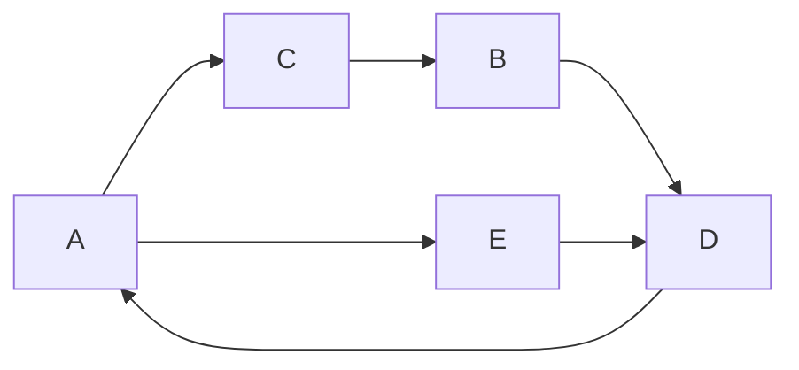

#### Directed DFS and Reachability

We specialize DFS (and BFS) to digraphs by traversing each edge **only along its direction**. In a directed DFS there are now four edge types: discovery, back, **forward**, and **cross** edges. A directed DFS starting at a vertex `s` discovers exactly the set of vertices **reachable** from `s` - the vertices you can arrive at by following directed paths. The DFS tree rooted at `v` is precisely the set of vertices reachable from `v`.

```java
import java.util.*;

public class DirectedReachability {
    // Set of all vertices reachable from source by following edge directions.
    public static <V> Set<V> reachable(Map<V, List<V>> outAdj, V source) {
        Set<V> seen = new HashSet<>();
        Deque<V> stack = new ArrayDeque<>();
        stack.push(source);
        while (!stack.isEmpty()) {
            V v = stack.pop();
            if (!seen.add(v)) continue;
            for (V w : outAdj.getOrDefault(v, List.of()))
                stack.push(w); // only outgoing edges
        }
        return seen;
    }
}
```

#### Strong Connectivity

A digraph is **strongly connected** if *each* vertex can reach *every* other vertex by directed paths. Contrast this with mere connectivity in an undirected graph; in a digraph, you can reach `b` from `a` yet be unable to return.

There is an elegant $O(n + m)$ test for strong connectivity:

```text
Algorithm StronglyConnected(G):
    Pick any vertex v of G
    Perform a DFS from v in G
        if some vertex w is not visited: return "no"
    Let G' be G with all edges reversed
    Perform a DFS from v in G'
        if some vertex w is not visited: return "no"
    return "yes"
```

The intuition: the first DFS confirms `v` can reach everyone. The second DFS on the edge-reversed graph confirms everyone can reach `v` (because reaching `v` in the reversed graph equals `v`-being-reached in the original). If `v` can reach all and all can reach `v`, then any vertex can reach any other by routing through `v`. Both DFS calls are $O(n + m)$, so the whole test is $O(n + m)$.

#### Strongly Connected Components

The **strongly connected components (SCCs)** of a digraph are its maximal strongly connected subgraphs. For example, a digraph might decompose into SCCs $\{a, c, g\}$ and $\{f, d, e, b\}$. Computing all SCCs can also be done in $O(n + m)$ time using DFS, though the algorithm is more involved (conceptually similar to biconnectivity).

#### Transitive Closure

Given a digraph $G$, its **transitive closure** $G^*$ is the digraph with the same vertices as $G$ such that $G^*$ has a directed edge $(u, v)$ whenever $G$ has a directed *path* from $u$ to $v$. In other words, $G^*$ makes all reachability explicit as direct edges. This answers "can I get from $u$ to $v$ at all?" in $O(1)$ after preprocessing.

One way to compute it is to run a DFS from every vertex, costing $O(n(n + m))$. A cleaner approach for dense graphs is **dynamic programming** via the **Floyd-Warshall algorithm**, built on a simple observation: if there is a way to get from $A$ to $B$, and a way to get from $B$ to $C$, then there is a way to get from $A$ to $C$.

```text
Algorithm FloydWarshall(G):       // transitive closure version
    number the vertices v[1..n]
    G_0 = G
    for k = 1 to n:
        G_k = G_{k-1}
        for i = 1 to n (i != k):
            for j = 1 to n (j != i, k):
                if G_{k-1} has edge (v_i, v_k) and edge (v_k, v_j):
                    add edge (v_i, v_j) to G_k
    return G_n
```

```java
public class FloydWarshallClosure {
    // reach[i][j] becomes true if j is reachable from i.
    public static boolean[][] transitiveClosure(boolean[][] adj) {
        int n = adj.length;
        boolean[][] reach = new boolean[n][n];
        for (int i = 0; i < n; i++)
            reach[i] = adj[i].clone();
        for (int k = 0; k < n; k++)
            for (int i = 0; i < n; i++)
                for (int j = 0; j < n; j++)
                    if (reach[i][k] && reach[k][j])
                        reach[i][j] = true;
        return reach;
    }
}
```

The triple loop considers each vertex `k` as a possible intermediate "stepping stone": if you can reach `k` from `i` and reach `j` from `k`, then you can reach `j` from `i`. This runs in $O(n^3)$ time.

### Directed Acyclic Graphs and Topological Ordering

A **directed acyclic graph (DAG)** is a digraph that contains no directed cycles. DAGs model precedence: course prerequisites, build dependencies, the steps of a recipe.

A **topological ordering** of a digraph is a numbering $v_1, v_2, \dots, v_n$ of its vertices such that for every edge $(v_i, v_j)$ we have $i < j$. That is, every edge points "forward" in the ordering. In a task-scheduling DAG, a topological ordering is a valid sequence in which to perform the tasks so that no task starts before its prerequisites are done.

The fundamental theorem ties these together: **a digraph admits a topological ordering if and only if it is a DAG.** Cycles make ordering impossible (each vertex on a cycle would have to come before itself), and acyclicity guarantees an ordering exists.

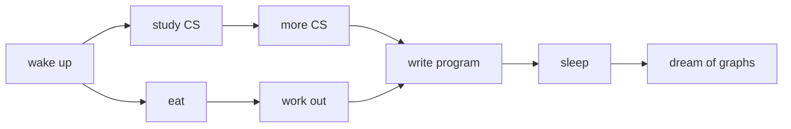

#### Topological Sort by Removing Sinks

One simple algorithm repeatedly removes a vertex with **no outgoing edges** (a "sink"), assigns it the highest remaining number, and deletes it. Because numbers are assigned from $n$ down to $1$, every edge ends up pointing from a smaller number to a larger number.

```text
Algorithm TopologicalSort(G):
    H = G                              // a disposable copy of G
    n = G.numVertices()
    while H is not empty:
        let v be a vertex of H with no outgoing edges
        label v with number n
        n = n - 1
        remove v from H
```

This runs in $O(n + m)$ time. If at some point no vertex without outgoing edges exists while `H` is non-empty, the graph has a cycle and is not a DAG.

#### Topological Sort via DFS

The same result comes naturally from DFS: when a vertex finishes (all its descendants are processed), assign it the next-highest available number. Numbering vertices in *decreasing* order of DFS finish time yields a topological order.

```text
Algorithm topologicalDFS(G):
    n = G.numVertices()
    for all u in G.vertices():
        setLabel(u, UNEXPLORED)
    for all v in G.vertices():
        if getLabel(v) = UNEXPLORED:
            topologicalDFS(G, v)

Algorithm topologicalDFS(G, v):
    setLabel(v, VISITED)
    for all outgoing edges e of v:
        w = opposite(v, e)
        if getLabel(w) = UNEXPLORED:    // discovery edge
            topologicalDFS(G, w)
        // else e is a forward or cross edge; ignore
    label v with topological number n
    n = n - 1
```

Here is a complete, runnable Java implementation using DFS finish order:

```java
import java.util.*;

public class TopologicalSort {
    public static <V> List<V> sort(Map<V, List<V>> outAdj) {
        Set<V> visited = new HashSet<>();
        Deque<V> finished = new ArrayDeque<>(); // acts like a stack
        for (V v : outAdj.keySet())
            if (!visited.contains(v))
                visit(v, outAdj, visited, finished);
        return new ArrayList<>(finished); // already in topological order
    }

    private static <V> void visit(V v, Map<V, List<V>> outAdj,
                                  Set<V> visited, Deque<V> finished) {
        visited.add(v);
        for (V w : outAdj.getOrDefault(v, List.of()))
            if (!visited.contains(w))
                visit(w, outAdj, visited, finished);
        finished.push(v); // pushed only after all descendants finish
    }

    public static void main(String[] args) {
        Map<String, List<String>> g = new LinkedHashMap<>();
        g.put("wake",  List.of("eat", "study"));
        g.put("eat",   List.of("workout"));
        g.put("study", List.of("program"));
        g.put("workout", List.of("program"));
        g.put("program", List.of("sleep"));
        g.put("sleep", List.of());
        System.out.println(sort(g));
    }
}
```

#### Topological Sort Worked Example

Imagine the "typical student day" DAG: wake up, then eat and study computer science, then work out and do more CS, eventually write a program, sleep, and dream about graphs. A valid topological numbering assigns earlier numbers to prerequisites: wake up = 1, then its successors get larger numbers, and "dream about graphs" - which depends on everything before it - gets the largest number. Any ordering that respects all the "before" arrows is a correct answer; topological orderings are generally not unique.

### Weighted Graphs and Shortest Paths

In a **weighted graph**, each edge carries a numerical value called its **weight**. Weights can represent distances, costs, travel times, or capacities. In a flight-route graph, an edge weight might be the mileage between two airports.

The **length** of a path is the sum of the weights of its edges. Given a weighted graph and two vertices `u` and `v`, the **shortest path problem** asks for a path of minimum total length between them. Applications are everywhere: Internet packet routing, flight reservations, and driving directions.

Two structural properties make efficient algorithms possible:

- **Property 1:** A subpath of a shortest path is itself a shortest path. (If the best route from Providence to Honolulu passes through Chicago, then the portion from Providence to Chicago must be the best route between *those* two.)
- **Property 2:** There is a *tree* of shortest paths from a start vertex to all other vertices - the shortest-path tree.

### Dijkstra's Algorithm

**Dijkstra's algorithm** computes the shortest-path distance from a single source `s` to every other vertex. It assumes the graph is connected, the edges are undirected, and crucially that **all edge weights are nonnegative**.

#### The Cloud Intuition

Dijkstra grows a "cloud" of finalized vertices, starting with just `s` and expanding until it covers all vertices. With each vertex `v` we store a label $d(v)$, the length of the best path to `v` found so far using only the cloud and its immediate fringe. At each step we do two things: we add to the cloud the **non-cloud vertex with the smallest $d$ label**, and then we **relax** the edges out of that newly added vertex to possibly improve its neighbors' labels.

This is a **greedy** strategy: once a vertex enters the cloud with the smallest tentative distance, that distance is provably final.

#### Edge Relaxation

The core operation is **edge relaxation**. Consider an edge $e = (u, z)$ where `u` was just added to the cloud and `z` is not yet in it. Relaxing `e` updates `z`'s label:

$$d(z) \leftarrow \min\{\, d(z),\; d(u) + \text{weight}(e)\,\}$$

In words: "Is it cheaper to reach `z` through `u` than by the best route I knew before? If so, update." For instance, if $d(u) = 50$, $d(z) = 75$, and $\text{weight}(e) = 10$, then relaxing gives $d(z) = \min\{75, 60\} = 60$.

#### Dijkstra Pseudocode

```text
Algorithm Dijkstra(G, s):
    for all vertices v:
        if v = s: setDistance(v, 0)
        else:     setDistance(v, +infinity)
    Q = priority queue of all vertices, keyed by distance
    while Q is not empty:
        u = Q.removeMin()          // smallest-distance non-cloud vertex
        for all edges e incident to u with opposite vertex z still in Q:
            if d(u) + weight(e) < d(z):
                d(z) = d(u) + weight(e)   // relax
                Q.updateKey(z, d(z))
```

#### Dijkstra in Java

```java
import java.util.*;

public class Dijkstra {
    public static class Edge {
        int to; int weight;
        Edge(int to, int weight) { this.to = to; this.weight = weight; }
    }

    // Returns the shortest distance from source to every vertex.
    public static int[] shortestPaths(List<List<Edge>> adj, int source) {
        int n = adj.size();
        int[] dist = new int[n];
        Arrays.fill(dist, Integer.MAX_VALUE);
        dist[source] = 0;

        // Min-heap ordered by current best distance.
        PriorityQueue<int[]> pq =
            new PriorityQueue<>(Comparator.comparingInt(a -> a[1]));
        pq.add(new int[]{source, 0});

        while (!pq.isEmpty()) {
            int[] top = pq.poll();
            int u = top[0], d = top[1];
            if (d > dist[u]) continue;          // stale entry, skip
            for (Edge e : adj.get(u)) {
                int nd = d + e.weight;          // candidate distance
                if (nd < dist[e.to]) {
                    dist[e.to] = nd;            // relax
                    pq.add(new int[]{e.to, nd});
                }
            }
        }
        return dist;
    }
}
```

#### Dijkstra Worked Example

Start with source $A$ at distance $0$ and all others at $\infty$. We add $A$ to the cloud and relax its edges, giving its neighbors tentative distances (say $C = 2$, $B = 3$, ...). We then repeatedly pull out the smallest-labeled vertex, add it to the cloud, and relax its outgoing edges, watching labels shrink as better routes are discovered. For example a vertex initially labeled $11$ might drop to $8$ once a shorter detour is relaxed. The algorithm finalizes vertices in increasing order of distance, and when the queue empties every label holds the true shortest-path distance.

#### Why Dijkstra Works (and Why Nonnegativity Matters)

Dijkstra is greedy: it finalizes vertices in increasing distance order. Suppose, for contradiction, it produced a wrong distance, and let `F` be the *first* vertex finalized with an incorrect label. Consider the true shortest path to `F`, and let `D` be the vertex just before `F` on that path. When `D` was finalized its label was correct (since `F` was the first mistake), and at that moment the edge $(D, F)$ was relaxed - which would have set `F`'s label correctly. So `F` cannot actually be wrong, contradicting the assumption. Hence there is no wrong vertex.

This argument depends entirely on **nonnegative weights**. With a negative edge, a vertex already finalized in the cloud could later be reached more cheaply through a negative edge added afterward, breaking the "finalize in increasing order" guarantee. The slides give exactly such a case: a vertex `C` finalized with $d(C) = 5$ whose true distance is $1$ via a later negative edge.

#### Dijkstra Analysis

Each vertex is inserted and removed from the priority queue once at $O(\log n)$ each. Each edge can trigger a key change, also $O(\log n)$, and there are $O(m)$ such relaxations (since $\sum_v \deg(v) = 2m$). Therefore Dijkstra runs in $O((n + m)\log n)$ time with an adjacency list and a heap-based priority queue. For a connected graph this simplifies to $O(m \log n)$.

### Bellman-Ford Algorithm

The **Bellman-Ford algorithm** (not in the textbook but covered in the course) solves single-source shortest paths even when edges have **negative weights**. It assumes directed edges - with undirected negative edges you would get negative-weight cycles, which make "shortest path" undefined.

The central idea: iteration $i$ finds all shortest paths that use at most $i$ edges. Since a shortest path in a graph with $n$ vertices uses at most $n - 1$ edges, running $n - 1$ rounds of relaxing *every* edge guarantees convergence.

```text
Algorithm BellmanFord(G, s):
    for all vertices v:
        if v = s: setDistance(v, 0)
        else:     setDistance(v, +infinity)
    for i = 1 to n - 1:
        for each edge e in G.edges():
            u = G.origin(e)
            z = G.opposite(u, e)
            r = getDistance(u) + weight(e)
            if r < getDistance(z):
                setDistance(z, r)         // relax
```

```java
import java.util.*;

public class BellmanFord {
    public static class Edge {
        int from, to, weight;
        Edge(int from, int to, int weight) {
            this.from = from; this.to = to; this.weight = weight;
        }
    }

    // Returns distances, or null if a negative-weight cycle is detected.
    public static int[] shortestPaths(int n, List<Edge> edges, int source) {
        long[] dist = new long[n];
        Arrays.fill(dist, Long.MAX_VALUE);
        dist[source] = 0;

        for (int i = 1; i <= n - 1; i++) {          // n-1 rounds
            for (Edge e : edges) {
                if (dist[e.from] != Long.MAX_VALUE
                        && dist[e.from] + e.weight < dist[e.to]) {
                    dist[e.to] = dist[e.from] + e.weight;
                }
            }
        }
        // One more pass: any further improvement means a negative cycle.
        for (Edge e : edges) {
            if (dist[e.from] != Long.MAX_VALUE
                    && dist[e.from] + e.weight < dist[e.to]) {
                return null; // negative-weight cycle exists
            }
        }
        int[] result = new int[n];
        for (int i = 0; i < n; i++) result[i] = (int) dist[i];
        return result;
    }
}
```

Bellman-Ford runs in $O(nm)$ time - slower than Dijkstra - but it tolerates negative weights and, with one extra relaxation pass, can **detect a negative-weight cycle**: if any distance still improves on the $n$-th pass, a negative cycle is reachable.

#### Dijkstra Versus Bellman-Ford

| Property | Dijkstra | Bellman-Ford |
| :--- | :---: | :---: |
| Negative weights | No | Yes |
| Detects negative cycle | No | Yes |
| Edge direction assumption | Undirected, nonnegative | Directed |
| Strategy | Greedy | Dynamic programming |
| Time complexity | $O(m \log n)$ | $O(nm)$ |

### Minimum Spanning Trees

Given a connected, weighted, undirected graph, a **minimum spanning tree (MST)** is a spanning tree whose total edge weight is the smallest possible. Recall a spanning tree connects all $n$ vertices using exactly $n - 1$ edges and no cycles; the MST is the *cheapest* way to do so. Applications include designing communication and transportation networks where you want to connect everything at minimum cost.

Two properties drive every MST algorithm.

#### The Cycle Property

Let $T$ be an MST of a weighted graph $G$. Let $e$ be an edge of $G$ not in $T$, and let $C$ be the cycle formed by adding $e$ to $T$. Then for every edge $f$ of $C$, $\text{weight}(f) \le \text{weight}(e)$.

The proof is by contradiction: if some $f$ on the cycle had $\text{weight}(f) > \text{weight}(e)$, we could swap - remove $f$ and add $e$ - and obtain a spanning tree of *smaller* total weight, contradicting that $T$ is minimum. Intuitively, the heaviest edge on any cycle is never forced into the MST.

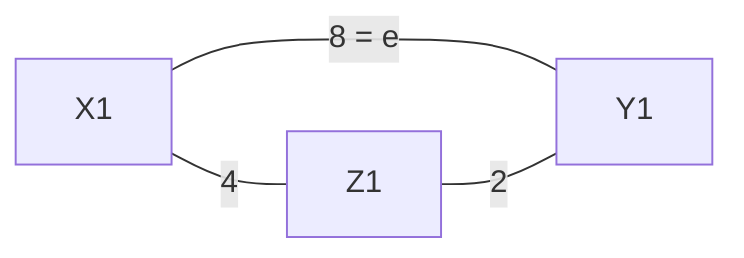

#### The Partition Property

Consider any partition of the vertices into two non-empty subsets $U$ and $V$. Let $e$ be a minimum-weight edge crossing the partition (one endpoint in $U$, one in $V$). Then there is an MST of $G$ that contains $e$.

The proof: take any MST $T$. If it does not already contain $e$, adding $e$ creates a cycle $C$ which must cross the partition at some other edge $f$. By the cycle property $\text{weight}(f) \le \text{weight}(e)$, but since $e$ is the *minimum* crossing edge $\text{weight}(e) \le \text{weight}(f)$, so they are equal and we may swap $f$ for $e$ to get another MST containing $e$. This property is the engine behind both Prim's and Kruskal's correctness: it is always safe to take the cheapest edge crossing any cut.

### Prim-Jarnik Algorithm

The **Prim-Jarnik algorithm** builds an MST much like Dijkstra builds a shortest-path tree. Pick an arbitrary start vertex `s` and grow the MST as a cloud, starting from `s`. With each vertex `v` we store a label $d(v)$ representing the **smallest weight of any edge connecting `v` to a vertex already in the cloud**. At each step we add the non-cloud vertex with the smallest label, then update its neighbors' labels.

Notice the one-word difference from Dijkstra: where Dijkstra's label is "distance from source," Prim's label is "weight of the cheapest single edge into the cloud." This is exactly the partition property applied repeatedly - each step adds the minimum-weight edge crossing the cut between the cloud and the rest.

```text
Algorithm PrimJarnik(G, s):
    for all vertices v:
        if v = s: setLabel(v, 0)
        else:     setLabel(v, +infinity)
        setParent(v, null)
    Q = priority queue of all vertices, keyed by label
    while Q is not empty:
        u = Q.removeMin()          // cheapest edge into the cloud
        for all edges e = (u, z) with z still in Q:
            if weight(e) < d(z):
                d(z) = weight(e)   // update label
                setParent(z, u)
                Q.updateKey(z, d(z))
    return the parent links as the MST
```

```java
import java.util.*;

public class PrimJarnik {
    public static class Edge {
        int to, weight;
        Edge(int to, int weight) { this.to = to; this.weight = weight; }
    }

    // Returns the total weight of the MST starting from vertex 0.
    public static int mstWeight(List<List<Edge>> adj) {
        int n = adj.size();
        boolean[] inTree = new boolean[n];
        int[] best = new int[n];                 // cheapest edge into the tree
        Arrays.fill(best, Integer.MAX_VALUE);
        best[0] = 0;
        PriorityQueue<int[]> pq =
            new PriorityQueue<>(Comparator.comparingInt(a -> a[1]));
        pq.add(new int[]{0, 0});
        int total = 0;

        while (!pq.isEmpty()) {
            int[] top = pq.poll();
            int u = top[0], w = top[1];
            if (inTree[u]) continue;             // already absorbed
            inTree[u] = true;
            total += w;                          // add this edge's weight
            for (Edge e : adj.get(u)) {
                if (!inTree[e.to] && e.weight < best[e.to]) {
                    best[e.to] = e.weight;       // partition property
                    pq.add(new int[]{e.to, e.weight});
                }
            }
        }
        return total;
    }
}
```

#### Prim-Jarnik Analysis

The analysis is identical in shape to Dijkstra's. Each vertex enters and leaves the priority queue once ($O(\log n)$ each), and each edge can cause at most one key change ($O(\log n)$), with $O(m)$ edges total since $\sum_v \deg(v) = 2m$. Hence Prim-Jarnik runs in $O((n + m)\log n) = O(m \log n)$ time on a connected graph with an adjacency list.

### Kruskal's Algorithm

**Kruskal's algorithm** approaches the MST from the edges rather than the vertices. The idea is to maintain a partition of the vertices into **clusters**:

- Initially every vertex is its own singleton cluster, and each cluster has a trivial MST (no edges).
- A priority queue stores all the edges, keyed by weight (smallest first), with the edge itself as the element.
- Repeatedly extract the lightest remaining edge. If its two endpoints are in *different* clusters, accept the edge (it merges the two clusters and their partial MSTs); if they are already in the *same* cluster, discard it (it would form a cycle).
- When only one cluster remains, its tree is the MST.

This is again the partition property in action: the lightest edge crossing the cut between any two clusters is safe to add. The crucial operation - "are these two endpoints in the same cluster, and if not, merge their clusters" - is precisely what the **union-find** data structure provides efficiently.

```text
Algorithm Kruskal(G):
    sort all edges by increasing weight (or use a min priority queue)
    initialize each vertex as its own cluster (makeSet)
    T = {}                                  // MST edge set
    for each edge (u, v) in nondecreasing weight order:
        if find(u) != find(v):              // different clusters?
            add (u, v) to T
            union(u, v)                      // merge the clusters
        if T has n - 1 edges: break
    return T
```

```java
import java.util.*;

public class Kruskal {
    public static class Edge implements Comparable<Edge> {
        int u, v, weight;
        Edge(int u, int v, int weight) { this.u = u; this.v = v; this.weight = weight; }
        public int compareTo(Edge o) { return Integer.compare(this.weight, o.weight); }
    }

    public static int mstWeight(int n, List<Edge> edges) {
        Collections.sort(edges);                 // lightest first
        UnionFind uf = new UnionFind(n);
        int total = 0, used = 0;
        for (Edge e : edges) {
            if (uf.find(e.u) != uf.find(e.v)) {  // no cycle created
                uf.union(e.u, e.v);
                total += e.weight;
                if (++used == n - 1) break;      // tree complete
            }
        }
        return total;
    }
}
```

#### Kruskal Worked Example

Consider a campus map with weighted edges. Kruskal sorts every edge by weight and walks through them lightest to heaviest. It grabs the cheapest edge, then the next cheapest, and so on, skipping any edge whose endpoints already sit in the same cluster (because that would close a cycle). After a handful of accept/reject decisions, exactly $n - 1$ edges have been accepted and all vertices belong to a single cluster - that cluster's edges form the minimum spanning tree.

#### Prim Versus Kruskal

| Aspect | Prim-Jarnik | Kruskal |
| :--- | :--- | :--- |
| Grows | One cloud from a start vertex | Many clusters merging together |
| Picks next edge | Cheapest edge leaving the cloud | Globally cheapest unused edge |
| Core data structure | Priority queue of vertices | Sorted edges + union-find |
| Time complexity | $O(m \log n)$ | $O(m \log n)$ |
| Best when | Graph is dense | Graph is sparse / edges pre-sorted |

### Union-Find (Disjoint Set) Structures

The **union-find** (also called *disjoint-set* or *partition*) structure maintains a collection of disjoint sets and supports three operations. It is exactly the engine Kruskal needs to track clusters.

- `makeSet(x)` creates a singleton set containing element `x` and returns the position storing `x`.
- `union(A, B)` returns the set $A \cup B$, destroying the old sets `A` and `B`.
- `find(p)` returns the set (or its representative) containing the element at position `p`.

#### List-Based Implementation

In the simplest version each set is a sequence stored as a linked list, and each node stores its element together with a reference to its set's name. `find` is $O(1)$ (follow the reference to the set name), but `union` must relabel every element of the smaller set, which can be slow.

#### Tree-Based Implementation

The standard efficient version stores each element in a node that holds a pointer to a *set name*. A node whose pointer points back to itself is the **representative** (root) of its set. Each set is therefore a tree rooted at its self-referencing node.

- To perform `union`, simply make the root of one tree point to the root of the other - an $O(1)$ pointer change.
- To perform `find`, follow set-name pointers from the starting node up to the root (the node pointing to itself) and return it.

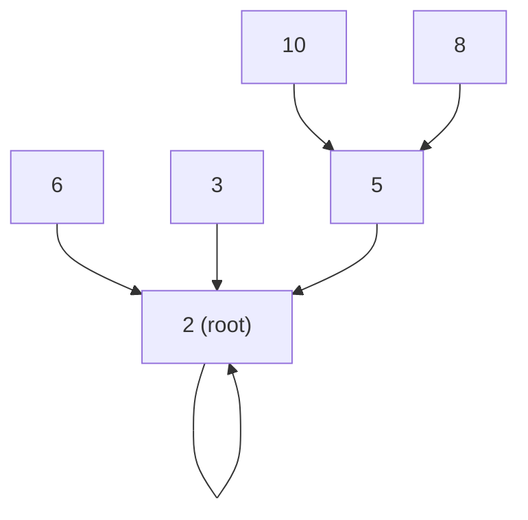

Without any optimization, trees can become long chains and `find` can degrade to $O(n)$. Two heuristics fix this.

#### Heuristic 1: Union by Size

When performing a `union`, always make the root of the **smaller** tree point to the root of the **larger** tree. This keeps trees shallow. The argument: every time you follow a pointer during a `find`, you move into a subtree at least double the size of the previous one, so you can follow at most $O(\log n)$ pointers. Consequently, performing $n$ union-find operations costs $O(n \log n)$ time.

#### Heuristic 2: Path Compression

After performing a `find`, **compress** the path you just traversed so that every node on it points directly to the root. This flattens the tree, so future finds on those nodes are nearly instantaneous. Combined with union by size, performing $n$ union-find operations costs $O(n \log^* n)$ time, where $\log^*$ (the iterated logarithm) grows so slowly it is effectively a small constant for any realistic input.

```java
public class UnionFind {
    private final int[] parent; // parent[i] = parent of i; root points to itself
    private final int[] size;   // size of the tree rooted at i

    public UnionFind(int n) {
        parent = new int[n];
        size = new int[n];
        for (int i = 0; i < n; i++) {
            parent[i] = i;   // makeSet: each element is its own root
            size[i] = 1;
        }
    }

    // find with path compression
    public int find(int x) {
        while (parent[x] != x) {
            parent[x] = parent[parent[x]]; // point to grandparent (compress)
            x = parent[x];
        }
        return x;
    }

    // union by size
    public void union(int a, int b) {
        int ra = find(a), rb = find(b);
        if (ra == rb) return;              // already in the same set
        if (size[ra] < size[rb]) { int t = ra; ra = rb; rb = t; }
        parent[rb] = ra;                   // smaller tree hangs under larger
        size[ra] += size[rb];
    }
}
```

### Putting It All Together

This final comparison ties the chapter's algorithms into one view. Here $n$ is the number of vertices and $m$ the number of edges; all time bounds assume an adjacency-list representation unless noted.

| Algorithm | Problem solved | Key data structure | Time complexity |
| :--- | :--- | :--- | :---: |
| BFS | Traversal, min-edge paths, components | Queue | $O(n + m)$ |
| DFS | Traversal, cycles, paths, components | Stack / recursion | $O(n + m)$ |
| Topological sort | Order a DAG by precedence | DFS finish order | $O(n + m)$ |
| Strong connectivity test | Is a digraph strongly connected? | DFS (twice) | $O(n + m)$ |
| Transitive closure | All-pairs reachability | Floyd-Warshall DP | $O(n^3)$ |
| Dijkstra | Single-source shortest paths ($w \ge 0$) | Min priority queue | $O(m \log n)$ |
| Bellman-Ford | Single-source shortest paths (any $w$) | Edge relaxation rounds | $O(nm)$ |
| Prim-Jarnik | Minimum spanning tree | Min priority queue | $O(m \log n)$ |
| Kruskal | Minimum spanning tree | Sorted edges + union-find | $O(m \log n)$ |
| Union-Find | Maintain disjoint sets | Forest + heuristics | $O(\log^* n)$ amortized |

A few connecting themes are worth internalizing. BFS and DFS are the two atoms; almost everything else is a specialization of one of them via the template-method pattern. Dijkstra and Prim-Jarnik are structurally the *same* greedy "grow a cloud, relax the fringe" algorithm - they differ only in what the vertex label means (distance from source versus cheapest single connecting edge). Kruskal and Prim solve the identical MST problem but from opposite directions (global cheapest edges versus one growing cloud), and Kruskal's efficiency hinges entirely on union-find. Finally, the recurring $O(n + m)$ bound across traversal algorithms is a direct consequence of the handshaking lemma $\sum_v \deg(v) = 2m$.

These notes cover all material from Goodrich Chapter 14 as taught in COMP202. Good luck studying.


## 17. Sorting - Comprehensive Study Notes

This section teaches the entire sorting chapter from scratch using only this document. Sorting is the act of rearranging a sequence so its elements follow a total order (smallest to largest, by default). It is one of the most studied problems in computing because so many other tasks - searching, deduplicating, finding medians, detecting duplicates, merging datasets - become easy once data is sorted. The source is Goodrich, Tamassia & Goldwasser, *Data Structures and Algorithms in Java*, 6th edition, Chapter 13, as used in COMP202.

We will build up from the simple quadratic sorts (selection and insertion), move to the fast $O(n \log n)$ sorts (heap, merge, quick), prove that no comparison-based sort can beat $O(n \log n)$, and finish with the related **selection problem** (finding the k-th smallest element) which can be solved in $O(n)$ expected time.

### Sorting via Priority Queues

A surprising unifying idea: **any priority queue gives you a sorting algorithm for free.** This is called **PQ-Sort**. The recipe has two phases:

1. **Phase 1 - insert everything.** Take each element out of the input sequence `S` and `insert` it into a priority queue `P`.
2. **Phase 2 - remove in order.** Repeatedly call `removeMin` on `P` and append the result back to `S`. Because a priority queue always hands back the smallest remaining key, the elements come out sorted.

```java
// PQ-Sort: sort the list S using any PriorityQueue P
static <E> void pqSort(List<E> S, PriorityQueue<E> P) {
    int n = S.size();
    for (int i = 0; i < n; i++) P.insert(S.remove(0)); // Phase 1
    for (int i = 0; i < n; i++) S.add(P.removeMin());  // Phase 2
}
```

The running time depends entirely on **which priority queue you plug in**. This single observation generates three classic sorts:

| Backing priority queue | Phase 1 cost | Phase 2 cost | Resulting sort | Total |
| :--- | :--- | :--- | :--- | :--- |
| Unsorted list | $O(n)$ (each insert O(1)) | $O(n^2)$ (each removeMin scans) | **Selection sort** | $O(n^2)$ |
| Sorted list | $O(n^2)$ (each insert shifts) | $O(n)$ (each removeMin O(1)) | **Insertion sort** | $O(n^2)$ |
| Binary heap | $O(n \log n)$ | $O(n \log n)$ | **Heap sort** | $O(n \log n)$ |

The work is just shuffled between the two phases depending on whether the priority queue does its sorting effort on the way in or on the way out.

### Selection Sort

**Selection sort is PQ-sort with an unsorted-list priority queue.** Inserting is cheap (just append, $O(1)$), so Phase 1 is $O(n)$. But every `removeMin` must scan the whole unsorted collection to *find* the minimum, costing $1 + 2 + \dots + n = O(n^2)$ over Phase 2. The name comes from this scanning: each step **selects** the smallest remaining element.

```java
// In-place selection sort on an int array
static void selectionSort(int[] a) {
    int n = a.length;
    for (int i = 0; i < n - 1; i++) {
        int min = i;                       // index of smallest in a[i..n-1]
        for (int j = i + 1; j < n; j++)
            if (a[j] < a[min]) min = j;     // scan to find the minimum
        int tmp = a[min]; a[min] = a[i]; a[i] = tmp; // swap it into place
    }
}
```

Worked example on input `(7, 4, 8, 2, 5, 3, 9)` - Phase 2 repeatedly pulls the current minimum out of the unsorted PQ:

```text
Sorted output | Remaining unsorted PQ
()            | (7,4,8,2,5,3,9)
(2)           | (7,4,8,5,3,9)
(2,3)         | (7,4,8,5,9)
(2,3,4)       | (7,8,5,9)
(2,3,4,5)     | (7,8,9)
(2,3,4,5,7)   | (8,9)
(2,3,4,5,7,8) | (9)
(2,3,4,5,7,8,9) | ()
```

Selection sort always does $\Theta(n^2)$ comparisons regardless of input order (the scan happens no matter what), but it does at most $n - 1$ swaps - useful when writes are far more expensive than reads.

### Insertion Sort

**Insertion sort is PQ-sort with a sorted-list priority queue.** Now the effort flips: each `insert` must find the right slot in a sorted list and shift elements over, costing $1 + 2 + \dots + n = O(n^2)$ in Phase 1, while Phase 2 is a trivial $O(n)$ because the minimum is always at the front. Intuitively, you grow a sorted prefix and **insert** each new element into its correct position within it - exactly how most people sort a hand of playing cards.

```java
// In-place insertion sort on an int array
static void insertionSort(int[] a) {
    for (int i = 1; i < a.length; i++) {
        int key = a[i], j = i - 1;
        while (j >= 0 && a[j] > key) {  // shift larger elements right
            a[j + 1] = a[j];
            j--;
        }
        a[j + 1] = key;                 // drop key into the gap
    }
}
```

Worked example showing the sorted prefix (in brackets) growing one element at a time on `(7, 4, 8, 2, 5)`:

```text
[7] 4 8 2 5      start: first element is a trivial sorted prefix
[4 7] 8 2 5      insert 4 before 7
[4 7 8] 2 5      8 already in place
[2 4 7 8] 5      insert 2 at the front (shifts 4,7,8 right)
[2 4 5 7 8]      insert 5 between 4 and 7
```

Insertion sort has a crucial practical virtue: it is **adaptive**. On nearly-sorted input the inner `while` loop rarely runs, giving close to $O(n)$ behaviour. This is why real-world libraries fall back to insertion sort for small or almost-sorted subarrays. Both selection and insertion sort are **in-place** (only $O(1)$ extra memory) and are good choices for small data sets (under ~1000 elements).

### Selection Versus Insertion Sort

| Property | Selection sort | Insertion sort |
| :--- | :--- | :--- |
| PQ implementation | Unsorted list | Sorted list |
| Effort concentrated in | Phase 2 (removeMin scans) | Phase 1 (insert shifts) |
| Best case | $O(n^2)$ (always scans) | $O(n)$ (already sorted) |
| Worst case | $O(n^2)$ | $O(n^2)$ (reverse sorted) |
| Adaptive to sortedness? | No | Yes |
| Number of swaps | $O(n)$ | $O(n^2)$ |
| In-place? | Yes | Yes |

### Heap Sort Revisited

The third PQ-sort uses a **binary heap** as the priority queue. Because both `insert` and `removeMin` are $O(\log n)$ on a heap, both phases cost $O(n \log n)$, giving an overall $O(n \log n)$ sort - a dramatic improvement over the quadratic sorts. (The heap data structure and its sift-up/sift-down mechanics are covered in detail in the Heap section above.)

Two refinements make heap sort excellent in practice. First, Phase 1 can use **bottom-up heap construction** (`heapify`), which builds the heap in $O(n)$ rather than $O(n \log n)$ - it does not change the asymptotic total but speeds up the constant. Second, heap sort can be made **in-place**: store the heap in the input array itself, use a max-heap, and after each `removeMax` place the extracted maximum into the slot just vacated at the end of the array. This needs only $O(1)$ extra space.

```java
// In-place heap sort using a max-heap region a[0..end]
static void heapSort(int[] a) {
    int n = a.length;
    for (int i = n / 2 - 1; i >= 0; i--) siftDown(a, i, n);   // build max-heap, O(n)
    for (int end = n - 1; end > 0; end--) {
        int t = a[0]; a[0] = a[end]; a[end] = t;              // move max to the back
        siftDown(a, 0, end);                                   // restore heap on a[0..end-1]
    }
}

static void siftDown(int[] a, int i, int n) {
    while (2 * i + 1 < n) {
        int child = 2 * i + 1;                                 // left child
        if (child + 1 < n && a[child + 1] > a[child]) child++; // pick larger child
        if (a[i] >= a[child]) break;
        int t = a[i]; a[i] = a[child]; a[child] = t;
        i = child;
    }
}
```

Heap sort is fast, in-place, and not recursive, but it is **not stable** (equal elements may be reordered) and tends to have worse cache behaviour than merge or quick sort because it jumps around the array.

### Merge Sort

Merge sort is the first of two **divide-and-conquer** sorts. The divide-and-conquer paradigm has three steps: **divide** the input into smaller subproblems, **recur** to solve each subproblem, then **conquer** by combining the sub-solutions. For merge sort:

1. **Divide:** split the sequence `S` of `n` elements into two halves `S1` and `S2` of about `n/2` each.
2. **Recur:** recursively merge-sort `S1` and `S2`.
3. **Conquer:** **merge** the two sorted halves into one sorted sequence.

The base case is a sequence of size 0 or 1, which is already sorted.

```java
// Merge sort on an int array (uses a temporary array for merging)
static void mergeSort(int[] a) {
    if (a.length < 2) return;            // base case
    int mid = a.length / 2;
    int[] left  = Arrays.copyOfRange(a, 0, mid);
    int[] right = Arrays.copyOfRange(a, mid, a.length);
    mergeSort(left);                     // recur on left half
    mergeSort(right);                    // recur on right half
    merge(left, right, a);               // conquer: merge back into a
}

// Merge two sorted arrays into out
static void merge(int[] L, int[] R, int[] out) {
    int i = 0, j = 0, k = 0;
    while (i < L.length && j < R.length)
        out[k++] = (L[i] <= R[j]) ? L[i++] : R[j++]; // take the smaller front element
    while (i < L.length) out[k++] = L[i++];          // drain remaining left
    while (j < R.length) out[k++] = R[j++];          // drain remaining right
}
```

The **merge** step is the heart of the algorithm. Given two already-sorted sequences, you walk a pointer along each and repeatedly emit the smaller of the two front elements. Because each comparison emits one element, merging two halves of total size `n` takes exactly $O(n)$ time. Note `<=` (not `<`) in the comparison: taking from the left on ties is what makes merge sort **stable**.

#### Merge Sort Recursion Tree

An execution of merge sort is captured by a binary **merge-sort tree**: each node is one recursive call, holding the unsorted sequence on the way down and the sorted sequence on the way back up. Here is the tree for `(7, 2, 9, 4)`:

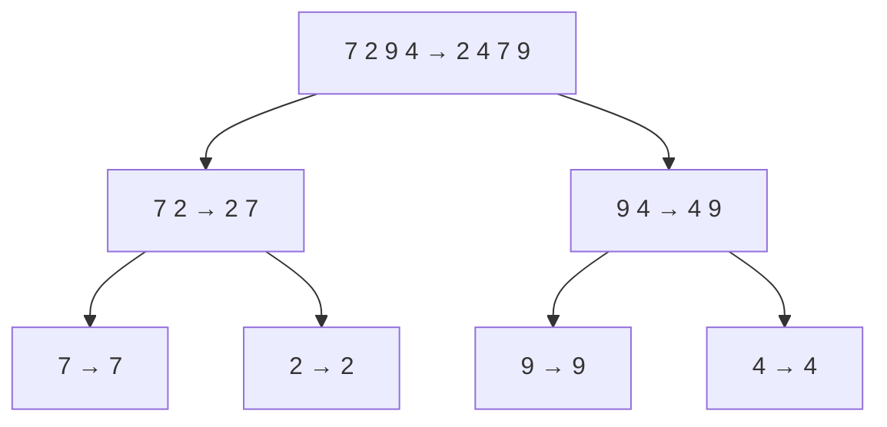

Reading top-down shows the **divide** phase splitting until singletons; reading bottom-up shows the **conquer** phase merging pairs back into sorted runs. Here is a fuller trace on eight elements, showing only the final merged result at each level:

```text
Level 0 (input):  7 2 9 4 3 8 6 1
Level 1 (split):  [7 2 9 4]      [3 8 6 1]
Level 2 (split):  [7 2][9 4]     [3 8][6 1]
Level 3 (leaves): 7 2 9 4 3 8 6 1
Merge up:         [2 7][4 9]     [3 8][1 6]
Merge up:         [2 4 7 9]      [1 3 6 8]
Merge up (root):  1 2 3 4 6 7 8 9
```

#### Merge Sort Analysis

Why is merge sort $O(n \log n)$? Look at the recursion tree. Its **height** is $O(\log n)$ because each level halves the sequence size, and you can only halve `n` down to 1 about $\log_2 n$ times. At **each level** of the tree, the total merging work across all nodes is $O(n)$: at depth `i` there are $2^i$ subsequences each of size $n / 2^i$, and merging them all touches every element once. Multiply the per-level cost $O(n)$ by the number of levels $O(\log n)$ and you get $O(n \log n)$.

Formally this is the recurrence

$$T(n) = \begin{cases} b & \text{if } n \le 1 \\ 2T(n/2) + bn & \text{if } n > 1 \end{cases}$$

where the $2T(n/2)$ is the two recursive calls and the $+bn$ is the linear-time merge. Solving by iterative substitution (repeatedly plugging the recurrence into itself) gives $T(n) = bn + bn \log n$, which is $O(n \log n)$.

Unlike heap sort, merge sort accesses data **sequentially** rather than jumping around, which makes it ideal for sorting data that lives on disk or in a stream, and for **external sorting** of datasets too large to fit in memory. Its one drawback is that the standard implementation needs $O(n)$ extra space for the temporary arrays.

### Quick Sort

Quick sort is the other divide-and-conquer sort, but it flips merge sort's strategy: it does the hard work **before** recursing rather than after. It is a **randomized** algorithm following a divide-and-conquer paradigm:

1. **Divide (partition):** pick a random element `x` from `S` called the **pivot**, and split `S` into three groups - `L` (elements less than `x`), `E` (elements equal to `x`), and `G` (elements greater than `x`).
2. **Recur:** recursively quick-sort `L` and `G`. (`E` is already in its final place.)
3. **Conquer:** concatenate `L`, then `E`, then `G`. Because everything in `L` is smaller than everything in `E`, which is smaller than everything in `G`, simple concatenation yields a sorted sequence - **there is no merge step.**

```java
// Simple quick sort using three lists (clear, not in-place)
static List<Integer> quickSort(List<Integer> S) {
    if (S.size() < 2) return S;
    int pivot = S.get(new Random().nextInt(S.size()));  // random pivot
    List<Integer> less = new ArrayList<>(), eq = new ArrayList<>(), gr = new ArrayList<>();
    for (int y : S) {                                    // partition
        if (y < pivot) less.add(y);
        else if (y == pivot) eq.add(y);
        else gr.add(y);
    }
    List<Integer> result = new ArrayList<>(quickSort(less)); // recur on L
    result.addAll(eq);                                       // E in the middle
    result.addAll(quickSort(gr));                            // recur on G
    return result;
}
```

#### Quick Sort Tree and Worked Example

Like merge sort, an execution is depicted by a binary tree, but now each node stores the sequence and its **pivot**, and the work (partitioning) happens on the way *down*. Trace `(7, 4, 9, 6, 2)` with pivots chosen as shown:

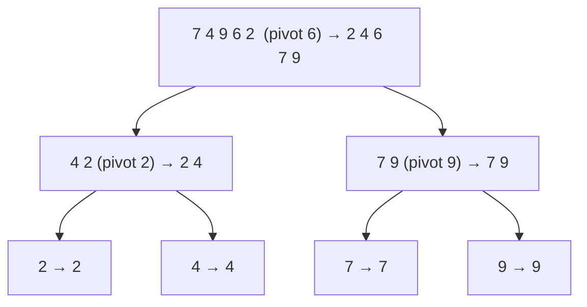

```text
Partition (7 4 9 6 2) on pivot 6:  L=(4 2)  E=(6)  G=(7 9)
  Partition (4 2) on pivot 2:      L=()     E=(2)  G=(4)      → 2 4
  Partition (7 9) on pivot 9:      L=(7)    E=(9)  G=()       → 7 9
Concatenate: (2 4) + (6) + (7 9) = 2 4 6 7 9
```

#### Quick Sort Analysis

The partition step is $O(n)$ (one pass to split into L, E, G). The total time depends on how **balanced** the splits are - which depends on pivot luck.

The **worst case** is $O(n^2)$. It happens when the pivot is always the minimum or maximum element, so one of `L`/`G` has size $n - 1$ and the other is empty. The recursion depth becomes `n`, and the work is $n + (n-1) + \dots + 2 + 1 = O(n^2)$. For a fixed (non-random) pivot like "always first element," already-sorted input triggers exactly this disaster - which is precisely why we pick the pivot **randomly**.

The **expected case** is $O(n \log n)$. Call a partition a **good call** if both `L` and `G` have size at most $3s/4$ (where `s` is the current size). A randomly chosen pivot is good with probability $1/2$, since half of the possible pivots fall in the middle range. A probabilistic argument shows the expected depth before the size shrinks by a constant factor is constant, so the expected tree height is $O(\log n)$, and with $O(n)$ work per level the expected total is $O(n \log n)$. In practice, quick sort is usually the **fastest** comparison sort because its inner loop is extremely tight and cache-friendly.

#### Quick Sort In-Place Partitioning

The list-based version above is clear but wastes memory. The classic in-place version partitions a subarray using **two indices that scan toward each other**, swapping out-of-place pairs. With pivot `x`:

```text
Scan j rightward until you find an element > x (it belongs on the right but is on the left).
Scan k leftward until you find an element < x (it belongs on the left but is on the right).
If j and k have not crossed, swap a[j] and a[k]; otherwise stop.
```

```java
// In-place quick sort on a[lo..hi]
static void quickSort(int[] a, int lo, int hi) {
    if (lo >= hi) return;
    int pivot = a[lo + new Random().nextInt(hi - lo + 1)];
    int i = lo - 1, j = hi + 1;
    while (true) {
        do { i++; } while (a[i] < pivot);   // scan right for an element >= pivot
        do { j--; } while (a[j] > pivot);   // scan left for an element <= pivot
        if (i >= j) break;
        int t = a[i]; a[i] = a[j]; a[j] = t; // swap the out-of-place pair
    }
    quickSort(a, lo, j);                     // recur on left part
    quickSort(a, j + 1, hi);                 // recur on right part
}
```

This brings the extra space down to $O(\log n)$ for the recursion stack, with no auxiliary arrays. The trade-off versus merge sort: quick sort is in-place and usually faster, but it is **not stable** and has an $O(n^2)$ worst case (made unlikely, not impossible, by randomization).

### Comparison-Based Sorting Lower Bound

We have several $O(n \log n)$ sorts. A natural question: **can we do better?** For **comparison-based** sorts - algorithms that only learn about elements by asking "is $x_i < x_j$?" (this includes selection, insertion, heap, merge, and quick sort) - the answer is **no**. $\Omega(n \log n)$ is a hard floor.

The proof uses a **decision tree**. Imagine the algorithm as a binary tree where each internal node is one comparison "$x_i < x_j$?" and the two branches are the yes/no outcomes. Each distinct run of the algorithm traces one root-to-leaf path, and each leaf corresponds to one specific output ordering (permutation) of the input.

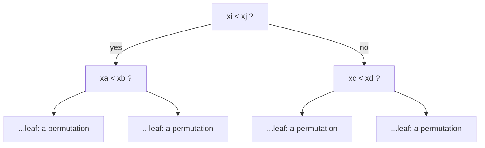

Here is the key counting argument. There are $n!$ possible orderings of `n` distinct elements, and **every one must lead to a different leaf** - if two different input permutations reached the same leaf, the algorithm would produce the same output for both, and at least one would be wrong. So the decision tree must have at least $n!$ leaves. A binary tree with $n!$ leaves has height at least $\log_2(n!)$. Since the height equals the worst-case number of comparisons, and

$$\log(n!) \ge \log\left(\frac{n}{2}\right)^{n/2} = \frac{n}{2}\log\frac{n}{2} = \Omega(n \log n),$$

**any** comparison-based sort must make $\Omega(n \log n)$ comparisons in the worst case. Heap sort and merge sort therefore hit this bound exactly - they are asymptotically optimal. (Non-comparison sorts like counting sort or radix sort can beat this bound, but only by exploiting special structure in the keys rather than comparing them.)

### The Selection Problem and Quick-Select

A close cousin of sorting is the **selection problem**: given `n` elements and an integer `k`, find the **k-th smallest element** (for `k = 1` this is the minimum; for `k = n/2` it is the median). You could sort in $O(n \log n)$ and index position `k` - but we can do better.

**Quick-select** adapts quick sort's partition idea using a **prune-and-search** paradigm. Partition around a random pivot into `L`, `E`, `G` exactly as in quick sort, then recurse into **only one** part based on where `k` falls:

```text
Let the k-th smallest be the target.
If k <= |L|:               recurse into L looking for the k-th smallest.
If |L| < k <= |L| + |E|:   the answer is the pivot itself (it sits at these ranks). Done.
If k > |L| + |E|:          recurse into G looking for the (k - |L| - |E|)-th smallest.
```

```java
// Return the k-th smallest (1-indexed) element of list S
static int quickSelect(List<Integer> S, int k) {
    int pivot = S.get(new Random().nextInt(S.size()));
    List<Integer> less = new ArrayList<>(), eq = new ArrayList<>(), gr = new ArrayList<>();
    for (int y : S) {
        if (y < pivot) less.add(y);
        else if (y == pivot) eq.add(y);
        else gr.add(y);
    }
    if (k <= less.size()) return quickSelect(less, k);              // answer in L
    if (k <= less.size() + eq.size()) return pivot;                // answer is the pivot
    return quickSelect(gr, k - less.size() - eq.size());           // answer in G
}
```

The crucial difference from quick sort is that quick-select **recurses into just one side**, not both. This single change drops the expected running time to $O(n)$. The intuition: the work shrinks geometrically. With good pivots the size falls by a constant factor each time, so the total expected work is $n + \frac{3}{4}n + (\frac{3}{4})^2 n + \dots$, a geometric series that sums to $O(n)$. The worst case is still $O(n^2)$ (consistently terrible pivots), but a more advanced **median-of-medians** pivot strategy - divide into groups of 5, find each group's median, then recursively select the median of those medians as the pivot - guarantees $O(n)$ even in the worst case.

### Sorting Algorithms Summary

| Algorithm | Time (worst) | Time (typical) | In-place? | Stable? | Best use case |
| :--- | :--- | :--- | :--- | :--- | :--- |
| Selection sort | $O(n^2)$ | $O(n^2)$ | Yes | No | Tiny inputs; minimizing swaps |
| Insertion sort | $O(n^2)$ | $O(n)$ if nearly sorted | Yes | Yes | Small or nearly-sorted inputs |
| Heap sort | $O(n \log n)$ | $O(n \log n)$ | Yes | No | Large inputs, guaranteed bound |
| Merge sort | $O(n \log n)$ | $O(n \log n)$ | No ($O(n)$ extra) | Yes | Huge / external / linked data |
| Quick sort | $O(n^2)$ | $O(n \log n)$ expected | Yes ($O(\log n)$ stack) | No | General-purpose, fastest in practice |

A few themes tie this chapter together. Selection, insertion, and heap sort are all the *same* PQ-sort algorithm with three different priority queues - the choice of data structure alone determines whether you get a quadratic or an $O(n \log n)$ sort. Merge sort and quick sort are mirror images of divide-and-conquer: merge sort splits trivially and works hard to combine, while quick sort works hard to split and combines trivially. The $\Omega(n \log n)$ decision-tree lower bound proves merge and heap sort are optimal among comparison sorts. And quick sort's partition routine, recursing into one side instead of two, becomes quick-select, solving the selection problem in linear expected time.

These notes cover all material from Goodrich Chapter 13 as taught in COMP202. Good luck studying.


## Quick-Reference Complexity Summary

| Structure | Access/Find | Insert | Delete | Min | Space |
| :--- | :--- | :--- | :--- | :--- | :--- |
| Array | O(1) by index | O(n) | O(n) | O(n) | O(n) |
| Singly LL | O(n) | O(1) head | O(1) head / O(n) tail | O(n) | O(n) |
| Doubly LL | O(n) | O(1) w/ node ref | O(1) w/ node ref | O(n) | O(n) |
| ArrayList | O(1) by index | O(1) amort end / O(n) mid | O(n) | O(n) | O(n) |
| Positional List | O(1) w/ position / O(n) by value | O(1) | O(1) | O(n) | O(n) |
| Stack | O(1) top only | O(1) | O(1) | - | O(n) |
| Queue | O(1) front only | O(1) | O(1) | - | O(n) |
| PQ (sorted list) | O(1) min | O(n) | O(1) min | O(1) | O(n) |
| PQ (unsorted list) | O(n) min | O(1) | O(n) min | O(n) | O(n) |
| Heap | O(1) min only | O(log n) | O(log n) min | O(1) | O(n) |
| BST (balanced) | O(log n) | O(log n) | O(log n) | O(log n) | O(n) |
| Hashtable | O(1) avg | O(1) avg | O(1) avg | O(n) | O(n) |
