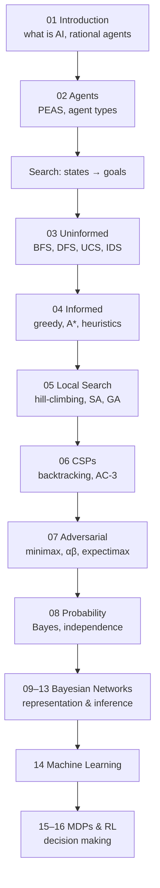
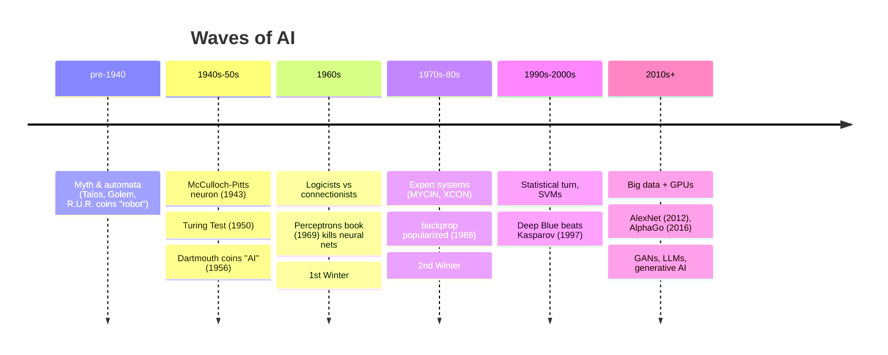

# 01 - Introduction to AI
**Koç University | Asst. Prof. Barış Akgün**

> **What this is.** A map of the whole course. COMP341 is a *broad* tour of classical, mathematically-grounded AI — search, constraint satisfaction, probabilistic reasoning, and decision-making — rather than a deep dive into any one area. Modern commercial AI is mostly deep learning, but this course deliberately builds the foundations that deep learning sits on top of.

The one framing idea that ties everything together: **AI is the science of building agents that act rationally** — that choose actions to maximize expected utility given what they know. Every technique in the course is a different way of computing that action when the state space is too large to brute-force.

## Course Arc

The progression is deliberate. Search assumes the agent knows the exact state of a static, deterministic world. CSPs add structure to that search. Adversarial search adds an opponent. Probability (lecture 08 onward) finally drops the assumption of certainty, and MDPs/RL add uncertain action outcomes and learning on top.

## Topic Map

| # | Topic | What it answers | AIMA (4e / 3e) |
| :--- | :--- | :--- | :--- |
| 01–02 | Introduction & Agents | What is AI? What is a rational agent? | 1–2 / 1–2 |
| 03–07 | Search | What sequence of actions reaches my goal? | 3,4,6 / 3–5 |
| 06 | CSPs | What assignment satisfies all constraints? | 5 / 6 |
| 08–13 | Probability & Bayes Nets | What should I believe under uncertainty? | 12–15 / 13–15 |
| 14 | Machine Learning | How do I learn rules from data? | 19,21 / 18,20 |
| 15–16 | MDPs & RL | How do I act well under uncertain outcomes? | 16,23 / 16,17,21 |

The four problem families, in one line each

- **Search** — "I'm in a state, I want a goal state, actions move between states. What path gets me there?" The state space is a graph; the field is about searching it without enumerating it.
- **CSPs** — variables, domains, and constraints. Map coloring, Sudoku, scheduling. Solved by backtracking + constraint propagation.
- **Probabilistic reasoning** — the world is uncertain, so reason with degrees of belief. Bayes' rule updates belief on evidence; Bayesian networks compress huge joint distributions.
- **Decision making (MDPs/RL)** — sequential decisions where actions have *uncertain* outcomes. Find a policy maximizing expected discounted reward; RL learns it without knowing the model.

## 1 What is AI?

"Artificial Intelligence" is one of computing's most overloaded terms — it evokes robots, chess computers, voice assistants, and now LLMs. The field is mid-**tectonic-shift**: before ChatGPT, AI research leaned on narrow techniques (decision trees, SVMs, hand-crafted logic); after it, the public conversation is dominated by large generative models. So the honest definition is that **AI is an ever-changing field** — any definition you commit to today may feel incomplete in five years.

## 2 A Short History

The field moves in waves: a burst of optimism, then disappointment (an **"AI Winter"**), then a rebound on better math, data, or hardware.

Key milestones explained

- **McCulloch & Pitts (1943)** — first mathematical model of a neuron (a binary threshold unit computing AND/OR/NOT). Ancestor of all neural nets.
- **Turing Test (1950)** — sidesteps "can machines think?" with a behavioral criterion: if a judge can't tell machine from human in text conversation, it passes. The "act like a human" school.
- **Dartmouth (1956)** — workshop that *coined* the term "Artificial Intelligence" and founded the discipline.
- **Perceptron (1958)** / **Perceptrons book (1969)** — Rosenblatt's learning algorithm, then Minsky & Papert's proof that a single layer can't learn XOR — widely (mis)read as a death sentence for neural nets.
- **Backpropagation** — described by Linnainmaa (1970), popularized by Rumelhart/Hinton/Williams (1986); the engine of all deep nets, recognized a decade after invention.
- **Expert systems (70s–80s)** — IF-THEN rule bases + inference engine. Worked in narrow domains but broke on messy, incomplete real-world knowledge.
- **Statistical turn (90s)** — "given evidence, what's the probability of each hypothesis?" replaced brittle logic. SVMs briefly outshone neural nets.
- **Deep learning era (2010s+)** — the missing ingredients were *data* (ImageNet) and *hardware* (GPUs), not ideas. AlexNet (2012) cut ImageNet error ~40% and started the revolution; AlphaGo (2016) beat the world Go champion with deep RL + tree search.
- **Generative AI (2014+)** — GANs (Goodfellow 2014), text-to-image (DALL·E, Stable Diffusion), LLMs (GPT-3 2020, ChatGPT 2022), video (Sora 2024). Limitations remain: hallucination, weak common-sense/causal reasoning, poor low-resource-language performance, alignment needs.

## 3 Four Views of AI

AIMA organizes definitions along two axes — *thinking vs acting* and *humanly vs rationally*:

|            | **Humanly** | **Rationally** |
| :--- | :--- | :--- |
| **Thinking** | Think like a human (cognitive science) | Think rationally (laws of logic) |
| **Acting**   | Act like a human (Turing Test) | **Act rationally (rational agent)** ✅ |

- **Think humanly** — model the brain's actual processes. Problem: we don't understand how humans think.
- **Act humanly** — Turing Test. Problem: mimicry ≠ intelligence; not a good build target.
- **Think rationally** — Aristotle's logic, formal inference. Problem: hard to formalize messy knowledge; inference can be intractable; the world is uncertain, not true/false.
- **Act rationally** ← **the course's choice.** "What matters is how you act, not how you think." A thermostat acts rationally without thinking. This view is general, measurable, and dodges philosophy-of-mind dead-ends.

## 4 What "Rational" Means

> **Rationality** = achieving goals, measured by an external performance measure. To be rational is to **maximize expected utility**.

**Utility** is a numerical score of how good an outcome is (from economics). It must be **external** — defined by the designer, not the agent, or the agent could just declare victory. When outcomes are uncertain, the agent maximizes **expected utility** (the probability-weighted average), not certain utility.

Rationality is **not** omniscience. A rational agent does the best it can given limited information and computation — **bounded rationality**. A grandmaster who can't compute every game line but plays the best move they found is still acting rationally.

Example — a cleaning robot's utility

A kitchen-cleaning robot might combine four objectives into one number:

`U = α·cleanliness − β·time − γ·noise − δ·energy`

The weights encode the designer's priorities — a design choice that can't be automated away. The rational robot picks the action sequence maximizing U (or expected U when paths are uncertain, e.g. a shortcut that's faster but might get it stuck).

## 5 The Agent (preview)

An **agent** perceives its environment through **sensors** and acts on it through **actuators**. The framework is deliberately broad: a thermostat, a spam filter, a chess engine, a self-driving car, and a human are all agents.

| Agent | Percepts | Actions | Environment |
| :--- | :--- | :--- | :--- |
| Chess program | board state | move | chessboard |
| Spam filter | email content | spam / not-spam | inbox |
| Self-driving car | cameras, lidar, GPS | steer, throttle, brake | roads |

The agent's decision function maps **percept histories to actions**. The space of histories is astronomically large, which is *why AI is hard* — we can't tabulate every case, so we need algorithms that compute or learn the right action. [Lecture 02](02-Agents.md) develops this with the PEAS framework, the environment taxonomy, and the agent-type hierarchy.

## 6 Scope of This Course

COMP341 is a **broad** tour: search (uninformed, informed, adversarial), CSPs, probabilistic reasoning, MDPs, and reinforcement learning, with ML and modern AI covered conceptually. It is **not** a deep-learning course (see ENGR421 / COMP441 for that). Breadth-first by design: practitioners who only know deep learning are poorly equipped to reason about agent design and planning under uncertainty. The classical foundations are the scaffolding that makes the modern stuff comprehensible.

## Practicalities (brief)

- **Textbook:** Russell & Norvig, *Artificial Intelligence: A Modern Approach* (3rd or 4th edition — both fine). Slides are primary; the book is a companion.
- **Programming:** The UC Berkeley **Pacman Projects** in Python. You implement real algorithms (search, minimax, Q-learning) and an autograder scores them. Submit `.py` files — Jupyter is not supported because the game uses graphical output.
- **LLMs:** Allowed *if cited*; uncited use counts as plagiarism. LLMs hallucinate, and any bug you submit is yours — so use them as an assistant, not an oracle. Catching their mistakes requires understanding the material, which is the point.

> **What's next.** [02 — Agents](02-Agents.md): the formal agent loop, PEAS problem formulation, the six environment properties, and the ladder of agent types from simple reflex up to learning agents.

*Notes from Lectures 0–1 — COMP341, Koç University.*