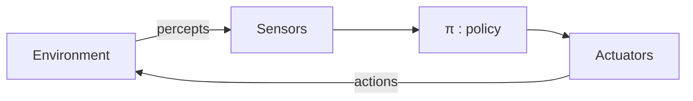
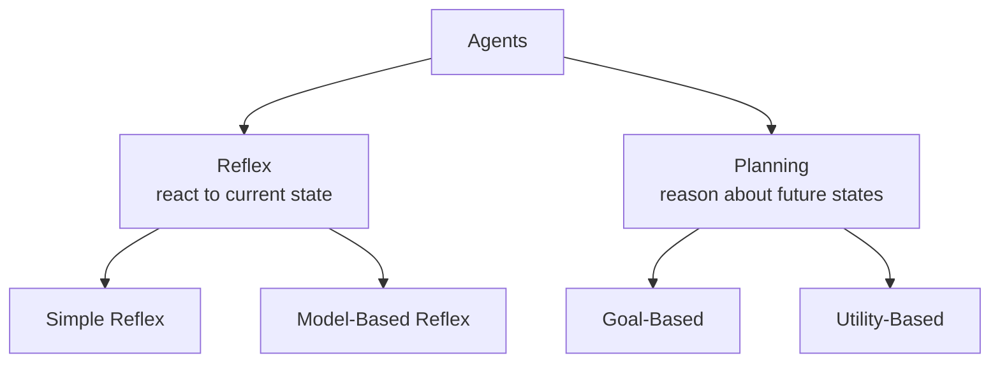
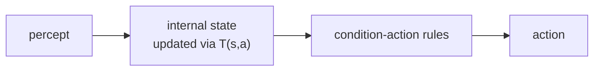
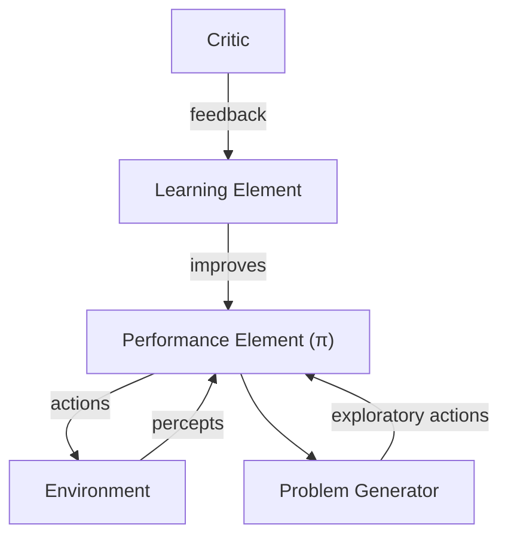

# 02 - Agents
**Koç University | Asst. Prof. Barış Akgün**

> **Where this fits.** [Lecture 01](01-Introduction.md) defined AI as building agents that *act rationally* and previewed the agent idea. This lecture makes it formal: how to specify an agent's problem (PEAS), how to classify its environment, and the ladder of agent designs from reflex to learning. The "planning agent" at the top of that ladder is exactly what the search lectures ([03](03-Uninformed-Search.md)+) implement.


## 1 The Agent Loop

An **agent** perceives its environment through **sensors** and acts through **actuators**. Its "brain" is a **policy** π that maps what it has seen to what it does.



| Term | Meaning |
| :--- | :--- |
| **Percept** | one sensory input at one moment |
| **Percept history** | the full sequence `[s₀, s₁, …, sₜ]` |
| **Action** | something done to affect the environment |
| **Policy π : H → A** | maps a history to an action |

Conceptually the agent runs forever: `sense → append to history → π(history) → act → repeat`.


## 2 Rationality (recap)

A **rational agent maximizes expected utility** — see [Lecture 01 §4](01-Introduction.md). Perfect rationality is impossible (incomplete information, limited compute, stochastic worlds), so the working goal is **bounded rationality**: do the best you can with the information and time available, like a grandmaster who can't search the whole game tree but plays well anyway.


## 3 Formulating a Problem: PEAS

Before building an agent, specify the problem with **PEAS**:

| Letter | Component | Question |
| :---: | :--- | :--- |
| **P** | Performance / Utility | How is success measured? |
| **E** | Environment | What world does it live in? |
| **A** | Actuators | What can it do? |
| **S** | Sensors | What can it perceive? |

<details>
<summary>Examples — vacuum robot & Pacman</summary>

**Vacuum robot:** P = % clean, time, energy · E = rooms A/B, dirty or clean · A = move left/right, suck · S = location, is-dirty.

**Pacman:** P = score (dot +10, ghost +200, death −500) · E = maze with walls, dots, capsules, ghosts · A = N/S/E/W/Stop · S = positions of pacman, ghosts (+ scared timers), food, score.

</details>

PEAS matters because **AI is only as good as the problem formulation**. A badly specified utility produces unintended behavior — the "reward hacking" problem in modern AI.


## 4 The Environment and Abstraction

The agent is *part of* its environment: its actions change the world, which produces new percepts, which drive future actions. You can't model every detail, so you **abstract** — keep only what's relevant. (Navigating Istanbul: roads matter, humidity doesn't.) The **state** is that abstracted, relevant description.

### Environment properties

| Dimension | Easy end | Hard end |
| :--- | :--- | :--- |
| Observability | **Fully** (see whole state, e.g. chess) | **Partially** (poker, driving) |
| Determinism | **Deterministic** (puzzle) | **Stochastic** (dice, weather) |
| Episodes | **Episodic** (classify one image) | **Sequential** (chess — decisions chain) |
| Change | **Static** (crossword) | **Dynamic** (driving); *semidynamic* = score changes with time |
| Values | **Discrete** (chess) | **Continuous** (robot joint angles) |
| Agents | **Single** (maze) | **Multi** (cooperative or competitive) |

The right end of each row is harder and dictates which algorithms apply. Most real-world problems sit on the hard end of several rows at once.


## 5 Why AI is Hard

The policy is `π : H → A` and the goal is `max E[U]`. The trouble is **combinatorial explosion**: a state→action lookup table is size `|S|×|A|`; a *history*→action table grows as `|S|^(t+1)·|A|` — exponential in time. Chess has ~10⁴³ positions; the universe ~10⁸⁰ atoms. You can never enumerate it. **All of AI is clever ways to represent and compute π without writing it all down** — via rules, learned functions, or search.

| Approach to π | Examples |
| :--- | :--- |
| Lookup table | toy problems only |
| Hand-coded rules | reflex agents, expert systems |
| Parameterized functions | neural nets, function approximation |
| Goal-directed search | planning, search algorithms |


## 6 The Agent-Type Hierarchy



The core split: **reflex** agents ask *"what's the world like now?"*; **planning** agents ask *"what would the world be like if I did X, then Y?"* Any of them can be **engineered**, **learned**, or a **mix**.

### Simple reflex
Acts on the **current percept only**, via condition–action rules (`IF dirty THEN suck`). No memory, no model. Works when the environment is fully observable and the task is memoryless. Brittle otherwise — a smoke detector, a basic thermostat.

### Model-based reflex
Keeps an **internal (belief) state** to cover what it can't currently see, updated with a **world model** (transition function `s' = T(s, a)`): how the world evolves and how the agent's actions change it.



This enables **one-step lookahead**: simulate each action's resulting state, score it, pick the best. Powerful under partial observability — the model fills the gaps.

<details>
<summary>One-step lookahead policy (pseudocode)</summary>

```python
def model_based_policy(state, world_model, eval_fn):
    best_action, best_score = None, float('-inf')
    for action in ACTIONS:
        next_state = world_model(state, action)   # s' = T(s, a)
        score = eval_fn(next_state)
        if score > best_score:
            best_action, best_score = action, score
    return best_action
```
Planning agents extend this from *one* step to *many*.

</details>

### Goal-based (planning)
Doesn't just react — **searches for a sequence of actions** reaching a goal state. Always needs a world model (to simulate futures without executing them). Example: GPS finding a route. Limitation: a binary goal can't distinguish *better* ways of reaching it (fastest vs scenic).

### Utility-based (planning)
Adds a **utility function U(s)** that scores states numerically, so the agent optimizes *quality*, not just goal-vs-not. It picks `argmaxₐ E[U(T(s,a))]`, handling trade-offs between competing objectives (time vs comfort vs fuel). This is the reflex-vs-planning distinction at its sharpest: reflex maps *current state* → action; planning maps *current state + simulated futures* → action.


## 7 Evaluating States: Feature Functions

When an agent scores a state, a common, interpretable form is a **weighted linear combination of features**:

$$J(x) = \sum_i w_i\, f_i(x)$$

where each `fᵢ(x)` is a number describing some aspect of state `x`, and `wᵢ` its importance. Weights are either **hand-tuned** or **learned** (later course material).

<details>
<summary>Pacman evaluation features & distance metrics</summary>

Features might be: Δscore (+), distance to nearest food (−), distance to nearest ghost (+, farther is safer), edible-ghost bonus (+).

Computing maze distances trades accuracy for cost: **Euclidean** `√(Δx²+Δy²)` and **Manhattan** `|Δx|+|Δy|` are cheap but ignore walls; **maze distance** (BFS shortest path) is exact but expensive. A cheap-but-wrong distance can mislead the agent.

</details>


## 8 Learning Agents

Where do the rules, weights, and models come from? Either **engineered** (hand-coded), **learned** (from experience), or **mixed**. A learning agent has four parts:



- **Performance element** — the policy π that picks actions.
- **Critic** — judges behavior against a standard ("good move" / "you died").
- **Learning element** — uses the critic's feedback to improve π.
- **Problem generator** — suggests exploratory (sometimes suboptimal) actions to gather information — the **exploration vs exploitation** trade-off.

This couples *acting* and *learning*: behavior generates experience, experience improves behavior. It's the skeleton of supervised learning (critic = labels), reinforcement learning (critic = reward), and unsupervised learning (no explicit critic). RL returns to this in [Lecture 16](16-Reinforcement-Learning.md).


## 9 Summary

| Concept | Formula |
| :--- | :--- |
| Policy | `π : H → A` |
| History | `H = [s₀, …, sₜ]` |
| Rationality | `max E[U]` |
| Transition (world model) | `s' = T(s, a)` |
| State evaluation | `J(x) = Σ wᵢ·fᵢ(x)` |

| Problem looks like… | Use… |
| :--- | :--- |
| Fully observable, simple rules | Simple reflex |
| Partially observable, no long planning | Model-based reflex |
| Need to reach a goal state | Goal-based (planning) |
| Optimize among competing objectives | Utility-based |
| Rules/parameters unknown | Learning agent |

The grand challenge restated: the state space — and the history space far more so — is exponentially large, so computing the optimal π exactly is intractable. **Every technique in this course fights that intractability** through search, approximation, learning, or clever representation.

> **What's next.** [03 — Uninformed Search](03-Uninformed-Search.md): the planning agent's core machinery. Formulate a problem as a state-space graph and search it with BFS, DFS, UCS, and iterative deepening — no domain knowledge required.

*Notes from Lecture 2 — COMP341, Koç University.*
