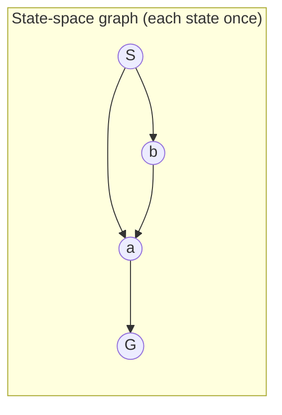

# 03 - Uninformed Search
**Course: COMP341 — Koç University | Asst. Prof. Barış Akgün**

> **Where this fits.** [Lecture 02](02-Agents.md) introduced the *planning agent*, which reasons about future states instead of just reacting. This lecture is its engine: formulate a problem as a state-space graph and **search** it for an action sequence to the goal. "Uninformed" means no domain knowledge about which states are closer to the goal — [Lecture 04](04-Informed-Search.md) adds that.


## 1 What Search Is

**Search**: look through a space of states to find one satisfying a goal, using actions, returning a *sequence of actions* (a plan). Key properties:

- The solution is a **plan**, not just an answer.
- Search is **offline** — the agent reasons over a **transition model**, simulating futures rather than trying actions for real. (Exploring a bad path in simulation is free and safe.)
- Actions may have **costs**.

A maze is the canonical example: each cell is a node, edges connect adjacent cells, and finding the food = finding a path. Note this is *only the navigation subproblem* — the full Pacman game also has ghosts, pellets, and scoring.

<details>
<summary>Data structures behind the algorithms</summary>

- **Stack (LIFO)** → Depth-First Search.
- **Queue (FIFO)** → Breadth-First Search.
- **Priority queue** (min-priority out) → Uniform Cost Search. Stacks and FIFO queues are just special-case priority queues.
- **Graph** — nodes + edges that may form cycles; a tree is an acyclic graph with one root.

</details>


## 2 Problem Formulation

A search problem has six parts:

| Component | Notation | Meaning |
| :--- | :--- | :--- |
| State space | S | all possible states |
| Action space | A | available actions |
| Transition model | T: S×A → S | successor of (state, action) |
| Action cost | d: S×A → ℝ | cost of an action |
| Start state | s₀ | where the agent begins |
| Goal test | g: S → {T,F} | is this a goal? |

A **solution** is a sequence of actions taking s₀ to a goal; its **cost** is the sum of action costs. For now we assume the world is **fully observable, static, discrete, and deterministic** — later lectures relax these.

<details>
<summary>Examples & the curse of scale</summary>

- **Vacuum robot:** 4 states `⟨location, status⟩`, actions {move, suck, noop}, costs noop 0 / move 1 / suck 2. Small enough to solve by hand.
- **Romania road trip:** states = cities, actions = drive to adjacent city, cost = km. A classic graph search.
- **Chess ≈ 2¹⁵⁵ states; Go ≈ 2⁵⁶⁵** (more than atoms in the universe). You cannot enumerate states or precompute solutions — you need **lazy** search that explores only what's needed.

</details>


## 3 State-Space Graph vs Search Tree

This distinction is the conceptual heart of the lecture.



- **State-space graph** — each state appears **exactly once**; arcs are transitions. Usually too large to build fully, but searchable lazily.
- **Search tree** — root is s₀; each node represents an **entire path** from the root. The **same state can appear many times** (one node per path to it). With cycles the tree can be **infinite** (S→a→b→S→a→…).

> Each node in the search tree is an entire *path* in the state-space graph. Expanding a node asks: "from the path ending here, what states are one action away?"

Both structures are built **on demand** — we only expand nodes we choose to explore.


## 4 The General Algorithm and the Frontier

Every uninformed algorithm shares one skeleton; they differ **only in how they pick the next node from the frontier**. The **frontier** (fringe / open list) holds discovered-but-not-yet-expanded leaf nodes.

```text
function TREE-SEARCH(problem):
    frontier ← {start state}
    loop:
        if frontier empty: return FAILURE
        node ← remove_chosen_leaf(frontier)   # ← the choice IS the algorithm
        if goal_test(node): return solution(node)
        add successors of node to frontier
```

| Remove which node? | Algorithm | Structure |
| :--- | :--- | :--- |
| deepest | DFS | LIFO stack |
| shallowest | BFS | FIFO queue |
| lowest path-cost g | UCS | priority queue |

**Evaluation vocabulary:** **completeness** (finds a solution if one exists), **optimality** (finds the least-cost one), **time** (nodes generated), **space** (max nodes in memory). Parameters: `b` branching factor, `d` shallowest-goal depth, `m` max depth (possibly ∞).


## 5 DFS and BFS

**DFS** — expand the deepest node first (stack); dive down a branch, backtrack at dead ends. **BFS** — expand the shallowest first (queue); explore level by level, like ripples.

| | Complete? | Optimal? | Time | Space |
| :--- | :--- | :--- | :--- | :--- |
| **DFS** (tree) | No (loops on cycles) | No | O(bᵐ) | **O(bm)** ✅ |
| **BFS** | Yes (finite b) | Yes *if equal costs* | O(b^d) | **O(b^d)** ✗ |

The trade-off is **space**. DFS only stores the current path → linear memory, its big advantage. BFS stores the whole frontier at depth d — at b=10, d=12 that's ~10¹² nodes (terabytes). **Memory kills BFS before time does.** DFS isn't optimal because it returns the first solution it stumbles on (maybe depth 10 when the best is depth 2); BFS is optimal only for equal costs because shallowest = cheapest *only then*.

<details>
<summary>Trace — DFS vs BFS on the same tree</summary>

Tree: A→{B,C}, B→{D,E}, C→{F,G}, D→{H,I}.

**DFS** fully explores B's subtree (down to H, I) before touching C: pop A → push C,B → pop B → push E,D → pop D → push I,H → pop H, I, E → pop C…

**BFS** explores all of depth 1 (B, C) before depth 2 (D, E, F, G): pop A → enqueue B,C → pop B → enqueue D,E → pop C → enqueue F,G → …

On the vacuum world: DFS found a 4-action plan expanding 4 states; BFS found a shorter 3-action plan but expanded 7. BFS pays in exploration for shorter solutions.

</details>


## 6 Depth-Limited and Iterative Deepening

Plain DFS loops forever on cycles. **Depth-limited DFS** fixes a limit L and treats depth-L nodes as leaves — complete only if `d ≤ L`, but you rarely know `d` in advance.

**Iterative Deepening Search (IDS)** removes the guesswork: run depth-limited DFS with L = 0, 1, 2, … until the goal is found.

```text
for L = 0, 1, 2, …:
    result = DEPTH_LIMITED_DFS(problem, L)
    if result ≠ CUTOFF: return result
```

IDS is the **best of both worlds**: BFS's completeness and optimality (equal costs) with DFS's linear space.

| IDS | Complete | Optimal (equal costs) | Time O(b^d) | Space O(bd) |
| :--- | :--- | :--- | :--- | :--- |

<details>
<summary>Isn't re-expanding wasteful? (the complexity proof)</summary>

IDS re-expands shallow nodes every iteration, but **most work is at the deepest level anyway**. Summing nodes across iterations and factoring out `b^d` gives `b^d · (1−1/b)⁻²` = **O(b^d)** — same as BFS, only a constant-factor overhead. For b=10, d=5: BFS ≈ 111,111 nodes, IDS ≈ 123,456 (≈ 11% more). The overhead is a small constant, not an asymptotic penalty.

</details>


## 7 Uniform Cost Search

BFS and IDS find the *shallowest* goal — cheapest only when all costs are equal. **UCS** expands the node with the lowest cumulative path cost **g(node)** first (priority queue). It's essentially **Dijkstra's algorithm** on the search tree.

| UCS | Complete (costs ≥ ε > 0) | Optimal (non-negative costs) | Time O(b^(C*/ε)) | Space O(b^(C*/ε)) |
| :--- | :--- | :--- | :--- | :--- |

Here C* is the optimal cost and ε the minimum action cost, so C*/ε is the effective depth in "cost tiers." UCS is still **uninformed** — it uses cost-so-far g(n) but no *estimate* of remaining cost. **If all costs equal 1, g(n) = depth and UCS reduces exactly to BFS.**

<details>
<summary>Trace — UCS finds the cheapest, not the shallowest</summary>

Edges: S→a 5, S→d 3, a→b 1, b→c 1, c→G 1, d→G 1.
Pop S(0) → push a(5), d(3). Pop d(3) → push G(4). Pop G(4): done, cost 4 via S→d→G — cheaper than any shallow-but-pricey route.

</details>


## 8 Graph Search: Avoiding Revisits

Tree search re-explores states and can loop forever. **Graph search** adds an **explored set** (closed list): skip any node whose state was already expanded. Any tree algorithm converts to a graph version this way.

The cost is memory: the explored set can hold the whole state space. For BFS/UCS that's fine (their frontiers are already exponential), but for **DFS it destroys the space advantage** — O(bm) becomes O(bᵐ).

> ⚠️ **Graph-search IDS is NOT optimal.** IDS deliberately re-explores nodes across iterations to stay cheap on memory; an explored set blocks the re-exploration a deeper iteration needs via a different path. **Rule:** use IDS in *tree* mode for bounded space + optimality; use graph search for BFS/UCS where memory is already exponential and cycle-avoidance matters.


## 9 One Algorithm, Many Frontiers

All of these are the *same* algorithm with different frontier priorities:

| Algorithm | Priority | Structure |
| :--- | :--- | :--- |
| BFS | shallowest | FIFO queue |
| DFS | deepest | LIFO stack |
| UCS | g(n) | min-heap |
| IDS | repeated DLS | stack + limit |

DFS and BFS just dodge the log-n priority-queue overhead with specialized structures.


## 10 Comparison & Takeaways

| Algorithm | Complete? | Optimal? | Time | Space |
| :--- | :--- | :--- | :--- | :--- |
| DFS (tree) | No | No | O(bᵐ) | O(bm) |
| DFS (graph) | Yes (finite) | No | O(bᵐ) | O(bᵐ) |
| BFS | Yes | Equal costs | O(b^d) | O(b^d) |
| Depth-Limited | Yes if L≥d | No | O(b^L) | O(bL) |
| IDS (tree) | Yes | Equal costs | O(b^d) | O(bd) |
| IDS (graph) | Yes | **No** | O(b^d) | O(b^d) |
| UCS | Yes | Non-neg costs | O(b^(C*/ε)) | O(b^(C*/ε)) |

**Choosing in practice:** tight memory + long paths → IDS (tree); varying costs → UCS; small problem → BFS/DFS; need cycle detection and memory allows → graph BFS/UCS; **never** graph-IDS if you need optimality.

Two ideas to carry forward: (1) search runs over a **model**, not the world — *your plan is only as good as your model*; (2) these algorithms are **blind** — they can't tell whether state A or B is closer to the goal.

> **What's next.** [04 — Informed Search](04-Informed-Search.md): give the search a **heuristic** `h(n)` estimating distance to the goal. Greedy search and A* use it to explore far fewer nodes while (for A*) still guaranteeing optimality.

*Notes from Lecture 3 — COMP341, Koç University.*
