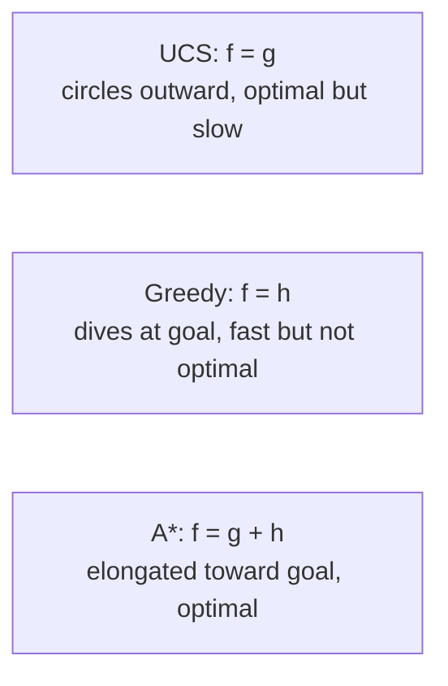
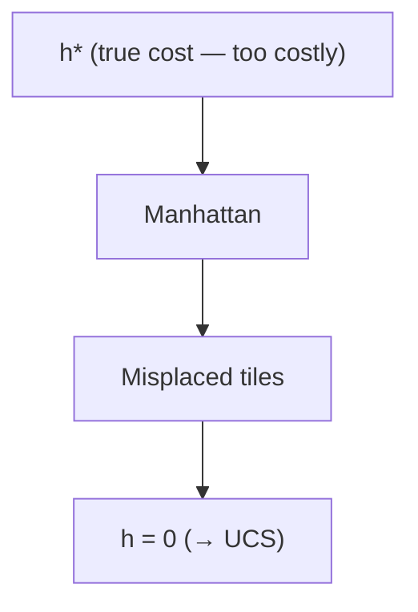

# 04 - Informed Search
**Course: COMP341 — Koç University | Asst. Prof. Barış Akgün**

> **Where this fits.** [Lecture 03](03-Uninformed-Search.md) searched *blind* — UCS expands outward in all directions like a circular wave, with no sense of where the goal is. This lecture adds a **heuristic** `h(s)` that estimates remaining cost, letting search aim at the goal. The headline result is **A***, and most of the work is designing good heuristics.


## 1 Heuristics and Evaluation Functions

A **heuristic** `h(s)` estimates the cost from `s` to the nearest goal. It is problem-specific, approximate, and must be **cheap to compute**. (Romania: straight-line distance to Bucharest. 8-puzzle: number of misplaced tiles.)

The frontier is always a **priority queue** keyed by an **evaluation function** `f(s)`. The choice of `f` *is* the algorithm:

| Symbol | Meaning |
| :--- | :--- |
| `g(s)` | backward cost — actual cost from start to `s` |
| `h(s)` | forward cost — *estimated* cost from `s` to goal |
| `h*(s)` | the **true** optimal cost from `s` to goal |

| Algorithm | `f(s)` |
| :--- | :--- |
| Uniform Cost Search | `g(s)` |
| Greedy Best-First | `h(s)` |
| **A\*** | **`g(s) + h(s)`** |


## 2 Greedy Best-First Search

`f(s) = h(s)` — always expand the node that *looks* closest to the goal, ignoring how far you've already traveled. Like a hiker always stepping in the most-uphill direction. Fast with a good heuristic (a "guided DFS"), but **not optimal** (ignores g, so it takes short-*looking* but expensive paths) and **not complete** in general (can chase a wrong branch forever). Worst case O(bᵐ) time and space.


## 3 A* Search

A* combines both worlds — UCS is safe but slow, greedy is fast but unsafe:

$$f(s) = g(s) + h(s) = \text{cost so far} + \text{estimated cost to go}$$

So `f(s)` estimates the total cost of the best solution *through* `s`. The node with lowest `f` is expanded first.



A* explores far fewer nodes than UCS (directional bias from h) yet finds optimal paths unlike greedy (it respects g). The better h is, the more "elongated toward the goal" the explored region becomes.

> **Termination rule:** stop only when the goal is **dequeued** (popped), never when first enqueued. When the goal is first added it may be via a suboptimal path; cheaper paths could still be pending in the frontier. Popping it guarantees no cheaper pending path exists (all have `f ≥ f(goal)`).


## 4 Admissibility → Optimality (Tree Search)

A heuristic is **admissible** if it never overestimates:

$$0 \le h(s) \le h^*(s)\quad\text{for all }s,\qquad h(\text{goal}) = 0$$

An admissible heuristic is **optimistic** — it never thinks the goal is harder to reach than it is. This makes `f(s)` a lower bound on the true solution cost through `s`, so A* never wrongly dismisses an optimal path.

**Examples:** straight-line distance (roads are never shorter than a straight line); misplaced tiles and Manhattan distance for the 8-puzzle; `h = 0` (trivially admissible, but reduces A* to UCS).

<details>
<summary>Proof: A* tree search is optimal with admissible h</summary>

Let A = optimal goal, B = a suboptimal goal, `n` = any unexpanded node on the optimal path to A (one must exist in the frontier since A isn't expanded yet).

1. `f(n) = g(n) + h(n) ≤ g(n) + h*(n) = cost(A)` — by admissibility.
2. `f(B) = g(B) + h(B) = g(B) = cost(B)` — since `h(B)=0`.
3. B suboptimal ⇒ `f(B) = cost(B) > cost(A) ≥ f(n)`.

So `f(n) < f(B)`: every node on the optimal path to A is expanded before B. A* finds A before ever expanding B. ∎

</details>


## 5 Consistency → Optimality (Graph Search)

Graph search marks states explored and never revisits — so if the *first* path to a state is suboptimal, we can get stuck with a wrong cost. The fix is a stronger property. A heuristic is **consistent** (monotone) if for every edge n→n':

$$h(n) \le \text{cost}(n, n') + h(n')$$

This is the **triangle inequality** for heuristics. Consequences:

1. **f never decreases along a path** (`f(n') ≥ f(n)`).
2. **Consistency ⟹ admissibility** (not the reverse).
3. **A\* graph search is optimal with a consistent h** — the first time a state is popped, it's already via its optimal path.

<details>
<summary>Admissible-but-inconsistent: what breaks, and the fix</summary>

State space: S→A 1, S→C 4, A→C 1, C→G 3. Heuristic h(A)=4, h(C)=2. Check arc A→C: `h(A)=4 ≤ cost(1)+h(C)=3`? **No** — inconsistent (though admissible).

Standard graph search reaches C via S→C (cost 4), marks it explored, then finds the cheaper S→A→C (cost 2) but **skips C** — missing the optimal path. **Fix:** allow re-expansion — if you find a cheaper path to an explored state, re-add it to the frontier.

```text
# A* graph search handling inconsistent heuristics
reached = {start: 0}                      # best known cost per state
frontier = PQ(start, f = h(start))
while frontier:
    node = frontier.pop()                 # min f = g + h
    if goal(node): return node            # pop, don't enqueue
    for child via action:
        c = reached[node] + cost(node, action, child)
        if child not in reached or c < reached[child]:
            reached[child] = c
            frontier.add(child, c + h(child))
```
With a consistent h the re-add never triggers.

</details>

| Property | A* tree | A* graph (consistent h) | A* graph (admissible h + re-expansion) |
| :--- | :--- | :--- | :--- |
| Complete | Yes | Yes | Yes |
| Optimal | if admissible | if consistent | Yes |
| Time | O(b^d), better with good h | — | — |
| Space | exponential (frontier in memory) | — | — |

**A*'s real weakness is space** — the frontier holds O(b^d) nodes; we usually run out of memory before time.


## 6 Designing Heuristics: Relaxed Problems

The most principled way to get an admissible heuristic: **solve a relaxed version** of the problem (remove constraints). Removing constraints can only make the optimum cheaper, so:

$$\text{cost}^*(\text{relaxed}) \le \text{cost}^*(\text{original}) \;\Rightarrow\; h = \text{cost}^*(\text{relaxed})\text{ is admissible.}$$

The tighter the relaxation (closer to the original), the more informative the heuristic.

<details>
<summary>8-puzzle case study — two heuristics</summary>

- **Misplaced tiles** — count tiles not in place. Relaxation: any tile may *teleport* to its goal. Admissible: each misplaced tile needs ≥1 move.
- **Manhattan distance** — sum each tile's `|Δrow|+|Δcol|`. Relaxation: tiles may *slide through each other*. Admissible: a tile needs ≥ its Manhattan distance in moves.

Nodes expanded (lower is better):

| optimal depth | UCS | Misplaced (A*) | Manhattan (A*) |
| ---: | ---: | ---: | ---: |
| 4 | 112 | 13 | 12 |
| 8 | 6,300 | 39 | 25 |
| 12 | 3,600,000 | 227 | 73 |

Manhattan wins everywhere because it carries more information (a tile 3 away contributes 3, not 1). A *perfect* heuristic `h = h*` would expand almost nothing — but computing it *is* the original problem (circular). Hence the trade-off: tighter heuristics cut node expansions but cost more per node.

</details>


## 7 Dominance and Combining Heuristics

`h_a` **dominates** `h_c` if `h_a(s) ≥ h_c(s)` for all `s` (both admissible). A more dominant heuristic expands fewer (⊆) nodes. Manhattan distance dominates misplaced tiles.



Free win: the **pointwise max of admissible heuristics is admissible and dominates both** — `h_max(s) = max(h_a(s), h_b(s))`.


## 8 Variants (when memory or structure helps)

- **Bidirectional A\*** — search forward from start and backward from goal; stop when frontiers meet. Each goes depth ~d/2, so `O(b^d) → O(b^(d/2))` — exponential savings. Needs an explicit goal, reversible actions, compatible heuristics.
- **IDA\*** — iterative deepening on **f-value cutoffs** instead of depth. Space O(d), optimal with admissible h. The go-to when you can't afford A*'s memory.
- **Beam search** — keep only the best `k` frontier nodes (bounds memory to O(k)); sacrifices completeness/optimality. Common in NLP/translation/speech.
- Others: **RBFS**, **SMA\*** (memory-bounded), **D\*** / **online A\*** (replan when the world changes), **learned heuristics**.

<details>
<summary>Why is AI search exponential when Dijkstra is O((V+E)log V)?</summary>

In data structures the graph is *given and stored*. In AI planning the graph is defined *implicitly* by a start state + actions and generated on the fly: `V = O(bᵐ)` states, `E = O(b^(m+1))` transitions. Plugging those into Dijkstra's formula is exponential in `m`. The blow-up is a property of the state space, not a failure of algorithm design — which is exactly why heuristics matter.

</details>


## 9 Summary

```text
f(s) = g(s) + h(s)                          A* evaluation
Admissible:  0 ≤ h(s) ≤ h*(s)               never overestimate
Consistent:  h(n) ≤ cost(n,n') + h(n')      triangle inequality
Dominance:   h_a ≥ h_c everywhere ⇒ fewer expansions
max(h_a, h_b) is admissible if both are
```

| Situation | Use |
| :--- | :--- |
| No heuristic, need optimality | UCS |
| No heuristic, just a path | DFS / BFS |
| Heuristic, care only about speed | Greedy |
| Admissible h, need optimality | A* (tree or graph) |
| Limited memory | IDA* / RBFS |
| Explicit goal, reversible actions | Bidirectional A* |

<details>
<summary>Self-test questions</summary>

1. How does A* differ from greedy? When do they coincide?
2. Why stop A* only on dequeue? Build an example where early stopping fails.
3. Is Manhattan distance consistent for the 8-puzzle? Prove or find a counterexample.
4. If h₁, h₂ admissible, which of `max`, `min`, `h₁+h₂` stay admissible?
5. What does A* become when `h = 0`? When `h = h*`?
6. Prove consistency ⟹ admissibility.

</details>

> **What's next.** [05 — Local Search](05-Local-Search.md): drop the *path* entirely. When you only care about the goal *state* (scheduling, layout, N-queens), explore by hill-climbing the evaluation landscape with O(1) memory.

*Notes from Lecture 4 — COMP341, Koç University.*
