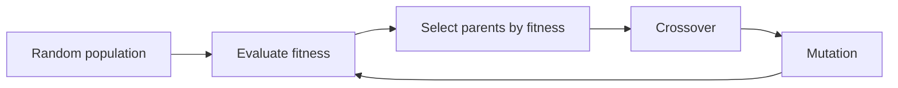

# 05 - Local Search
**Course: COMP341 — Koç University | Asst. Prof. Barış Akgün**

> **Where this fits.** [Lectures 03–04](03-Uninformed-Search.md) found a *path* from start to goal. But for many problems — scheduling, chip layout, N-queens — **you only care about the final state, not how you got there**. Local search exploits this: keep one state, iteratively improve it, use **O(1) memory**. The catch is it trades away completeness and optimality. This sets up [Lecture 06](06-CSPs.md), where local search (min-conflicts) solves constraint problems.


## 1 Classical vs Local Search

| | Classical search | Local search |
| :--- | :--- | :--- |
| Track | full path | only current state |
| Return | action sequence | best state found |
| Memory | O(b^d) | **O(1)** |
| Complete / Optimal | usually yes | usually **no** |

Formulation needs just three things: a **current state**, a **successor function** (neighbors), and an **evaluation function** (how good a state is). The algorithm: *move to a better neighbor, repeat.* These are **optimization problems** — maximize/minimize an objective where the path is irrelevant (IC design, factory layout, scheduling, TSP, portfolio allocation).


## 2 The State-Space Landscape

Plot every state on the x-axis and its evaluation on the y-axis: a **landscape** of hills and valleys. Local search climbs it — but you're climbing **in heavy fog with amnesia**: you only see your current spot and its neighbors.

```text
eval
 |        global max
 |          /\
 |   /\    /  \
 |  /  \  /    \
 | / loc \/     \___
 +----------------------> states
```

- **Global maximum** — the best state (the goal).
- **Local maximum** — better than all neighbors but not globally best (the villain).
- **Plateau / shoulder** — flat region; no uphill signal. A *shoulder* eventually leads up; a *flat local max* doesn't.
- **Ridge** — a narrow crest; every single step looks flat or downhill even though progress is possible along it.


## 3 Hill Climbing

Repeatedly move to the **best neighbor**; stop when none is better.

```text
function HILL-CLIMBING(problem):
    current = initial
    loop:
        neighbor = highest-valued successor of current
        if neighbor.value ≤ current.value: return current   # local max
        current = neighbor
```

Greedy, constant memory, no backtracking. **Not complete, not optimal** — it gets trapped at the three landscape features above.

<details>
<summary>N-queens formulation & reality check</summary>

State = one queen per column `[r₁,…,r_N]`; successor = move one queen within its column (N=8 → 56 successors); evaluation = number of attacking pairs (minimize). Empirically hill climbing solves 8-queens almost instantly but can get stuck. With **random restarts**, even N=100+ is solved in ~O(N) restarts, each converging fast — so it's practical despite no guarantees.

</details>


## 4 Escaping the Traps

| Variant | Idea | Best for |
| :--- | :--- | :--- |
| Steepest-ascent HC | always best neighbor | simple, fast |
| Stochastic HC | random *uphill* neighbor | avoids same local max |
| First-choice HC | first uphill neighbor found | huge branching factor |
| **Random-restart HC** | restart from random states, keep best | when local maxima are common |

- **Plateaus** → allow sideways moves to equal-value neighbors (with a cap to avoid infinite loops).
- **Local maxima** → **random restart** is *probabilistically complete*: enough restarts eventually start near the global max.


## 5 Simulated Annealing

Hill climbing never goes downhill — that's its fatal flaw. SA *occasionally* accepts downhill moves to escape local maxima, but accepts fewer over time so it still converges. Borrowed from metallurgy: heat a metal (atoms move freely, even "uphill"), then cool slowly so it settles into a low-energy crystal.

**Accept a worse move (ΔE < 0) with probability** `e^(ΔE/T)`:
- **High T** (early) → e^(small) ≈ 1 → accept almost anything (explore).
- **Low T** (late) → e^(large negative) ≈ 0 → almost only uphill (exploit).
- More-negative ΔE → lower acceptance → very bad moves are rarer than slightly bad ones.

```text
function SIMULATED-ANNEALING(problem, schedule):
    current = initial; t = 0
    loop:
        T = schedule(t); t += 1
        if T == 0: return current
        next = random successor of current
        ΔE = next.value − current.value
        if ΔE > 0: current = next                  # better: always accept
        else: current = next with probability e^(ΔE/T)   # worse: maybe
```

**Schedules:** logarithmic `T = d/log t` (theoretically optimal — globally optimal & probabilistically complete — but slow); geometric `T = α·T` with α≈0.99 (common, practical); linear (simple, easy to mis-tune). Used in VLSI design, protein folding, scheduling.


## 6 Local Beam Search

Track **k** states instead of one. Each round: generate all successors of all k states, keep the best k overall.

**Not the same as k independent hill climbers** — the k searches **share information**: good regions effectively recruit effort from the others, poor branches are abandoned. (k explorers who call the rest over when they strike gold.) **Problem:** the beam often **clusters** onto one hill, losing diversity. **Fix — stochastic beam search:** pick k successors randomly but biased toward better ones. This is the bridge to genetic algorithms.


## 7 Genetic Algorithms

GA = stochastic beam search where new states come from **pairs** of parents (crossover), not just mutation. Inspired by evolution: fitter individuals reproduce more, crossover mixes parents, mutation adds variety, the population improves over generations.



| GA term | Search meaning |
| :--- | :--- |
| individual / chromosome | a candidate state, encoded as a string |
| population | the current k states |
| fitness | evaluation function |
| selection | choose who reproduces (roulette, tournament) |
| crossover | combine two parents at a cut point |
| mutation | random small change |

**Requirement:** states must encode as **fixed-length strings** over some alphabet.

<details>
<summary>Crossover/mutation example & full pseudocode</summary>

Crossover at point 4: `parent1 = 1100|1101`, `parent2 = 0111|0010` → `child1 = 1100|0010`, `child2 = 0111|1101`. Mutation: flip each bit with small p (e.g. 0.01) — prevents premature convergence once the population looks alike.

```python
def genetic_algorithm(k, p_mut, max_gen):
    pop = [random_individual() for _ in range(k)]
    for _ in range(max_gen):
        fit = [fitness(i) for i in pop]
        if max(fit) >= goal_fitness:
            return pop[argmax(fit)]
        new = []
        while len(new) < k:
            p1, p2 = select(pop, fit), select(pop, fit)
            c1, c2 = crossover(p1, p2)
            new += [mutate(c1, p_mut), mutate(c2, p_mut)]
        pop = new[:k]
    return best(pop)
```

**8-queens:** encode `[r₁..r₈]`, fitness = 28 − attacking pairs (28 = max non-attacking pairs).

</details>

GAs shine when solutions encode as strings with meaningful **building blocks** (Schema Theorem), no gradient is available, and the landscape is highly multimodal. They struggle when the encoding hides structure or crossover disrupts good partial solutions (epistasis).


## 8 Gradient Descent / Ascent

Everything above is **derivative-free** (treats the objective as a black box). If `f(x)` is **differentiable** over continuous `x ∈ ℝⁿ`, use calculus directly. The **gradient** `∇f = (∂f/∂x₁,…,∂f/∂xₙ)` points uphill; `−∇f` points down.

$$x_{t+1} = x_t - \alpha\,\nabla f(x_t)\ \ (\text{descend}) \qquad x_{t+1} = x_t + \alpha\,\nabla f(x_t)\ \ (\text{ascend})$$

`α` is the **learning rate** (step size). Stop when steps or the gradient get tiny, or at an iteration cap. Not complete/optimal unless `f` is convex.

<details>
<summary>Extensions & computing the gradient</summary>

- **Newton–Raphson** — uses the Hessian: `x_{t+1} = x_t − H⁻¹∇f`; faster direction, expensive.
- **Momentum** — accumulate gradient history to glide through ravines.
- **Adaptive rates** — AdaGrad, RMSProp, Adam adjust α per dimension.
- **Gradient** computed **analytically** (exact, needs closed form) or **numerically** via finite differences `[f(x+εeᵢ)−f(x)]/ε` (any f, slow in high dimensions).

</details>

**Why it matters:** gradient descent is the **engine of neural-network training** — `x` = millions of weights, `f` = loss, gradient computed by **backpropagation**. The heart of modern ML.


## 9 Online Search (brief)

| | Plan | Execute |
| :--- | :--- | :--- |
| **Offline** (all of the above) | fully in advance | then act |
| **Online** | interleaved | act and discover as you go |

Online search suits **dynamic**, **non-deterministic**, or **hard-to-model** worlds — you only learn `s'` *after* acting. Challenges: irreversible actions, dead ends, safety (a robot can't "try" driving off a cliff). Local methods (hill climbing) work online (local info only); A* doesn't (it "jumps" around the space non-physically). **LRTA\*** brings A* ideas online by following `g+h` locally and **learning** (updating) `h` from experience to escape repeated dead ends.

> **Beyond classical search (preview):** *non-deterministic actions* need **contingency plans** (a tree: "if grasp succeeds … else …"); *partial observability* needs **belief states** (reason over a set/distribution of possible states). Both are developed later — belief states reappear with probability ([Lecture 08](08-Probability.md)) and HMMs.


## 10 Summary

| Algorithm | Idea | Complete | Optimal | Space |
| :--- | :--- | :--- | :--- | :--- |
| Hill climbing | best neighbor | No | No | O(1) |
| HC + random restart | restart from random | Prob. | No | O(1) |
| Simulated annealing | accept bad moves, cooling | Prob. (slow) | Prob. | O(1) |
| Local beam (k) | keep best k, shared | No | No | O(k) |
| Genetic algorithm | evolve population | No | No | O(k) |
| Gradient descent | follow ∇f | No | if convex | O(1) |

Key tensions: **exploitation vs exploration** (every algorithm balances them differently — SA's temperature, GA's mutation rate); **no free lunch** (no algorithm dominates all problems); and **gradient descent is king for differentiable objectives**.

> **What's next.** [06 — CSPs](06-CSPs.md): problems with explicit structure (variables, domains, constraints). That structure powers general-purpose backtracking heuristics and constraint propagation — and min-conflicts, a local search, solves million-queen problems in near-constant time.

*Notes from Lecture 5 — COMP341, Koç University.*
