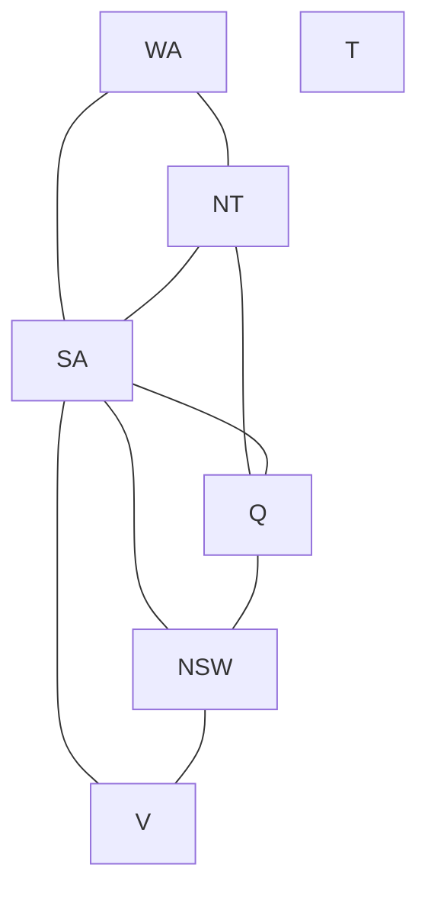

# 06 - Constraint Satisfaction Problems
**Course: COMP341 — Koç University | Asst. Prof. Barış Akgün**

> **Where this fits.** [Lectures 03–05](03-Uninformed-Search.md) treated the state as a **black box** — just a successor function and a goal test. CSPs instead expose **explicit structure** (variables, domains, constraints), and that structure powers *general-purpose* algorithms — smart ordering, constraint propagation, and the local-search method min-conflicts from [Lecture 05](05-Local-Search.md).


## 1 What is a CSP?

A CSP has three parts:

- **Variables** `X₁,…,Xₙ` — what we must assign (a region's color, a queen's row).
- **Domains** `Dᵢ` — legal values for each (`{red, green, blue}`).
- **Constraints** — allowed value combinations over subsets of variables (`WA ≠ NT`).

A **complete assignment** gives every variable a value; it's a **solution** if it violates no constraint. A **partial/legal assignment** assigns some variables without violation.

**Why this beats black-box search:** because the goal test and structure are explicit, we can build heuristics that work across *all* CSPs without per-problem engineering. (Like debugging: knowing the program checks variables against conditions lets you reason about which inputs pass, instead of trying every input.)

<details>
<summary>Examples — map coloring, N-queens, Sudoku, carpool, cryptarithmetic</summary>

- **Map coloring (Australia):** variables = regions, domain = {R,G,B}, constraints = adjacent regions differ. SA touches 5 regions → most constrained.
- **N-queens:** `Qₖ` = row of queen in column k; domain {1..N}; constraints `Qᵢ≠Qⱼ` and `|Qᵢ−Qⱼ|≠|i−j|` (one-per-column already kills the column constraint).
- **Sudoku:** variables = empty cells, domain {1..9}, alldiff on each row/column/3×3 box.
- **Carpool:** A,E,M,Z → {C1,C2} with `A=C1, Z=C2, A≠E, M=Z` → solution A=C1, E=C2, M=C2, Z=C2.
- **Cryptarithmetic** (SEND+MORE=MONEY): distinct digits per letter; constraints are **higher-order** (>2 variables).

</details>

### Constraint graph



Nodes = variables, edges = binary constraints. A **binary CSP** has constraints over at most 2 variables (map coloring is naturally binary). T (Tasmania) is isolated — no constraints.

<details>
<summary>Varieties of variables & constraints</summary>

- **Discrete finite** (map coloring, SAT — NP-complete): O(dⁿ) assignments. **Discrete infinite** (job scheduling over integers): need a constraint *language* like `Job1+5 < Job2`; linear solvable, nonlinear undecidable in general. **Continuous** (Hubble scheduling): linear programming solves linear cases in polynomial time.
- **Unary** (one variable — just prune the domain), **binary** (edges in the graph), **higher-order** (`alldiff`), and **soft constraints / preferences** (assign costs → constrained *optimization*, handled by local search).

</details>


## 2 CSP as Search → Backtracking

A CSP maps to standard search: initial state = empty assignment `{}`; successor = assign one unassigned variable a consistent value; goal = complete & all constraints satisfied; path cost = irrelevant.

Naively this gives `n!·dⁿ` leaves — needlessly worse than `dⁿ` because it also chooses *which* variable to assign. **Backtracking search** = DFS + two ideas:

1. **One variable at a time** — assignments are commutative, so fix an ordering. Branching drops from `(n−l)·d` to just `d`.
2. **Check constraints as you go** — only try values consistent with the current assignment; prune violations early.

```text
function BACKTRACK(assignment, csp):
    if complete(assignment): return assignment
    var = SELECT-UNASSIGNED-VARIABLE(csp)          # MRV + DH
    for value in ORDER-DOMAIN-VALUES(var, csp):    # LCV
        if consistent(value, assignment):
            add {var = value}
            inferences = INFERENCE(csp, var, value)    # FC or AC-3
            if inferences ≠ failure:
                add inferences
                result = BACKTRACK(assignment, csp)
                if result ≠ failure: return result
            remove {var = value} and inferences
    return failure                                 # backtrack
```

It stores only the current partial assignment (memory-efficient); every solution is at depth n. Plain backtracking solves N-queens up to ~25.


## 3 Ordering Heuristics

These don't change worst-case complexity but transform average-case performance — combined, they make **1000-queens feasible**.

| Heuristic | Applies to | Rule | Philosophy |
| :--- | :--- | :--- | :--- |
| **MRV** (minimum remaining values) | variable | pick the variable with fewest legal values left | **fail fast** — hit dead ends early |
| **Degree (DH)** | variable (tie-break) | pick the one constraining the most *unassigned* variables | propagate the most info |
| **LCV** (least constraining value) | value | pick the value ruling out fewest neighbor options | **succeed** — keep options open |

The asymmetry is the key insight: **for variables, fail fast** (choose the hardest, to prune dead branches early); **for values, succeed** (choose the most flexible, to finish the assignment). At the start of map coloring all domains are {R,G,B}, so MRV ties — DH then picks SA (5 neighbors).


## 4 Filtering: Detecting Failure Early

Ordering chooses *what* to try; filtering **removes doomed values from domains** proactively.

### Forward Checking (FC)
When you assign `X`, delete from each unassigned neighbor's domain any value violating the constraint; **backtrack the moment a domain empties**. Cheap, pairs well with MRV. **Limitation:** it only looks from the *just-assigned* variable to its neighbors — it misses interactions *between* two unassigned variables.

> Classic miss: after WA=red and Q=green, FC leaves NT={blue} and SA={blue}. But NT and SA are adjacent — both blue is impossible. FC won't notice until it tries to assign one of them.

### Arc Consistency (AC-3)
An **arc** `X→Y` is consistent if **every** value in X's domain has *some* compatible partner in Y's domain. If not, delete the unsupported values **from the tail (X)**. Enforcing this across the whole graph catches the failure FC missed.

Crucial cascade: **when X's domain shrinks, recheck every arc pointing *into* X** (`Z→X`), since Z's values may have relied on what was deleted.

```text
function AC-3(csp):
    queue = all arcs (both directions per constraint)
    while queue:
        (Xi, Xj) = queue.pop()
        if REVISE(csp, Xi, Xj):
            if domain(Xi) empty: return false          # failure
            for Xk in neighbors(Xi) − {Xj}:
                queue.add((Xk, Xi))                     # recheck arcs into Xi
    return true

function REVISE(csp, Xi, Xj):
    revised = false
    for x in domain(Xi):
        if no y in domain(Xj) satisfies constraint(Xi, Xj):
            delete x; revised = true
    return revised
```

<details>
<summary>Walkthrough — AC-3 detects the NT/SA failure</summary>

WA=red assigned. Arcs (NT,WA),(SA,WA): remove red → NT={G,B}, SA={G,B}. Q=green assigned. Arcs (NT,Q),(SA,Q): remove green → NT={B}, SA={B}. NT shrank → recheck (SA,NT): for SA=B, is there `y∈NT={B}` with SA≠NT? No → remove B → **SA={} → return false.** Failure detected *before* any further assignment — exactly what FC couldn't see.

</details>

| | Forward Checking | Arc Consistency (AC-3) |
| :--- | :--- | :--- |
| Scope | just-assigned var → neighbors | all arcs, propagated to fixpoint |
| Detection | misses unassigned–unassigned | catches more, earlier |
| Cost | cheap per step | more per step |
| Relation | a single pass | AC-3 *subsumes* FC, iterates |

AC-3 is **O(n²d³)** (or O(e·d³)); AC-4 is O(n²d²) worst-case but slower in practice. AC-3 catches many failures early but **not all** — detecting every future inconsistency is NP-hard.


## 5 Local Search for CSPs: Min-Conflicts

Instead of building up an assignment, start with a **complete (possibly violating) assignment** and **repair** it.

```text
function MIN-CONFLICTS(csp, max_steps):
    current = random complete assignment
    for i in 1..max_steps:
        if current is a solution: return current
        var = random conflicted variable          # in ≥1 violated constraint
        value = argmin_v CONFLICTS(var, v)         # fewest conflicts (ties random)
        current[var] = value
    return failure                                 # or restart
```

Remarkably, min-conflicts solves N-queens in **near-constant time for huge N (even 10⁷)** — because the landscape has very few local minima at large N, so most random starts reach a solution in a handful of steps.

> **Phase transition:** randomly generated CSPs flip from "almost always easy" → "almost always hard" → "easy" as the constraint-to-variable ratio crosses a critical point. Near that point problems are hard for *any* algorithm — a genuine property of the landscape, like water freezing.

| | Backtracking | Min-conflicts |
| :--- | :--- | :--- |
| Approach | build partial, backtrack | repair complete |
| Complete | Yes | No (may give up) |
| Best for | provable solutions, tight constraints | large, dense-solution problems |
| Weakness | thrashing | local minima/plateaus (restarts help) |


## 6 Summary

| Pillar | Technique | Effect |
| :--- | :--- | :--- |
| Variable order | MRV (+ DH tie-break) | fail fast |
| Value order | LCV | keep options open |
| Filtering (weak) | Forward checking | prune neighbors of assigned var |
| Filtering (strong) | AC-3 | propagate to fixpoint |
| Alternative | Min-conflicts | repair a complete assignment |

Carry forward: **CSPs have structure — exploit it**; **fail fast for variables, succeed for values**; **arc consistency propagates transitively** (a deletion can invalidate arcs pointing back in); filtering and ordering **amplify each other** (FC shrinks domains, MRV uses the shrunken domains).

> **What's next.** [07 — Adversarial Search](07-Adversarial-Search.md): add an *opponent*. The plan becomes a strategy, and minimax + alpha-beta pruning let an agent play optimally against an adversary in games like chess.

*Notes from Lecture 6 — COMP341, Koç University.*
