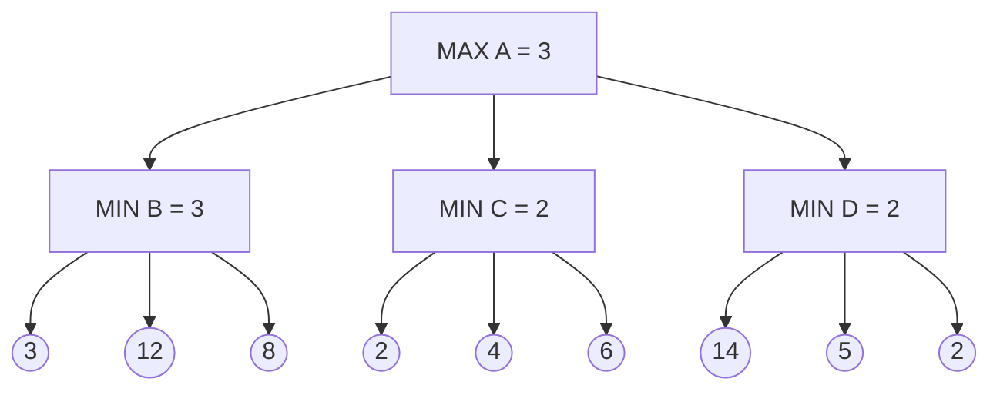
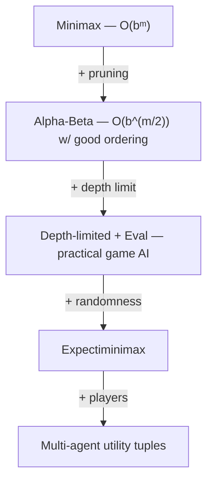

# 07 - Adversarial Search
**Course: COMP341 — Koç University | Asst. Prof. Barış Akgün**

> **Where this fits.** [Lectures 03–06](03-Uninformed-Search.md) were *single-agent* search. Now add an **opponent** whose goals conflict with yours. Two things change: a plan must become a **strategy** (a response to every possible opponent move), and the tree is too big to search fully — so we **prune** (alpha-beta) and **approximate** (evaluation functions). The chance-node extension at the end leads straight into probability ([Lecture 08](08-Probability.md)).


## 1 Why Games Are Different

- **Unpredictable opponent** — you can't dictate their moves, so a plan can't be a fixed sequence; it must be a **strategy** covering every contingency ("if light green turn left; if red, take the highway").
- **Time limits** — chess has b≈35, ~100 plies → 35¹⁰⁰ ≈ 10¹⁵⁴ games, far more than atoms in the universe. You can't search it all.

### Types of games

|  | Deterministic | Stochastic |
| :--- | :--- | :--- |
| **Perfect info** | chess, Go, checkers | backgammon |
| **Imperfect info** | Stratego | poker, bridge, Scrabble |

This lecture focuses on **turn-taking, 2-player, zero-sum, deterministic, perfect-information** games. **Zero-sum** = one player's gain is the other's loss, so a single number suffices: **MAX** maximizes it, **MIN** minimizes it.

<details>
<summary>Formal definition & tic-tac-toe</summary>

A game = states S, initial s₀, players P, actions A, transition S×A→S, terminal test, and **terminal utilities** (s,p)→value. Only *terminal* states have intrinsic values (+1/0/−1); interior values are *computed* by minimax. Tic-tac-toe: S = board configs, A = place mark on empty square, terminal = 3-in-a-row or full, utility = +1 X-win / −1 O-win / 0 draw (from X's view).

</details>


## 2 Minimax

The tree alternates **MAX nodes** (your turn, pick max) and **MIN nodes** (opponent's turn, pick min). The **minimax value** is defined recursively:

$$V(s) = \begin{cases} \text{utility}(s) & \text{terminal}\\ \max_{s'} V(s') & \text{MAX node}\\ \min_{s'} V(s') & \text{MIN node}\end{cases}$$



Each MIN node takes the min of its leaves (B→3, C→2, D→2); MAX takes the max (3). **Best move: a1 (to B).** This is a *forward simulation* — MIN hasn't moved; we imagined optimal play and chose the action that's best even against it.

```python
def value(s):
    if terminal(s): return utility(s)
    return max_value(s) if max_turn(s) else min_value(s)

def max_value(s):
    return max(value(s2) for s2 in successors(s))   # init −∞

def min_value(s):
    return min(value(s2) for s2 in successors(s))   # init +∞
```

**Optimal against a perfect opponent**, and **at least as good against an imperfect one** — minimax assumes a worst case that may not happen, leaving extra value on the table (if MIN blunders 9→100 in a branch, you gain). Complete for finite trees. **Complexity: O(bᵐ) time, O(bm) space** — like DFS. For chess (35¹⁰⁰) that's intractable, which motivates the next two sections.


## 3 Alpha-Beta Pruning

Same minimax value at the root, computed while **skipping branches a rational player would never pick**. Two bounds thread through the recursion:

- **α** — best value MAX can guarantee so far (only **increases**), updated at MAX nodes.
- **β** — best value MIN can guarantee so far (only **decreases**), updated at MIN nodes.

**Prune when:** at a MIN node `v ≤ α` (MIN already found something worse than MAX's existing option — MAX won't come here); at a MAX node `v ≥ β` (symmetric).

```python
def max_value(s, α, β):
    if terminal(s): return utility(s)
    v = −∞
    for s2 in successors(s):
        v = max(v, min_value(s2, α, β))
        if v ≥ β: return v          # prune
        α = max(α, v)
    return v

def min_value(s, α, β):
    if terminal(s): return utility(s)
    v = +∞
    for s2 in successors(s):
        v = min(v, max_value(s2, α, β))
        if v ≤ α: return v          # prune
        β = min(β, v)
    return v
```

> ⚠️ Only the **root** value is guaranteed correct — **children of the root may have wrong values**, because pruning stops early once a branch is proven irrelevant.

<details>
<summary>Trace on the tree above</summary>

`max_value(A, −∞, +∞)`:
- a1 → `min_value(B)`: 3, 3, 3 → returns 3. Back at A: α=3.
- a2 → `min_value(C, α=3)`: c1=2, `2 ≤ α=3` → **prune c2, c3**, return 2.
- a3 → `min_value(D, α=3)`: 14, 5, then d3=2, `2 ≤ 3` → **prune**, return 2.
- max(3,2,2)=3 → action a1. Pruned 3 leaves; in deep/wide trees the savings are enormous.

</details>

**With perfect move ordering, time drops to O(b^(m/2))** — you can search **twice as deep** for the same budget, which is why alpha-beta matters. Perfect ordering isn't achievable (you'd need to know the answer), so practical engines order moves heuristically (captures first, results from shallower searches). Deciding *what to search* to save search effort is an example of **metareasoning**.


## 4 Resource Limits & Evaluation Functions

Even with pruning you can't reach terminal states in chess. Solution: **depth-limited search** + an **evaluation function** `Eval(s)` applied at the cutoff as if those nodes were terminal.

**Evaluation function** — estimates how favorable a non-terminal position is for MAX, usually a weighted linear combination of features:

$$\text{Eval}(s) = \sum_i w_i f_i(s)$$

Chess features: material balance (pawn 1, knight/bishop 3, rook 5, queen 9), pawn structure, king safety. **In deterministic zero-sum games only the *ordering* of eval values matters** — any monotone rescaling gives the same play.

> **Depth beats eval quality.** "The deeper the evaluation is buried, the less its quality matters." Errors at leaves shrink as those leaves get closer to terminal states — like predicting tomorrow's weather vs next year's. A fundamental trade-off: spend on a fancy eval, or on deeper search.

<details>
<summary>Practical depth & anytime search</summary>

At 10⁴ nodes/s × 100 s = 10⁶ nodes, with O(b^(m/2)) we get `35^(m/2) ≈ 10⁶ → depth ≈ 8` — a "decent" chess program. Use **iterative deepening** as an **anytime algorithm**: search depth 1, 2, 3, … and always keep the deepest completed result when time runs out.

</details>


## 5 Stochastic Games: Expectiminimax

Randomness (dice, card shuffles, noisy actions, random ghosts) adds **chance nodes** between MAX and MIN. A chance node's value is the **expected value** of its children:

$$V(s) = \sum_{\text{outcomes}} P(\text{outcome})\cdot V(s')\quad\text{at a chance node}$$

```python
def exp_value(s):
    return sum(probability(s2) * value(s2) for s2 in successors(s))
```

> **You generally cannot prune chance nodes.** A chance value is an *average*, so an unexplored child could be extreme and swing it — unlike a MIN node where one bad child gives a tight bound. (Exception: if values are bounded.)

Two more subtleties:
- **Eval values matter numerically** here, not just ordinally — chance nodes average them, and a nonlinear rescaling would change the averages. Evals must be **proportional to true expected payoff**.
- **A probability over an opponent's move is your *belief*, not the opponent flipping coins** — they may be deterministic; you're just uncertain.

<details>
<summary>Backgammon, TDGammon & the model-mismatch experiment</summary>

Backgammon: 21 distinct dice rolls × ~20 moves → a depth-2 search touches ~10⁹ nodes; deep lookahead helps little when a bad roll can undo planning. **TDGammon (1995)** reached world-class play with depth-2 + a learned eval (self-play RL) — the first world-class game AI.

Model mismatch matters enormously:

| Pacman | Ghosts | Wins | Score |
| :--- | :--- | :---: | ---: |
| Minimax | Adversarial | 5/5 | 483 |
| Minimax | Random | 5/5 | 493 |
| Expectimax | Adversarial | 1/5 | −303 |
| Expectimax | Random | 5/5 | 503 |

Minimax (assume worst case) is **robust**; expectimax (assume random) is **brittle** — great vs random ghosts, catastrophic vs adversarial ones. *Dangerous optimism* = assume chance when the world is adversarial; *dangerous pessimism* = the reverse.

</details>


## 6 Multi-Agent / Non-Zero-Sum Utilities

Beyond 2-player zero-sum, each state carries a **utility tuple** (one value per player), and **each player maximizes their own component**. No special machinery needed; **cooperation and competition emerge naturally** (two players may briefly align against a third if it helps both their components).

<details>
<summary>3-player trace</summary>

Leaves are tuples (A,B,C). Bottom-up with order C, B, A: C maximizes the 3rd component at the lowest nodes, B the 2nd above, A the 1st at the root. From the slide example the root resolves to (5,2,5): A=5, B=2, C=5 — B does the best available given A's and C's choices.

</details>


## 7 Summary



Exam-ready points: minimax is optimal vs an optimal opponent, ≥ otherwise · alpha-beta gives the **exact root value** (interior values may be wrong) and doubles searchable depth with good ordering · chance nodes take **expected values** and **can't generally be pruned** · stochastic evals must be **proportional to true payoff** · model mismatch (adversarial vs random) causes catastrophic failure · iterative deepening = anytime.

<details>
<summary>Historical context</summary>

Minimax: von Neumann (1928, game theory), Shannon (1950, chess). Alpha-beta: formalized by Knuth & Moore (1975). TDGammon (Tesauro, 1995). Deep Blue beat Kasparov (1997) with optimized alpha-beta + custom hardware. AlphaGo (2016) used Monte Carlo Tree Search + deep nets — Go's b≈250 makes alpha-beta impractical.

</details>

> **What's next.** [08 — Probability](08-Probability.md): every agent so far assumed it knew the true state of the world. The chance nodes above were the first crack in that assumption. Probability replaces TRUE/FALSE with **degrees of belief** — the foundation for Bayesian networks and reasoning under uncertainty for the rest of the course.

*Notes from Lecture 7 — COMP341, Koç University.*
