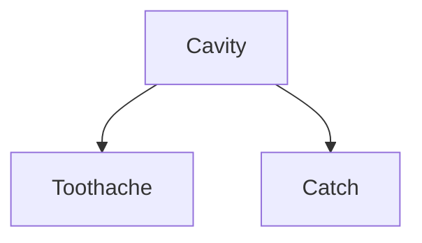
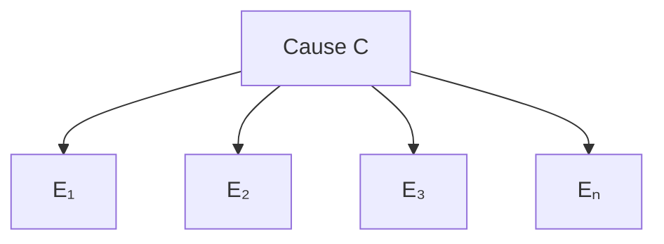

# 08 - Probability
**Koç University | Intro to Artificial Intelligence | Asst. Prof. Barış Akgün**

> **Where this fits.** The search, CSP, and adversarial-search agents from earlier lectures all assumed the agent knew the true state of the world. This lecture drops that assumption: the world is uncertain, so we replace TRUE/FALSE logic with *probability*. Everything here — joint distributions, conditioning, Bayes' rule, and especially **conditional independence** — is the toolkit that the next five lectures on Bayesian Networks are built on. The final idea (conditional independence compresses an exponential joint into something tractable) is exactly what Bayesian Networks formalize.

## 1 Why Uncertainty

Pure logic fails in the real world. Take *"Should I leave for the airport t minutes before my flight?"* You either assert something false ("25 minutes is enough") or something useless ("25 minutes is enough *if* no accident *and* no rain *and* no construction *and* …"). You can never enumerate every condition — this is the **qualification problem**. To be *logically* certain of arriving on time you'd leave 24 hours early.

The fix: use probability to express a **degree of belief**.

**Six sources of uncertainty:**

| Source | Example |
| :--- | :--- |
| Partial observability | Traffic you haven't hit yet; opponents' poker cards |
| Noisy sensors | GPS ±5 m; drifting thermometer |
| Uncertain action outcomes | "Turn left" but you slip on ice |
| Unexpected events | Sudden accident, earthquake |
| Inherent stochasticity | Radioactive decay |
| Complexity of modelling | Stock prices |

**Epistemic vs objective probability.** Here probability is the agent's *belief state*, not a claim about reality (the **Bayesian / subjective** interpretation). New evidence updates belief: `P(on time | no accidents) = 0.06`, but `P(on time | no accidents, it's 5AM) = 0.15`.

## 2 Random Variables and Sample Spaces

A **random variable** is a question about the world with a set of possible answers (its **domain**).

| Variable | Domain |
| :--- | :--- |
| Cavity | {true, false} |
| Weather | {sunny, rain, cloudy, snow} |
| D (die) | {1, …, 6} |

Formal notation (Ω, ω, events)

- **Ω** — the **sample space**, all possible outcomes (die: Ω = {1,…,6}).
- **ω** — a single **sample point** / possible world (e.g. ω = 3).
- A **probability model** assigns P(ω) to every ω.
- An **event A** is a subset of Ω; P(A) = sum of P(ω) over ω ∈ A. E.g. A = "3 or 6", P(A) = 1/6 + 1/6 = 1/3.
- **F** — the **event space**, the power set of Ω (all subsets).
- Shorthand: write P(ω) for P(D = ω) when values are unique.

## 3 Probability Axioms

Three **Kolmogorov axioms**:

1. **Non-negativity:** P(E) ≥ 0.
2. **Normalization:** P(Ω) = 1.
3. **Additivity:** for mutually exclusive (disjoint) events, P(E₁ ∪ E₂ ∪ …) = P(E₁) + P(E₂) + …

Consequences: 0 ≤ P(E) ≤ 1; P(∅) = 0; complement P(Aᶜ) = 1 − P(A); monotonicity (A ⊆ B ⟹ P(A) ≤ P(B)); and inclusion–exclusion

$$P(A \cup B) = P(A) + P(B) - P(A \cap B)$$

(the subtraction removes the double-counted overlap).

## 4 Probability Distributions

A **distribution** assigns a probability to each value in the domain; entries must **sum to 1**. These priors are the agent's beliefs *before* any evidence.

| W | P |
| :---: | ---: |
| sun | 0.6 |
| rain | 0.1 |
| fog | 0.3 |
| meteor | 0.0 |

**Continuous variables** use a **probability density function** f(x) ≥ 0 with ∫f(x)dx = 1, where P(a ≤ X ≤ b) = ∫ₐᵇ f(x)dx. Common cases: the **Uniform** (flat PDF over an interval) and the **Gaussian** $f(x) = \frac{1}{\sqrt{2\pi\sigma^2}}\exp\!\big(-\frac{(x-\mu)^2}{2\sigma^2}\big)$, centered at μ with spread σ.

## 5 Joint Probability Distributions

A **joint distribution** assigns a probability to every combination of values.

| T | W | P |
| :---: | :---: | ---: |
| hot | sun | 0.4 |
| hot | rain | 0.1 |
| cold | sun | 0.2 |
| cold | rain | 0.3 |

**Why it matters:** *every* question about a domain can be answered from the joint, because every event is a sum of sample points. It is the ultimate model — but it grows as **d ⁿ** (the curse of dimensionality): 10 binary variables → 1,024 entries, 30 → ~10⁹. This exponential blowup is *the* problem that independence and conditional independence solve.

Worked exercise — querying a joint table

Given P(+x,+y)=0.2, P(+x,−y)=0.3, P(−x,+y)=0.4, P(−x,−y)=0.1:

- **P(+x, +y)** = 0.2 (lookup).
- **P(+x)** = 0.2 + 0.3 = 0.5 (sum the +x rows).
- **P(−y OR +x)** = P(−y) + P(+x) − P(−y,+x) = 0.4 + 0.5 − 0.3 = 0.6.

## 6 Marginalization

A **marginal** distribution sums the joint over the variables you don't care about ("summing out"):

$$P(X) = \sum_y P(X, Y=y)$$

From the T,W table: P(hot) = 0.4 + 0.1 = 0.5; P(sun) = 0.4 + 0.2 = 0.6, etc.

## 7 Conditional Probability

P(a | b) is the belief in *a* once *b* is known — the **posterior**:

$$P(a \mid b) = \frac{P(a, b)}{P(b)} \quad (P(b)\neq 0)$$

Intuition: zoom in on the worlds where *b* holds, then ask what fraction also have *a*. A **conditional distribution** is a normalized slice of the joint.

Worked examples — conditioning

From the T,W table:
- P(sun | hot) = P(sun,hot)/P(hot) = 0.4 / 0.5 = **0.8**
- P(rain | cold) = 0.3 / 0.5 = **0.6**

From the X,Y table:
- P(+x | +y) = 0.2 / 0.6 = **1/3**, P(−x | +y) = 0.4 / 0.6 = **2/3** (sum to 1 ✓)
- P(−y | +x) = 0.3 / 0.5 = **0.6**

P(W | T=hot): sun 0.8, rain 0.2. P(W | T=cold): sun 0.4, rain 0.6.

## 8 The Normalization Trick

To get P(X | evidence) without computing P(evidence) separately: **select** the rows matching the evidence, then **normalize** them (divide by their sum). The sum of the selected rows *equals* P(evidence), so normalizing is the same as dividing by it. The constant is written α = 1/P(evidence).

Worked example — P(W | T=cold)

Select T=cold rows: (cold,sun)=0.2, (cold,rain)=0.3. Sum = 0.5 = P(cold). Normalize: P(sun|cold)=0.4, P(rain|cold)=0.6.

## 9 Inference by Enumeration

The general query: given evidence **E = e**, compute P(**Q** | e), marginalizing out the hidden variables **H**.

$$P(Q \mid e) = \alpha \sum_h P(Q, e, h)$$

**Algorithm:** select rows consistent with *e* → sum out *H* → normalize. Conceptually simple, but **O(dⁿ)** in time and space — you scan the whole joint. Infeasible past ~30 variables. This cost is exactly why the next lectures pursue smarter representations.

Worked example — 3-variable table (S, T, W)

| S | T | W | P |
| :---: | :---: | :---: | ---: |
| summer | hot | sun | 0.30 |
| summer | hot | rain | 0.05 |
| summer | cold | sun | 0.10 |
| summer | cold | rain | 0.05 |
| winter | hot | sun | 0.10 |
| winter | hot | rain | 0.05 |
| winter | cold | sun | 0.15 |
| winter | cold | rain | 0.20 |

- **P(W):** sum out S,T → P(sun)=0.65, P(rain)=0.35.
- **P(W | winter):** select winter rows, sum out T → both 0.25 → normalize → 0.5 / 0.5.
- **P(W | winter, hot):** select (0.10, 0.05), normalize → sun 2/3, rain 1/3.

## 10 Product Rule and Chain Rule

Rearranging the definition of conditional probability gives the **product rule**:

$$P(a, b) = P(a \mid b)\,P(b) = P(b \mid a)\,P(a)$$

Applied repeatedly, it gives the **chain rule** (an *exact* identity, any ordering):

$$P(X_1, \ldots, X_n) = \prod_{i=1}^{n} P(X_i \mid X_1, \ldots, X_{i-1})$$

The chain rule is the direct foundation of Bayesian Networks — a BN is just the chain rule with most conditioning terms dropped via conditional independence.

## 11 Bayes' Rule

Equating the two factorizations of P(a,b) and dividing by P(b):

$$\boxed{P(a \mid b) = \frac{P(b \mid a)\,P(a)}{P(b)}} \qquad\text{or}\qquad P(a\mid b) = \alpha\,P(b\mid a)\,P(a)$$

| Term | Name |
| :--- | :--- |
| P(a \| b) | Posterior |
| P(b \| a) | Likelihood |
| P(a) | Prior |
| P(b) | Evidence (marginal likelihood) |

**Why it matters:** we usually know one direction (P(symptom \| disease), from textbooks) but want the other (P(disease \| symptom), what a doctor needs). Bayes' rule flips it.

Worked examples — meningitis & wet road

**Meningitis:** P(stiff neck | M)=0.7, P(M)=10⁻⁶, P(stiff neck)=0.01.
P(M | stiff neck) = 0.7 · 10⁻⁶ / 0.01 = **0.00007**. Still tiny — a strong symptom can't overcome a tiny prior (base rate) — but 70× the base rate, so still worth checking (consequences matter → decision theory, lecture 12).

**Wet road:** P(sun)=0.8, P(rain)=0.2; P(dry|sun)=0.9, P(dry|rain)=0.4.
P(sun,dry)=0.72, P(rain,dry)=0.08, sum 0.80 → P(sun | dry)=**0.9**, P(rain | dry)=**0.1**. Dry road ⟹ probably sunny.

## 12 Independence

X and Y are **independent** iff

$$P(X, Y) = P(X)\,P(Y) \iff P(X \mid Y) = P(X)$$

Knowing one tells you nothing about the other (fair coin & fair die). Check it on a table by testing whether the joint equals the product of marginals — e.g. for the T,W table P(hot)P(sun)=0.30 ≠ 0.4 = P(hot,sun), so **not** independent.

**Why it's powerful:** *n* independent coin flips need only *n* parameters instead of 2ⁿ — exponential compression. But **absolute independence is rare**: most variables share at least an indirect relationship. We need something more flexible.

## 13 Conditional Independence

The practical powerhouse: two variables may be correlated in general but **independent once a third variable is known**.

$$P(X, Y \mid Z) = P(X \mid Z)\,P(Y \mid Z) \iff P(X \mid Y, Z) = P(X \mid Z)$$

**Toothache–Catch–Cavity.** Both a toothache and the probe "catching" are caused by a cavity. Once you know whether there's a cavity, the toothache adds nothing about the catch:

$$P(\text{catch} \mid \text{toothache}, \text{cavity}) = P(\text{catch} \mid \text{cavity})$$

This is the **common-cause** pattern: shared cause creates the correlation; knowing the cause "screens it off." (Lecture 09 turns this picture into the formal rule for *reading* independence off a graph.)

How conditional independence compresses the joint

Full joint over 3 binary variables: 2³ − 1 = **7** numbers. With the chain rule + conditional independence:

$$P(\text{T}, \text{C}, \text{Cav}) = P(\text{Cav})\,P(\text{T}\mid\text{Cav})\,P(\text{C}\mid\text{Cav})$$

needs P(Cav) [1] + P(T|Cav) [2] + P(C|Cav) [2] = **5** numbers. The saving is modest here but, in general, conditional independence turns an **exponential** representation into a **linear** one — the entire reason Bayesian Networks are tractable.

## 14 Naive Bayes

A single cause C with effects E₁,…,Eₙ that are all conditionally independent given C:

$$P(C, E_1, \ldots, E_n) = P(C)\prod_i P(E_i \mid C) \qquad P(C \mid E_{1:n}) = \alpha\,P(C)\prod_i P(E_i \mid C)$$

The "naive" assumption (effects independent given the cause) is often false — symptoms correlate even given a diagnosis — yet it works remarkably well for spam filtering, medical diagnosis, and text classification. **Parameters: 2n + 1** (linear) versus 2ⁿ⁺¹ for the full joint.

## 15 Summary

| Rule | Formula |
| :--- | :--- |
| Conditional probability | P(a\|b) = P(a,b)/P(b) |
| Product rule | P(a,b) = P(a\|b)P(b) = P(b\|a)P(a) |
| Chain rule | P(X₁…Xₙ) = ∏ P(Xᵢ \| X₁…Xᵢ₋₁) |
| Bayes' rule | P(a\|b) = P(b\|a)P(a)/P(b) |
| Marginalization | P(X) = Σ_y P(X, Y=y) |
| Independence | P(X,Y) = P(X)P(Y) |
| Conditional independence | P(X,Y\|Z) = P(X\|Z)P(Y\|Z) |
| Naive Bayes | P(C,E₁…Eₙ) = P(C) ∏ P(Eᵢ\|C) |

The arc: joint distributions answer anything but are exponentially large; inference by enumeration is simple but expensive; product/chain/Bayes give us algebra to manipulate; independence compresses when variables are unrelated; **conditional independence** compresses the realistic case.

> **What's next.** Conditional independence is powerful but, written as bare equations, it's hard to track in a big domain. **Lecture 09 (Bayesian Networks: Representation)** gives it a graphical language: a DAG whose edges encode exactly which conditional independences hold, turning the chain rule into a compact product of local tables.

*Notes compiled from COMP341 Lecture 8 slides (Asst. Prof. Barış Akgün, Koç University).*
