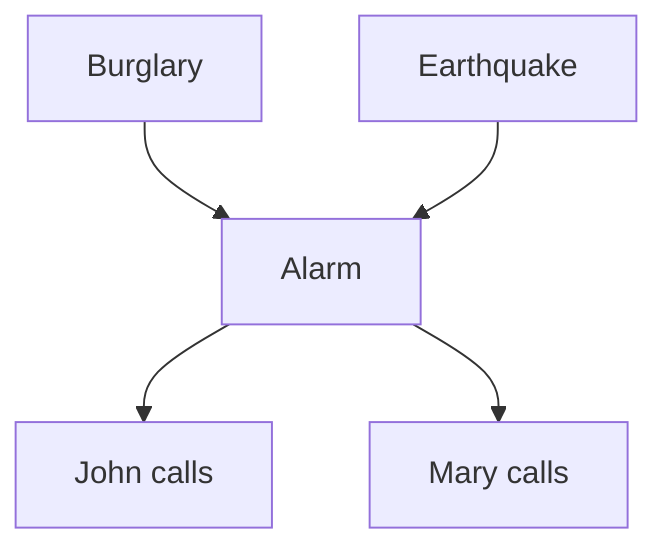
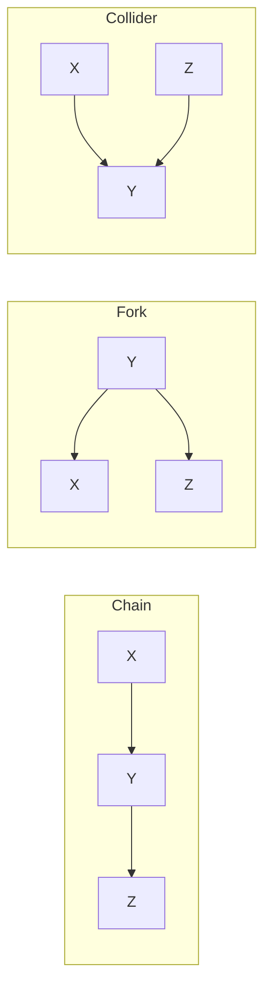
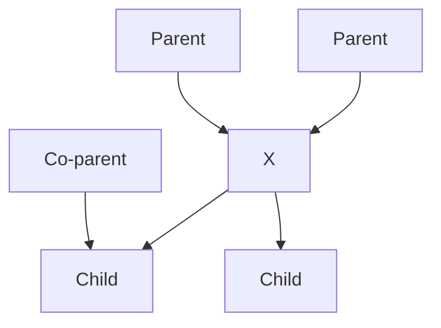

# 09 - Bayesian Networks: Representation

**Course**: COMP 341 Intro to AI - Koç University
**Instructor**: Asst. Prof. Barış Akgün

> **Where this fits.** Lecture 08 ended on a promise: conditional independence can compress an exponential joint distribution into something tractable, but written as bare equations it's unwieldy. This lecture delivers the graphical language that makes it manageable — the **Bayesian Network**. The chain rule (08) plus conditional independence (08) become a DAG whose edges *are* the independence assumptions. Once we can represent a distribution this compactly, lecture 10 shows how to query it.

## 1 Why Probabilistic Models

An agent reasons under uncertainty using a **probabilistic model** to perform **inference** — computing a posterior over unknowns given evidence:

$$P(X_q \mid x_{e_1}, \ldots, x_{e_k})$$

Three flavors of reasoning:

| Type | Direction | Example |
| :--- | :--- | :--- |
| **Diagnostic** | Effect → Cause | Mehmet has a medical report — was he sick? |
| **Causal** | Cause → Effect | There's an exam tomorrow — will he be sleepy? |
| **Value of information** | Any | Should I check the forecast before deciding? |

> *"All models are wrong; but some are useful."* — George Box. Don't aim for a perfect model, aim for one good enough to support decisions.

## 2 The Problem with Full Joint Distributions

A joint over *n* binary variables needs **2ⁿ − 1** numbers; in general **O(dⁿ)** — exponential. Two concrete failures:

1. **Too large to store.** 50 binary variables → 2⁵⁰ ≈ 10¹⁵ entries (over a petabyte).
2. **Too hard to specify.** You can't estimate 10¹⁵ values from data, and no expert can write them down.

**The escape:** in any real domain each variable has only a handful of *direct* causes. Encode only those local relationships and you store far fewer numbers, get an interpretable structure, and can learn from data. Bayesian Networks formalize this.

## 3 What Is a Bayesian Network

A **Bayesian Network** (Bayes net, belief network) is a compact encoding of a joint distribution as a **directed acyclic graph (DAG)** plus **local conditional probability tables (CPTs)**:

- Each **node** is a random variable.
- Each **edge** A → B means A directly influences B.
- Each node stores P(node | its parents).

The payoff: the full joint can be *reconstructed* from these local tables via one product formula.

**Intuition.** A doctor doesn't memorize every symptom/disease/test combination. They know local links — pneumonia causes fever, smoking causes lung cancer, lung cancer causes a positive X-ray — and chain them. A BN formalizes that chaining.

## 4 Semantics: Nodes, Arcs, CPTs

- **Nodes** — random variables (binary, discrete, or continuous). Each is either **observed** (evidence) or **unobserved** (hidden).
- **Arcs** — A → B means A is a *direct parent* of B; the arc encodes a conditional-independence structure. The graph **must be a DAG** (no directed cycles) so the factorization is well-defined.
- **CPTs** — every node Xᵢ stores P(Xᵢ | Parents(Xᵢ)). A binary node with two binary parents has 2² = 4 rows. A **root** node (no parents) stores a prior P(Xᵢ).

$$\textbf{Bayes Net} = \textbf{DAG topology} + \textbf{CPTs}$$

## 5 The Core Formula

The joint factorizes as a product of local conditionals:

$$\boxed{P(X_1, \ldots, X_n) = \prod_{i=1}^{n} P(X_i \mid \text{Parents}(X_i))}$$

To get the probability of a full assignment, multiply one entry from each node's CPT.

Why this works (from the chain rule)

The chain rule (lecture 08) always holds:

$$P(X_1, \ldots, X_n) = \prod_i P(X_i \mid X_1, \ldots, X_{i-1})$$

The BN asserts that each Xᵢ depends only on its parents, not all predecessors:

$$P(X_i \mid X_1, \ldots, X_{i-1}) = P(X_i \mid \text{Parents}(X_i))$$

Substituting gives the factorization. The conditional independences encoded by the structure are exactly what make this substitution valid.

## 6 Worked Examples

**Independent coins.** No causal links ⟹ **no arcs**. The factorization is just a product of marginals: P(H,T,T,H,T,H) = 0.5⁶.

**Rain → Traffic.** One edge captures the causal link; P(T,R) = P(T|R)P(R). E.g. P(−t,+r) = P(−t|+r)P(+r) = 0.25 · 0.25 = 0.0625.

### The Alarm Network (the classic example)

*"I'm at work. John calls saying my alarm is ringing; Mary doesn't call. Alarms can also be set off by minor earthquakes. Is there a burglar?"*

$$P(B,E,A,J,M) = P(B)\,P(E)\,P(A\mid B,E)\,P(J\mid A)\,P(M\mid A)$$

This needs only **12 numbers** (2+2+4+2+2) instead of 2⁵ − 1 = 31 for the full joint.

CPTs and a sample calculation

| B | P(B) | | E | P(E) |
| :---: | ---: | :--- | :---: | ---: |
| +b | 0.001 | | +e | 0.002 |

| B | E | P(+a\|B,E) |
| :---: | :---: | ---: |
| +b | +e | 0.95 |
| +b | −e | 0.94 |
| −b | +e | 0.29 |
| −b | −e | 0.001 |

| A | P(+j\|A) | | A | P(+m\|A) |
| :---: | ---: | :--- | :---: | ---: |
| +a | 0.90 | | +a | 0.70 |
| −a | 0.05 | | −a | 0.01 |

P(+b, −e, +a, +j, −m) = 0.001 · 0.998 · 0.94 · 0.90 · 0.30 ≈ 0.000252.

Mehmet's day — the running course example

Variables: Exam, Concert, Sickness, Weather, MedicalReport, Sleepy, Boredom. Causal logic: bad Weather → Sick (and affects Concert); Sick/Exam/Concert → MedicalReport; Sick or missed Concert → Boredom; Exam or Concert → Sleepy next day. Diagnostic query: given a medical report, what caused it? The BN gives a posterior over each explanation (weather, exam pressure, sickness).

## 7 Constructing a Bayesian Network

1. Choose an ordering X₁, …, Xₙ.
2. For each Xᵢ in order, add it and pick its parents from the *earlier* variables — the **minimal** set making Xᵢ conditionally independent of the rest of the earlier variables:
   $$P(X_i \mid \text{Parents}(X_i)) = P(X_i \mid X_1, \ldots, X_{i-1})$$

By construction this matches the chain rule, so the network is valid.

**Ordering matters.** A *causal* ordering (causes before effects) gives the simplest graph.

Bad ordering example — M, J, A, B, E

- P(J|M) = P(J)? **No** — John & Mary correlate (common cause Alarm), so M → J.
- P(A|J,M) = P(A|J)? **No** — A needs both J and M as parents.
- P(B|A,J,M) = P(B|A)? **Yes** — once Alarm is known, the calls add nothing.
- P(E|B,A,J,M) = P(E|A,B)? **Yes.**

This ordering produces extra arcs. The causal order (B, E, A, J, M) is far simpler — matching expert intuition and easing specification.

## 8 Size: Full Joint vs Bayes Net

| Representation | Size |
| :--- | :--- |
| Full joint | O(dⁿ) |
| Bayes net (≤ k parents per node) | O(n · d^(k+1)) |

When k ≪ n, this is an **exponential → linear** win. Alarm net: 31 → 10 numbers. For 30 binary variables with ≤ 3 parents: 10⁹ → ~480.

## 9 Causality vs Topology

Edges encode **conditional independence, not necessarily causality**. Both R → T and T → R represent the same joint P(R,T). So why prefer the causal direction? Fewer parents, easier to understand and elicit from experts ("what directly causes this?"), and easier to reason about interventions. **Always try to draw arrows causally.**

## 10–11 Reading Independence: The Three Canonical Structures

The central question: given the graph, are X and Z independent (possibly given evidence)? A naive "is there an unblocked path" check almost works but **breaks on colliders**. All reasoning reduces to three building blocks.

| Structure | X ⊥ Z? (no evidence) | X ⊥ Z \| Y? | Observing Y |
| :--- | :---: | :---: | :--- |
| **Chain** X→Y→Z | No | **Yes** | **Blocks** the path |
| **Fork** X←Y→Z | No | **Yes** | **Blocks** the path |
| **Collider** X→Y←Z | **Yes** | No | **Opens** the path |

The reversal on colliders is the whole subtlety: for chains and forks, observing the middle **blocks** flow; for a collider, observing the middle (or any descendant) **opens** it.

**Chain** — e.g. LowPressure → Rain → Traffic. Once rain is known, pressure adds nothing about traffic.
**Fork** — e.g. Weather → RoofDrip and Weather → Traffic. Once the common cause is known, the effects are independent (like two siblings' eye colors given their parents' genes).
**Collider** — e.g. Burglar → Alarm ← Earthquake. The causes are independent *until* you observe the alarm; then learning it was an earthquake **explains away** the burglar (Berkson's paradox).

Proofs for the three structures

**Chain, X ⊥ Z | Y:**
$$P(Z\mid X,Y) = \frac{P(X)P(Y\mid X)P(Z\mid Y)}{P(X)P(Y\mid X)} = P(Z\mid Y)$$

**Fork, X ⊥ Z | Y:**
$$P(Z\mid X,Y) = \frac{P(Y)P(X\mid Y)P(Z\mid Y)}{P(X,Y)} = P(Z\mid Y)$$

**Collider, X ⊥ Z (marginal):**
$$P(X,Z) = \sum_y P(X)P(Z)P(y\mid X,Z) = P(X)P(Z)$$
But observing Y couples them: P(Z | X, Y) ≠ P(Z | Y) in general — this is explaining away.

## 12 D-Separation: The General Algorithm

For arbitrary topologies, **d-separation** decides whether X ⊥ Y given evidence set Z:

1. Shade all evidence nodes (Z).
2. Enumerate every undirected path between X and Y.
3. Check each consecutive triple on each path:

| Triple | Active when | Blocked when |
| :--- | :--- | :--- |
| Chain A→B→C | B unobserved | B observed |
| Fork A←B→C | B unobserved | B observed |
| Collider A→B←C | B **or a descendant** observed | B and all descendants unobserved |

4. A path is **active** iff *every* triple on it is active. If **any** path is active → not d-separated (dependence possible). If **all** paths are blocked → d-separated → **conditionally independent**.

Worked d-separation examples

**Network** R → T ← B, with T → T′:

- **R ⊥ B?** Only path R→T←B; collider at T unobserved → inactive → blocked → **YES**.
- **R ⊥ B | T?** Collider at T now observed → active → **NO**. (Observing traffic makes rain and bad weather compete as explanations.)

**Network** L → R → T ← B, with T → T′:

- **L ⊥ B | T?** Triple at R (chain, unobserved) active; triple at T (collider, observed) active → path active → **NO**.
- **L ⊥ B?** Collider at T unobserved → blocked → **YES**.

**Pitfall:** a "block at shaded nodes" reachability rule works for chains/forks but inverts for colliders — unobserved collider blocks, observed collider opens.

## 13 The Markov Blanket

The **Markov blanket** of X is the minimal set that, once observed, makes X independent of everything else:

$$\text{MB}(X) = \text{Parents}(X) \cup \text{Children}(X) \cup \text{Co-parents}(X)$$

where co-parents are the *other* parents of X's children.

Why each piece: **parents** determine X; **children** carry information about X; **co-parents** are needed because observing a child opens a collider, coupling X with the child's other parents (explaining away). Including the co-parents removes that dependency.

**Where it's used:** Gibbs sampling resamples each variable given only its blanket (lecture 11); feature selection (the blanket of a target is its optimal predictor set); local structure learning.

## 14 Key Takeaways

- A BN = **DAG + CPTs**; the joint is $\prod_i P(X_i \mid \text{Parents}(X_i))$ — an exponential table compressed to a linear set of local tables.
- **D-separation** reads conditional independence off the graph. Chains/forks: observing the middle **blocks**. Colliders: observing the middle (or a descendant) **opens** — always check descendants.
- Prefer **causal** edge directions: fewer arcs, more interpretable.
- **MB(X)** = parents + children + co-parents.
- Sanity check: every CPT row sums to 1.

> **What's next.** We can now represent a distribution compactly and tell which variables are independent. **Lecture 10 (Exact Inference)** uses this structure to actually answer queries P(Q | e) — first by enumeration, then far more efficiently with variable elimination, which exploits the very factorization defined here.

### Appendix — quick reference

| Symbol | Meaning |
| :--- | :--- |
| P(Xᵢ \| Pa(Xᵢ)) | CPT for node Xᵢ |
| X ⊥ Y | marginally independent |
| X ⊥ Y \| Z | conditionally independent given Z |
| MB(X) | Markov blanket |
