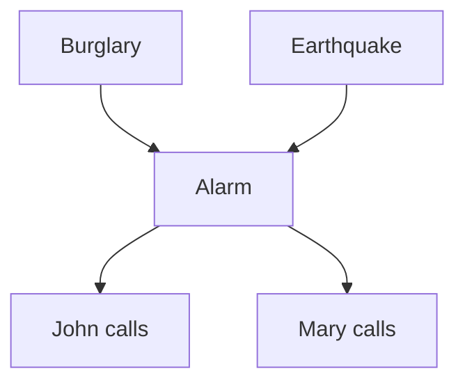

# 10 - Bayesian Networks: Exact Inference

**Course**: COMP 341 Intro to AI - Koç University
**Instructor**: Asst. Prof. Barış Akgün
**Topic**: Inference by Enumeration and Variable Elimination

> **Where this fits.** Lecture 09 gave us a compact representation: a DAG plus CPTs. But a model is only useful if we can *ask it questions*. This lecture answers P(Q | E = e) exactly — first with enumeration (the brute-force method from lecture 08, now phrased over a BN), then with **variable elimination**, which exploits the factorization from lecture 09 to avoid ever building the full joint. We end at a wall (exact inference is NP-hard), which motivates the sampling methods of lecture 11.


## 0 What Is Inference

Given observations (**evidence**), compute the probability of something you care about (the **query**):

- Mary called about the alarm — P(Burglary | Alarm, MaryCalled)?
- A student showed a medical report — P(Ill | Report)?

**Setup:** query variables **Q**, evidence **E = e**, hidden variables **H** (everything else). We want **P(Q | E = e)**.


## 1 Running Example: The Alarm Network



<details>
<summary>CPTs</summary>

P(B): +b = 0.001. P(E): +e = 0.002.

| B | E | P(+a) | P(−a) |
| :---: | :---: | ---: | ---: |
| +b | +e | 0.95 | 0.05 |
| +b | −e | 0.94 | 0.06 |
| −b | +e | 0.29 | 0.71 |
| −b | −e | 0.001 | 0.999 |

| A | P(+j) | P(−j) | | A | P(+m) | P(−m) |
| :---: | ---: | ---: | :--- | :---: | ---: | ---: |
| +a | 0.9 | 0.1 | | +a | 0.7 | 0.3 |
| −a | 0.05 | 0.95 | | −a | 0.01 | 0.99 |

</details>


## 2 The Four Methods

| Method | Exact? | Complexity |
| :--- | :--- | :--- |
| Inference by Enumeration | Yes | Exponential (naive) |
| Variable Elimination | Yes | Worst-case exponential, usually far better |
| Polytree / Junction Tree | Yes | Polynomial for restricted topologies |
| Sampling | No | Depends on sample count |

**Key fact:** exact inference in a general BN is **NP-hard** — a fundamental lower bound, not a weakness of any algorithm. This lecture covers the exact methods; lecture 11 covers sampling.


## 3 Inference by Enumeration

Using the BN factorization for the joint, any query is answered by **select evidence → sum out hidden → normalize**:

$$P(Q \mid e) = \alpha \sum_h P(Q, e, h) = \alpha \sum_h \prod_i P(X_i \mid \text{Pa}(X_i))$$

where α normalizes at the end (so you never compute P(e) directly).

<details>
<summary>Worked example — P(B | +j, +m)</summary>

Query B; evidence +j, +m; hidden E, A.

$$P(B\mid +j,+m) = \alpha \sum_{e,a} P(B)P(e)P(a\mid B,e)P(+j\mid a)P(+m\mid a)$$

For B = +b, enumerate the four (e, a) combinations:

| e | a | product |
| :---: | :---: | :--- |
| +e | +a | ~1.197e−6 |
| −e | +a | ~5.916e−4 |
| +e | −a | tiny |
| −e | −a | tiny |

Sum for +b, repeat for −b, normalize:

$$P(+b\mid +j,+m) = \frac{P(+b,+j,+m)}{P(+b,+j,+m)+P(-b,+j,+m)} \approx 0.284$$

About a 28% chance of burglary even with both calls — earthquakes and false alarms are competing explanations.

</details>

**Why it's slow:** you effectively build the entire joint (2ⁿ rows) before summing out. With 30 hidden variables that's ~10⁹ terms per query. Variable elimination fixes exactly this waste.


## 4 Factors: The Building Block

A **factor** is a table mapping an assignment of some variables to a non-negative number. It's a generalized probability table — a CPT, a joint, or a partial product — and unlike a distribution it **need not sum to 1**. Fixing (observing) a variable removes it as a dimension, shrinking the table.

<details>
<summary>Types of factors</summary>

- **Joint** P(X,Y): sums to 1.
- **Selected joint** P(X=x, Y): only X=x rows kept; sums to P(x).
- **Single conditional** P(Y | X=x): sums to 1 over Y.
- **Family** P(Y | X): sums to |domain(X)| (each row sums to 1).
- **Specified family** P(Y=y | X): fixed y, all x; does **not** sum to 1 — just likelihood-proportional numbers.

</details>

### Two operations

**Factor product (join).** Multiply two factors on their shared variables — like a database join — producing a factor over the union of variables.

**Elimination (sum-out).** Sum a factor over all values of one variable, producing a smaller factor.

<details>
<summary>Worked operations (Traffic domain)</summary>

Join f(R) with f(T|R) on R:

| R | T | value |
| :---: | :---: | :--- |
| +r | +t | 0.1·0.8 = 0.08 |
| +r | −t | 0.1·0.2 = 0.02 |
| −r | +t | 0.9·0.1 = 0.09 |
| −r | −t | 0.9·0.9 = 0.81 |

This is P(R,T). Now sum out R:

| T | value |
| :---: | :--- |
| +t | 0.08 + 0.09 = 0.17 |
| −t | 0.02 + 0.81 = 0.83 |

This is P(T).

</details>


## 5 Enumeration as Factor Operations

Restated cleanly: (1) one factor per CPT, (2) apply evidence (restrict factors), (3) **join all** factors into the full joint, (4) **eliminate all** hidden variables, (5) normalize. Joining everything *before* eliminating is the inefficiency VE removes.

<details>
<summary>Worked example — P(L), Traffic domain (R→T→L)</summary>

Join f(R), f(T|R), f(L|T) into the 8-row joint f(R,T,L), then sum out R then T:

| L | value |
| :---: | :--- |
| +l | 0.134 |
| −l | 0.866 |

P(Late) = 13.4%. We built an 8-row table unnecessarily.

</details>


## 6 Variable Elimination (VE)

**Core insight:** *interleave* joining and summing-out. Eliminate a variable as soon as you have all factors mentioning it, keeping intermediate factors small. (Algebraic analogy: compute (u+v)(w+x)(y+z) as three factors, not by expanding into 8 terms.)

### General Algorithm

```text
VE(Query Q, Evidence E=e, BN):
  1. One factor per CPT.
  2. Instantiate evidence: restrict every factor mentioning an Eᵢ to its eᵢ rows.
  3. While hidden variables remain:
       a. Pick a hidden variable H.
       b. Collect all factors mentioning H.
       c. Join them → big factor.
       d. Sum out H → new factor.
       e. Replace the collected factors with the new one.
  4. Join all remaining factors.
  5. Normalize over Q.
```

Correct for **any** elimination order, but the order dramatically affects efficiency.

<details>
<summary>Worked example — P(L | +r), Traffic domain</summary>

Evidence +r; hidden T. After instantiating: f1 = 0.1 (scalar), f2 = P(T|+r) = {+t:0.8, −t:0.2}, f3 = P(L|T).

Eliminate T: join f2·f3 → f4(T,L), then sum out T → f5(L) = {+l:0.26, −l:0.74}. Multiply by scalar 0.1 and normalize → P(+l|+r) = **0.26**.

Largest factor: 4 rows (vs 8 for enumeration).

</details>

<details>
<summary>Worked example — P(B | +j, +m), Alarm network</summary>

Hidden A, E. Initial factors after evidence: f_B(B), f_E(E), f_A(A|B,E), f_J(A)=P(+j|A), f_M(A)=P(+m|A).

**Eliminate A** — join f_A, f_J, f_M over (B,E,A), then sum out A → f(B,E):

| B | E | value |
| :---: | :---: | :--- |
| +b | +e | 0.598525 |
| +b | −e | 0.59223 |
| −b | +e | 0.183055 |
| −b | −e | 0.0011295 |

**Eliminate E** — multiply by P(E), sum out E → f(B) = {+b: 0.592244, −b: 0.001493}.

**Join prior** f_B and normalize:

| B | × P(B) |
| :---: | :--- |
| +b | 0.000592 |
| −b | 0.001492 |

P(+b | +j, +m) = 0.000592 / 0.002084 ≈ **0.284** — matching enumeration, with smaller intermediate tables. Low because burglaries are rare (0.1%) and earthquakes/false alarms compete.

</details>


## 7 Elimination Ordering and Complexity

**Ordering matters enormously.** For a hub variable Z connected to a chain X₁…X_{n−1}: eliminating Z *first* forces a factor over all X's (2ⁿ entries); eliminating the chain left-to-right first keeps every factor at ≤ 4 entries. Exponential vs constant.

**Treewidth.** The best achievable maximum factor size is governed by the **treewidth** *w* of the network's undirected skeleton: best-case max factor is d^(w+1).

- Polytrees (singly-connected): w = 1 → factors ≤ d² → linear inference.
- Grids: w = O(√n).
- Complete graphs: w = n − 1 → fully exponential.

Finding the optimal order is itself NP-hard, so we use heuristics: **min-degree** (eliminate the least-connected variable) or **min-fill** (eliminate the one adding fewest new edges).

**Cost** is dominated by the largest factor generated: **O(n · d^w)** time, **O(d^w)** space. VE is never worse than enumeration (which is VE with the worst ordering). Exact inference is feasible for polytrees, small-treewidth networks, and small networks; large dense networks need **approximate inference** (lecture 11).


## 8 Enumeration vs VE Side-by-Side

| | Enumeration | Variable Elimination |
| :--- | :--- | :--- |
| Strategy | Build full joint, then sum out | Interleave join and sum-out |
| Largest factor (Traffic, P(L\|+r)) | 8 rows | 4 rows |
| Scaling | d ⁿ | d ^ w (w = treewidth) |

<details>
<summary>Common conceptual questions</summary>

- **Normalization** turns the unnormalized f(Q, e) into P(Q | e) by dividing by Σ_q f(q, e) = P(e). You never compute P(e) separately.
- **Order affects efficiency, not correctness** — sums commute, so the answer is identical; only the intermediate table sizes differ.
- **Multiple query variables** — just don't sum them out; normalize the joint at the end.
- **Evidence-only factors** become scalars and still scale the result (they matter for normalization).
- **Specified-family factors** (e.g. P(B=+b | A), which don't sum to 1) arise when you observe a child and propagate evidence backward — the mechanism behind explaining away.

</details>

<details>
<summary>Review problems</summary>

**P1 — chain A→B→C**, P(+a)=0.1, P(+b|+a)=0.8, P(+b|−a)=0.1, P(+c|+b)=0.3, P(+c|−b)=0.1. Eliminate A → f(B)={+b:0.17,−b:0.83}; eliminate B → f(C)={+c:0.134,−c:0.866}. **P(+c) = 0.134.**

**P2 — chain X₁→…→Xₙ, eliminate left-to-right:** each step joins a 1-D factor with a 2-D CPT (4 entries), sums out one variable. Max factor = d² regardless of n — optimal.

**P3 — why not just divide by P(e)?** You can — it's correct by definition. But computing P(e) needs its own marginalization, as expensive as the query. Normalizing P(Q, e) over Q avoids ever computing P(e) explicitly.

</details>


## 9 Key Takeaways

- Inference asks **P(Q | E = e)**; enumeration builds the full joint (O(dⁿ)) — correct but exponentially slow.
- A **factor** is a generalized table; two operations suffice — **join** (multiply on shared variables) and **sum-out** (eliminate one variable).
- **VE** interleaves them, never building the full joint; typically far faster.
- **Ordering** controls intermediate factor size (treewidth); optimal ordering is NP-hard, so use min-degree / min-fill heuristics.
- Exact inference is **NP-hard in general**; tractable for polytrees and small treewidth.

> **What's next.** For large, densely connected networks (medical diagnosis, vision, thousands of variables), even VE blows up. **Lecture 11 (Approximate Inference)** gives up exactness for speed, estimating P(Q | e) by drawing samples instead of summing over all configurations.

*End of Lecture 10 — COMP341 Intro to AI*
