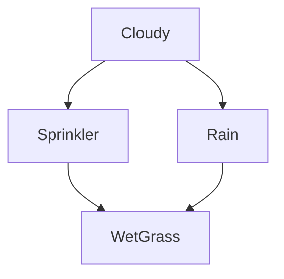

# 11 - Bayesian Networks: Approximate Inference

**Course**: COMP341 – Introduction to AI, Koç University
**Instructor**: Asst. Prof. Barış Akgün
**Topic**: Sampling-based approximate inference

> **Where this fits.** Lecture 10 gave exact methods (enumeration, variable elimination) and ended at a wall: exact inference is NP-hard, and even VE explodes on large, dense networks. This lecture trades exactness for tractability. The four methods here form a ladder — each fixes the previous one's weakness — and two of them (prior sampling and likelihood weighting) come back directly as the engine of **particle filters** in lecture 13. Gibbs sampling reuses the **Markov blanket** from lecture 09.


## 1 Why Approximate Inference

Exact inference is **NP-complete** in general — no polynomial algorithm exists unless P = NP. A 50-variable medical network needs up to 2⁵⁰ ≈ 10¹⁵ evaluations; real BNs (spam, speech, protein folding) have thousands of variables.

**The trade-off:** give up the exact answer for dramatically faster computation, with a tunable accuracy knob — more samples → more accuracy. The core idea is **sampling**: instead of summing over all configurations, draw random samples and estimate probabilities from them, like an opinion poll.


## 2 The Core Idea: Sampling

**Sampling** means generating a random outcome according to a distribution. By the **Law of Large Numbers**, the fraction of N samples with X = x converges to P(X = x):

$$P(X = x) \approx \frac{\text{count}(X = x)}{N}$$

The error shrinks like 1/√N. The workflow: draw N samples → count the events of interest → normalize → (and prove the sampler converges to the true P).

<details>
<summary>Sampling from a discrete distribution (CDF method)</summary>

Partition [0, 1) into segments sized by each outcome's probability; a uniform draw lands in each with the right frequency.

| C | P(C) | CDF | Interval |
| :---: | ---: | ---: | :--- |
| red | 0.6 | 0.6 | [0, 0.6) |
| green | 0.1 | 0.7 | [0.6, 0.7) |
| blue | 0.3 | 1.0 | [0.7, 1.0) |

Draw u ~ Uniform[0,1); the interval u lands in is your sample (u = 0.83 → blue).

```python
from random import random
def cumsum(f):
    total = 0
    for x in f:
        total += x; yield total
def getVal(u, cs):
    for i in range(len(cs)):
        if u < cs[i]: return i

probs = [0.6, 0.3, 0.1]; cs = list(cumsum(probs)); counts = [0]*len(probs)
for _ in range(1000):
    counts[getVal(random(), cs)] += 1
# → ~[0.6, 0.3, 0.1], noise shrinking with more iterations
```

Convergence: 10 samples noisy (0.7/0.2/0.1), 1000 samples close (0.603/0.297/0.1).

</details>


## 3 Canonical Example: Weather and Wet Grass



<details>
<summary>CPTs</summary>

```
P(+c) = 0.5
P(+s | +c) = 0.1   P(+s | −c) = 0.5
P(+r | +c) = 0.8   P(+r | −c) = 0.2
P(+w | +s,+r) = 0.99   P(+w | +s,−r) = 0.90
P(+w | −s,+r) = 0.90   P(+w | −s,−r) = 0.01
```

</details>

Inference means computing the posterior P(Q | e) or the most likely explanation argmax. Since this is NP-complete exactly, we sample.


## 4 Prior Sampling

Sample every variable in **topological order** (parents before children) from its CPT — no evidence. Topological order guarantees each node's parents are already fixed when you sample it.

```text
PRIOR-SAMPLE(BN):
    for i = 1..n in topological order:
        xᵢ ~ P(Xᵢ | Parents(Xᵢ))   # parents already sampled
    return (x₁, …, xₙ)
```

**Consistency:** the probability of generating an assignment is exactly the joint, so sample frequencies converge to true probabilities:

$$S_{PS}(x_1,\ldots,x_n) = \prod_i P(x_i \mid \text{Pa}(x_i)) = P(x_1,\ldots,x_n)$$

From N samples you can estimate any marginal or joint (count and divide). **Limitation:** can't efficiently handle conditional queries when evidence is unlikely — which leads to rejection sampling.

<details>
<summary>One run through the weather network</summary>

Sample C → +c; S given +c → −s; R given +c → +r; W given (−s,+r) → +w. Result (+c, −s, +r, +w). Repeat for many samples.

</details>


## 5 Rejection Sampling

Run prior sampling but **discard** any sample inconsistent with the evidence e. The survivors are distributed as P(Q | e). (Like estimating left-handers' average height by ignoring right-handers.)

```text
REJECTION-SAMPLING(BN, evidence E):
    sample in topological order;
    if any xᵢ contradicts E: reject (return NULL)
    else return the sample
```

**Consistency:** kept samples are distributed ∝ P(x, e); normalize → P(x | e).

**The fatal flaw — rare evidence.** If P(e) is small, almost all samples are rejected. In a Burglary→Alarm net with P(+b)=0.01 and P(+a|−b)=0.05, conditioning on +a keeps only ~1 in 17 samples. The deeper problem: **evidence doesn't guide sampling** — you sample blindly, then throw most away.

<details>
<summary>Worked example — P(C | +s)</summary>

From 5 prior samples, keep only those with +s: (+c,+s,+r,+w) and (−c,+s,+r,−w). One +c, one −c → P(+c|+s) ≈ P(−c|+s) ≈ 0.5.

</details>


## 6 Likelihood Weighting

**Fix** the evidence variables to their observed values and sample only the rest — so *every* sample is consistent. But forcing evidence biases the distribution, so weight each sample by the probability of the evidence given the current configuration.

```text
LIKELIHOOD-WEIGHTING(BN, evidence E):
    w = 1.0
    for i = 1..n in topological order:
        if Xᵢ is evidence:  Xᵢ = xᵢ;  w *= P(xᵢ | Parents(Xᵢ))
        else:               xᵢ ~ P(Xᵢ | Parents(Xᵢ))
    return (x₁,…,xₙ), w
```

$$P(Q = q \mid e) \approx \frac{\sum_{\text{samples with } Q=q} w}{\sum_{\text{all samples}} w}$$

<details>
<summary>Why the weight corrects the bias</summary>

Fixing evidence gives sampling distribution S_LW(z,e) = ∏_{Zᵢ∉E} P(zᵢ | Pa). The true joint is

$$P(z,e) = S_{LW}(z,e)\prod_{E_i \in E} P(e_i \mid \text{Pa}(E_i)) = S_{LW}(z,e)\cdot w$$

so weighting by w = ∏ P(eᵢ | Pa(Eᵢ)) makes the weighted distribution equal the true joint.

</details>

<details>
<summary>Worked example — P(+r | +c, +w), 20 samples</summary>

C and W are evidence (fixed); S, R sampled freely.

| Sample | Count | Weight = P(+c)·P(+w\|s,r) | Total |
| :--- | ---: | :--- | ---: |
| (+c,+s,+r,+w) | 4 | 0.5·0.99 = 0.495 | 1.98 |
| (+c,−s,+r,+w) | 15 | 0.5·0.90 = 0.45 | 6.75 |
| (+c,−s,−r,+w) | 1 | 0.5·0.01 = 0.005 | 0.005 |

$$P(+r\mid +c,+w) = \frac{1.98 + 6.75}{1.98 + 6.75 + 0.005} \approx 0.999$$

Exact = 0.9758; off because 20 samples is too few. P(+s | +c,+w) ≈ 0.227 (exact 0.1304) — same story.

</details>

**Limitation — upstream evidence is ignored.** Evidence at W never flows *up* to influence how C is sampled (C is drawn from its prior). If grass is wet, that should make cloudy/rain more likely, but LW doesn't use this when sampling C; the weights correct it only in the limit, so convergence is slow. This motivates Gibbs sampling.


## 7 Gibbs Sampling and MCMC

**Markov Chain Monte Carlo (MCMC)** builds a Markov chain whose stationary distribution is the target P(Q | e). You make small random changes to the current state; after **burn-in** the chain "forgets" its start and each state is a sample. Unlike prior/rejection sampling, the chain spends time proportional to probability mass — no wasted effort.

**Gibbs sampling** (the common MCMC for BNs):

1. Initialize a complete assignment consistent with evidence (evidence fixed throughout).
2. Repeatedly pick a non-evidence variable and **resample it given all others**.
3. After burn-in, collect states as samples (no weights needed).

The resampling conditions only on the **Markov blanket** (lecture 09) — everything else is irrelevant:

$$x_i \sim P(X_i \mid \text{MB}(X_i)) \propto P(X_i \mid \text{Pa}) \prod_{c \in \text{children}} P(c \mid \text{Pa}(c))$$

For the weather net, MB(S) = {C, W, R}, so P(S | C,R,W) ∝ P(S | C)·P(W | S,R).

<details>
<summary>Computing a resampling distribution — P(S | +c, +r, −w)</summary>

$$P(+s\mid\ldots) \propto P(+s\mid+c)P(-w\mid+s,+r) = 0.1\cdot0.01 = 0.001$$
$$P(-s\mid\ldots) \propto P(-s\mid+c)P(-w\mid-s,+r) = 0.9\cdot0.10 = 0.09$$

Normalize → P(+s) ≈ 0.011, P(−s) ≈ 0.989. When it's raining and the grass is dry, the sprinkler is almost certainly off — rain explains the wet grass, not the sprinkler.

</details>

**Gibbs solves the upstream problem:** C's Markov blanket carries W's evidence (through its children S, R, whose child is W), so both upstream and downstream variables respond to evidence.

<details>
<summary>Step-by-step run — P(S | +r)</summary>

Fix R = +r; init C=+c, S=+s, W=+w.
- Resample C from P(C|S,R) ∝ P(C)P(S|C)P(R|C): +c→0.04, −c→0.05 → C=−c.
- Resample W from P(W|+s,+r): +w almost certain → W=+w.
- Resample S from P(S|−c,+r,+w): P(+s)∝0.5·0.99=0.495, P(−s)∝0.5·0.90=0.45 → ~0.52 chance +s.

After hundreds of burn-in steps, collect S values to estimate P(S | +r).

</details>

<details>
<summary>Why it converges; Gibbs vs Metropolis-Hastings</summary>

The chain's transitions satisfy **detailed balance** w.r.t. P(X | e), so its stationary distribution is exactly the target. Practical issues: burn-in (discard early samples), mixing time (slow if the chain gets stuck), convergence diagnostics (multiple chains). Gibbs is a special case of **Metropolis-Hastings** where proposals come from the exact conditional, giving acceptance probability 1 (never rejects).

</details>


## 8 Method Comparison

| Method | Evidence | Limitation | Best for |
| :--- | :--- | :--- | :--- |
| **Prior** | Not handled | Can't condition | Priors, exploration |
| **Rejection** | Discard mismatches | Rejects most when evidence rare | Common evidence |
| **Likelihood weighting** | Fix + weight | Upstream vars unaffected; weight skew | Most practical cases |
| **Gibbs** | Fix + resample | Needs burn-in; can mix slowly | Large nets, complex evidence |

All four are **consistent** (converge to the exact answer with infinite samples). They differ in how many samples you need, how they handle rare evidence, and whether upstream variables respond to downstream evidence.

**Effective sample size / weight degeneracy:** in likelihood weighting, if a few samples carry huge weight and the rest near-zero, you effectively have far fewer independent samples. The sum of weights indicates the "effective" sample count — we want large weights. Gibbs avoids this (equal-weight counts).

<details>
<summary>Numeric comparison from the slides</summary>

**Prior sampling** P(+c,+w): 6/20 = 0.30 (exact 0.3735). **Rejection** P(+r | +c,+w): all 6 kept samples have +r → 1.0 (exact 0.9758, lucky with few samples). **Likelihood weighting** (see §6): P(+r|+c,+w) ≈ 0.999, P(+s|+c,+w) ≈ 0.227 — both off; "20 samples is not enough."

</details>


## 9 Applications of MCMC

MCMC is among the most-used algorithm families in science: probabilistic models (BNs, LDA topic models), computer vision (segmentation, generative/diffusion models), robotics (**particle filters** for localization — see lecture 13), Bayesian deep learning, statistical physics, computational biology, and combinatorial optimization (simulated annealing is related).


## 10 Summary

| Quantity | Formula |
| :--- | :--- |
| Prior sampling probability | S_PS(x) = P(x) |
| Likelihood weight | w = ∏_{Eᵢ} P(eᵢ \| Pa(Eᵢ)) |
| LW estimate | P(Q=q\|e) ≈ Σ_{Q=q} w / Σ w |
| Gibbs resampling | xᵢ ~ P(Xᵢ \| MB(Xᵢ)) |
| Markov blanket | parents + children + co-parents |

The ladder: **prior** (no evidence) → **rejection** (discard, wasteful) → **likelihood weighting** (fix + weight, but upstream-blind) → **Gibbs** (resample everything via the Markov blanket, both directions respond). All consistent; they differ in sample efficiency.

> **What's next.** We've now covered representation (09), exact inference (10), and approximate inference (11) — everything needed to compute any probability in a static network. **Lecture 12** asks what an agent should *do* with those probabilities (decisions and utilities), and **lecture 13** unfolds the network over time, where prior sampling and likelihood weighting reappear as the **particle filter**.
