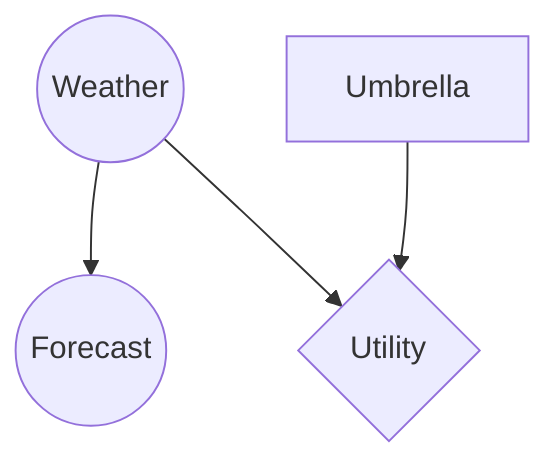
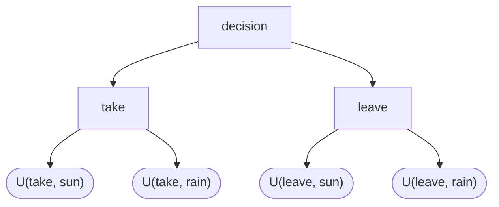
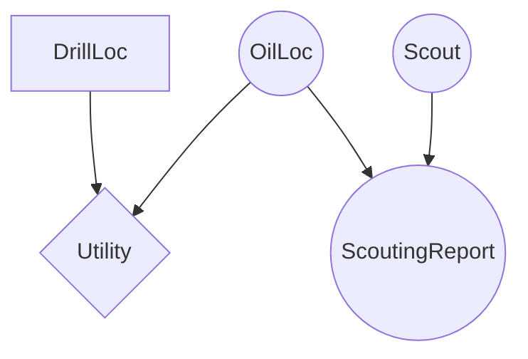

# 12 - Bayesian Networks: Incorporating Decisions

**Course**: COMP341 Intro to AI, Koç University
**Instructor**: Asst. Prof. Barış Akgün
**Topic**: Decision Networks, Utilities, Maximum Expected Utility, Value of Information

> **Where this fits.** Lectures 08–11 built up the machinery to compute any probability P(Q | e) in a Bayesian Network. But knowing `P(Rain | Clouds) = 0.66` doesn't tell you whether to grab an umbrella — you also need to know *how much you care* about each outcome. This lecture adds **utilities** and **decisions** on top of the probabilistic model, completing the architecture of a rational agent. The Value-of-Information section reuses **d-separation** from lecture 09 as a shortcut.

## 1 From Probabilities to Decisions

Should you take an umbrella? A BN gives P(Rain | evidence), but you still must compare the *consequences* of each action — soaked vs dry vs carrying it pointlessly. That comparison requires a **utility function**.

## 2 Utilities

A **utility** is a real number measuring how much an agent values an outcome (higher = more preferred). It's a scorecard:

| Weather | Decision | Utility |
| :---: | :--- | ---: |
| Rain | Take | 70 |
| Rain | Leave | 0 |
| Sun | Take | 20 |
| Sun | Leave | 100 |

An agent chooses among **prizes** (certain outcomes) and **lotteries** (uncertain ones), written L = [p, A; (1−p), B].

Rationality axioms and the MEU theorem

Preferences must satisfy: **Orderability** (prefer A, prefer B, or indifferent), **Transitivity** (no A>B>C>A cycles), **Continuity** (some lottery of A and C equals B for certain), **Substitutability**, **Monotonicity** (prefer higher probability of the better outcome), **Decomposability** (compound lotteries reduce normally).

**MEU theorem** (Ramsey 1931; von Neumann–Morgenstern 1944): if preferences satisfy the axioms, there exists a utility function U such that rational behavior = **maximizing expected utility**. Humans routinely violate the axioms, but we adopt them as design principles for AI agents.

## 3 Expected Utility vs Expected Money

For a money lottery, **Expected Monetary Value** is EMV(L) = pX + (1−p)Y. But the **expected utility** uses utilities of the amounts:

$$U(L) = p\,U(\$X) + (1-p)\,U(\$Y)$$

Crucially U(L) ≠ U(EMV(L)). For most people U(L) < U(EMV(L)) — they prefer a guaranteed \$500 to a 50/50 shot at \$1000. This is **risk aversion**, arising from a concave utility-of-money curve (the jump \$0→\$500 helps more than \$500→\$1000).

- **Risk-averse:** prefer the certain equivalent (most people).
- **Risk-prone:** prefer the gamble (e.g. deep in debt).
- **Risk-neutral:** care only about EMV.

Insurance, the Allais paradox, utility scales

**Insurance:** for [0.5, \$1000; 0.5, \$0], EMV = \$500 but the certainty equivalent is ~\$400; the \$100 gap is the insurance premium. People pay above EMV to remove risk — which is why insurance exists.

**Allais paradox (1953):** most prefer B=[1.0,\$3k] over A=[0.8,\$4k] yet C=[0.2,\$4k] over D=[0.25,\$3k]. B>A ⟹ U(\$3k) > 0.8U(\$4k); C>D ⟹ 0.8U(\$4k) > U(\$3k). Contradiction — humans aren't fully rational.

**Utility scales:** utilities are defined up to positive linear transform, so normalize u⁺=1.0, u⁻=0.0. Domain scales: **micromorts** (one-in-a-million death risk), **QALYs** (quality-adjusted life years).

## 4 Decision Networks (Influence Diagrams)

Extend a BN with two new node types:

| Node | Shape | Role |
| :--- | :--- | :--- |
| Chance | circle | random variable (CPT), as in a BN |
| Action / Decision | rectangle | a choice the agent controls (stores its list of actions) |
| Utility | diamond | numeric utility (a *utility table*), a function of its parents |

**Action nodes** have no parents (freely chosen), can be parents of others, and are treated as observed once chosen. **Utility nodes** are leaves with a utility table.

Weather and Forecast are chance nodes; Umbrella is the action {take, leave}; U depends on what you did (Umbrella) and what happened (Weather). Forecast is the observable signal you can condition on.

## 5 Maximum Expected Utility (MEU)

Given evidence e, the expected utility of action a:

$$EU(a \mid e) = \sum_y P(y \mid e)\,U(y, a)$$

(y ranges over the utility node's chance-variable parents). Then:

$$MEU(e) = \max_a EU(a \mid e) \qquad a^* = \arg\max_a EU(a \mid e)$$

**Procedure:** instantiate evidence → run BN inference for the posterior over the utility's chance parents → compute EU for each action → pick the max.

Worked example — no evidence

Priors P(sun)=0.7, P(rain)=0.3. Utility table as in §2.

- EU(leave) = 0.7·100 + 0.3·0 = **70**
- EU(take) = 0.7·20 + 0.3·70 = **35**

MEU = 70 → optimal action **leave**.

Worked example — Forecast = bad

Inference gives P(sun | bad)=0.34, P(rain | bad)=0.66.

- EU(leave) = 0.34·100 + 0.66·0 = **34**
- EU(take) = 0.34·20 + 0.66·70 = **53**

MEU = 53 → optimal action **take**. With rain likely, the umbrella pays off.

**Connection to expectimax.** A decision network is structurally an expectimax tree (lecture 07): rectangles = agent (max) nodes, circles = chance nodes, leaves = utilities, evaluated bottom-up. The difference: the chance outcomes come from an explicit BN, not a hand-coded tree.

## 6 Value of Information (VPI)

Sometimes you can **observe more before acting**. Should you, and at what price? **Value of Perfect Information** answers how much your expected utility improves by observing E′ first.

$$VPI(E' \mid e) = \underbrace{\sum_{e'} P(e' \mid e)\,MEU(e, e')}_{\text{expected MEU after observing }E'} - MEU(e)$$

In words: how much better off you are, on average, finding out E′ before acting versus acting now. (Doctor deciding whether to run a lab test: VPI is the max you'd pay for it.)

Oil-drilling example

Two sites A, B; one has oil worth k; P(A)=P(B)=0.5; drill one.

- **Without info:** EU(drill A) = EU(drill B) = 0.5k → MEU = k/2.
- **With perfect info:** told the location, drill there → k for certain. E[MEU] = 0.5k + 0.5k = k.
- **VPI(OilLoc) = k − k/2 = k/2.** Pay up to k/2 for a perfect survey.

Umbrella VPI and the non-negativity caveat

P(F=good)=0.59, P(F=bad)=0.41; MEU(no evidence)=70, MEU(bad)=53, and MEU(good) must be computed from the *actual* posterior P(W | good). VPI = 0.59·MEU(good) + 0.41·53 − 70. VPI is guaranteed ≥ 0, so the real posteriors always yield a non-negative result — plug in the correct numbers rather than rounded ones.

### VPI Properties

1. **Non-negative** — more information can't hurt: if it wouldn't change your action, you ignore it. Formally MEU(e, e′) ≥ EU(a* | e) for every e′, and the average preserves it.
2. **Non-additive** — VPI(E₁,E₂) ≠ VPI(E₁) + VPI(E₂) in general (if E₁ determines E₂, the second adds nothing).
3. **Order-independent** — learning E₁ then E₂ has the same total value as E₂ then E₁.

Quick intuition examples

- **Soup you'd never order:** VPI = 0 — no information changes your action.
- **Two forks, one slightly sturdier:** VPI small but positive — decision may change, but the utility gap is tiny.
- **1% lottery where you pick the number:** knowing the winning number flips \$1 expected to \$100 — VPI huge. Information is valuable in proportion to the decision improvement it enables.

### When VPI = 0 (the key theorem)

- VPI(OilLoc) = k/2 (tells you directly where oil is).
- **VPI(Scout) = 0** — Scout and OilLoc are marginally independent (the only connection runs through the collider ScoutingReport, which is blocked while unobserved).
- But **VPI(Scout | ScoutingReport) ≠ 0** — observing ScoutingReport opens the collider (explaining away), so Scout becomes informative.

> **Theorem.** If the utility node's chance parents Y are **d-separated** from Z given the current evidence, then VPI(Z | evidence) = 0.

A cheap screening rule: check d-separation (lecture 09) *before* computing any VPI.

What you need to compute VPI, and "imperfect" information

To compute VPI(E′ | e) you need P(E′ | e) and P(Y | e, E′=e′) for each value of E′ — both require BN inference. There's no separate "value of imperfect information": a noisy sensor is modeled as a new chance node (e.g. ScoutingReport) that is a noisy function of the underlying variable, and you take VPI of *that* node. The noise lives in P(ScoutingReport | OilLoc); the same formula applies.

Extensions — action nodes as causes, multiple utility/action nodes

- **Action as a parent of a chance node** (a drug changes disease progression): treat the action as observed evidence, then run inference.
- **Multiple chance parents of U:** EU sums over the joint posterior P(y₁,y₂,… | e).
- **Multiple action parents:** enumerate action combinations, compute EU for each, pick the best.
- **Multiple utility nodes:** independent decisions → optimize separately; overlapping → maximize the **sum** of expected utilities.

## 7 Summary

| Concept | Formula |
| :--- | :--- |
| Expected Utility | EU(a\|e) = Σ_y P(y\|e) U(y,a) |
| MEU | max_a EU(a\|e) |
| Optimal action | argmax_a EU(a\|e) |
| VPI | Σ_{e'} P(e'\|e) MEU(e,e') − MEU(e) |
| VPI = 0 | Parents(U) ⊥ Z given evidence (d-separation) |

- Probabilities alone aren't enough — **utilities** capture what the agent cares about.
- **Decision networks** add rectangular action nodes and diamond utility nodes to a BN.
- **MEU** is the formal definition of rational behavior; it's expectimax over a probabilistic model.
- Expected utility ≠ expected money → risk aversion, insurance.
- **VPI** prices information: always ≥ 0, and **zero exactly when the candidate variable is d-separated from the utility's parents** given current evidence.

> **What's next.** So far everything reasons about a single point in time. **Lecture 13 (Reasoning Over Time)** unfolds the Bayesian Network across time steps — Markov models and HMMs — where the inference and sampling tools from lectures 10–11 become filtering and particle filtering.
