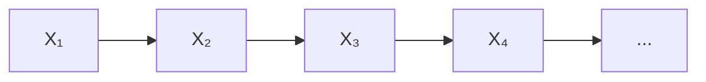
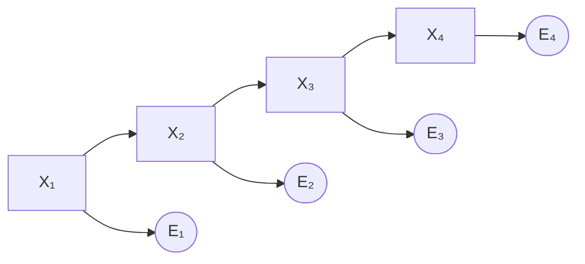
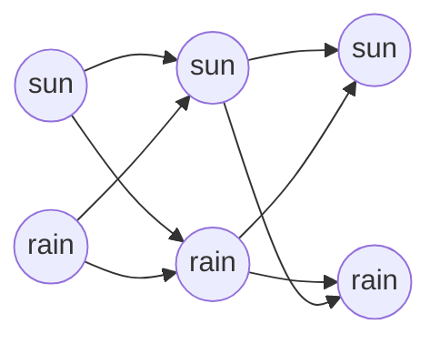
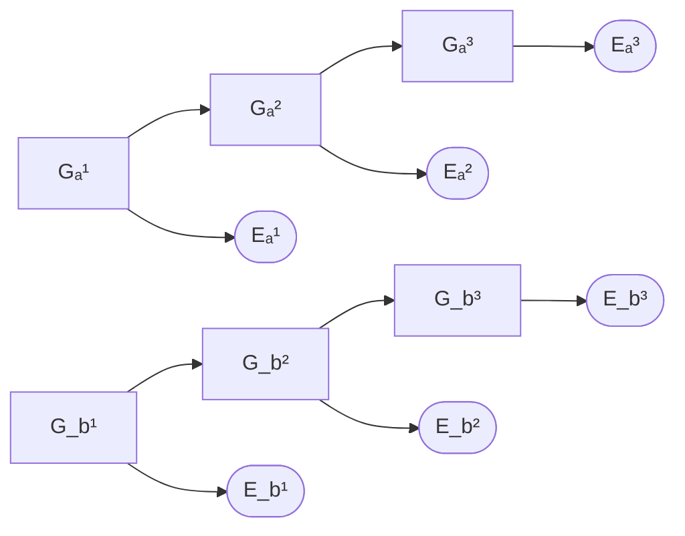

# 13 - Bayesian Networks: Reasoning Over Time

**Course**: COMP341 Introduction to Artificial Intelligence, Koç University
**Instructor**: Asst. Prof. Barış Akgün
**Topic**: Markov Models, HMMs, Filtering, Particle Filtering, Viterbi, Dynamic Bayes Nets

> **Where this fits.** Lectures 09–12 reasoned about a *single* snapshot in time. The real world is dynamic: a robot moves, a patient's vitals trend, speech unfolds. This lecture unfolds the Bayesian Network across time. The inference idea from lecture 10 (predict then condition) becomes **filtering**; the sampling methods from lecture 11 (prior sampling + likelihood weighting) become the **particle filter**; and the Markov property is just a structural special case of conditional independence (lecture 09).


## 1 Why Reason Over Time

We have a **sequence of observations** and want to infer a **sequence of hidden states** that changes over time. Applications: speech recognition, robot localization, medical monitoring, financial models, activity recognition, gene alignment, cryptanalysis. The challenge: **how to model time and do inference efficiently as data streams in.**


## 2 Markov Models

A **Markov model** is a chain-structured BN — states laid out in a line:



Each Xₜ is the **state** at time t. Parameters:

- **Transition (dynamics):** P(Xₜ | Xₜ₋₁) — given state s at t−1, the distribution over states at t.
- **Initial (prior):** P(X₁).
- **Stationarity:** the transition model is the *same* at every time step (the rules don't change).

If you know the current state perfectly, you can predict the future without the history — the Markov assumption.


## 3 The Markov Property

The future is conditionally independent of the past given the present:

$$P(X_{t+1} \mid X_t, X_{t-1}, \ldots, X_1) = P(X_{t+1} \mid X_t)$$

The current state is a **sufficient statistic** for the future (like a chess position: only the current board matters for choosing the next move, not how you got there).

<details>
<summary>Controlled and higher-order variants</summary>

- **Controlled:** with actions, P(Xₜ₊₁ | Xₜ, Uₜ) — next state depends on current state and action.
- **Higher-order:** a k-th order model conditions on the last k states. You can always reduce it to first-order by redefining the state as a window X̄ₜ₋₁ = [Xₜ₋₁, …, Xₜ₋ₖ].

</details>


## 4 Markov Chains

A **Markov chain** is a Markov model where states are **directly observable** — finite states, stochastic transitions, next depends only on current.

**Transition matrix** T with Tᵢⱼ = P(Xₜ₊₁ = sᵢ | Xₜ = sⱼ). Columns = current state, rows = next state; **each column sums to 1**.

**Weather chain** (states {sun, rain}):

| | from sun | from rain |
| :--- | :---: | :---: |
| **to sun** | 0.9 | 0.3 |
| **to rain** | 0.1 | 0.7 |

The joint factorizes (BN chain rule + Markov property):

$$P(X_1, \ldots, X_T) = P(X_1)\prod_{t=2}^{T} P(X_t \mid X_{t-1})$$


## 5 The Mini-Forward Algorithm

**Question:** given P(X₁) and the transitions, what is the marginal P(Xₜ) at a future time? Marginalize out the previous state — a recurrence run forward:

$$P(X_t) = \sum_{x_{t-1}} P(X_t \mid x_{t-1})\,P(x_{t-1})$$

In matrix form: **Pₜ = T·Pₜ₋₁ = T^(t−1)·P₁.**

<details>
<summary>Pseudocode + weather walkthrough</summary>

```text
MiniForward(P_X1, T, target_t):
    P = P_X1
    for t = 2..target_t:
        P[sᵢ] = Σⱼ T[sᵢ][sⱼ] · P_old[sⱼ]   for each sᵢ
    return P
```

Start P(sun)=1.0. Step 1: P(sun)=0.9·1.0+0.3·0=0.9, P(rain)=0.1. Step 2: P(sun)=0.9·0.9+0.3·0.1=0.84, P(rain)=0.16.

</details>

<details>
<summary>Pacman ghost-localization example</summary>

States are grid tiles; a ghost moves to one of 4 neighbors or stays, each with prob 1/5 (fewer options at edges). Starting at (3,3) with prob 1, probability spreads each step. P(X₃=(3,3)) = 5 neighbors each contributing 0.2·0.2 = 0.04 → 0.20; P(X₃=(3,4)) gets contributions only from (3,4) and (3,3) → 0.08.

</details>


## 6 Stationary Distributions

Run mini-forward forever with no observations and **uncertainty accumulates** — the distribution converges to a **stationary distribution** π, unchanged by a transition:

$$\pi = T\pi$$

(π is the eigenvector of T with eigenvalue 1.) For ergodic chains (irreducible, aperiodic) it exists, is unique, and is reached regardless of the start.

<details>
<summary>Weather example</summary>

Solve π(sun)=0.9π(sun)+0.3π(rain), π(sun)+π(rain)=1 → **π(sun)=0.75, π(rain)=0.25.** Check: 0.9·0.75 + 0.3·0.25 = 0.75 ✓.

</details>

**Practical implication:** after many steps without observations you know nothing beyond the stationary distribution — you've lost all your information. This is *why observations are crucial*.


## 7 Hidden Markov Models (HMMs)

A pure Markov chain assumes states are observable, but usually they aren't — you get noisy, partial observations. An **HMM** adds **emission** variables Eₜ:



The states are **hidden**; each Eₜ depends only on the current Xₜ. Three components:

1. **Initial** P(X₁).
2. **Transition** P(Xₜ | Xₜ₋₁) — how the hidden state evolves.
3. **Emission (sensor) model** P(Eₜ | Xₜ) — how observations are generated.

Two conditional independences: the hidden chain is Markov, and each emission depends only on its own state. The joint:

$$P(X_{1:T}, E_{1:T}) = P(X_1)P(E_1 \mid X_1)\prod_{t=2}^{T} P(X_t \mid X_{t-1})\,P(E_t \mid X_t)$$

<details>
<summary>Weather HMM (used throughout) and real-world HMMs</summary>

Hidden Xₜ ∈ {rain, sun}; observation Eₜ ∈ {umbrella, none}.

Transition: P(rain|rain)=0.7, P(rain|sun)=0.1. Emission: P(umbrella|rain)=0.9, P(umbrella|sun)=0.2.

| Application | Hidden states | Observations |
| :--- | :--- | :--- |
| Speech recognition | word/phoneme positions | acoustic signal |
| Machine translation | translation options | source words |
| Robot tracking | grid positions | range/sonar |
| Medical monitoring | health state | vitals, labs |

</details>


## 8 Inference Tasks in HMMs

| Task | Query | Algorithm | Use |
| :--- | :--- | :--- | :--- |
| **Filtering** | P(Xₜ \| e₁:ₜ) | Forward | "Where is it *now*?" |
| **Prediction** | P(Xₜ₊ₖ \| e₁:ₜ) | Forward + mini-forward | "Where in 3 s?" |
| **Smoothing** | P(Xₖ \| e₁:ₜ), k<t | Forward-Backward | "Where was it 2 h ago?" |
| **Most likely path** | argmax P(x₁:ₜ \| e₁:ₜ) | Viterbi | decode a sequence |
| **Sequence likelihood** | P(e₁:ₜ) | Forward (by-product) | model selection |


## 9 Filtering: The Forward Algorithm

The **belief state** Bₜ(X) = P(Xₜ | e₁:ₜ) summarizes everything known about the current state. The algorithm alternates two operations:

**① Passage of time (predict)** — push belief through the transition model (uncertainty grows):

$$B'_{t+1}(X) = \sum_{x_t} P(X_{t+1} \mid x_t)\,B_t(x_t)$$

**② Observation update (condition)** — reweight by the likelihood of the new evidence, then normalize (uncertainty shrinks):

$$B_{t+1}(X) \propto P(e_{t+1} \mid X_{t+1})\,B'_{t+1}(X_{t+1})$$

Combined:

$$B_{t+1}(X) = \alpha\,P(e_{t+1} \mid X)\sum_{x'} P(X \mid x')\,B_t(x')$$

This predict-then-condition structure is the temporal echo of select-and-marginalize from lecture 10.

<details>
<summary>Derivation of the observation update</summary>

$$P(X_{t+1} \mid e_{t+1}, e_{1:t}) = \alpha\,P(e_{t+1} \mid X_{t+1}, e_{1:t})\,P(X_{t+1} \mid e_{1:t})$$
$$= \alpha\,P(e_{t+1} \mid X_{t+1})\,B'_{t+1}(X_{t+1})$$

using Bayes' rule then emission independence; α = 1/P(eₜ₊₁ | e₁:ₜ).

</details>

<details>
<summary>Pseudocode</summary>

```text
Forward(initial, transition, emission, obs):
    B = initial
    for t = 1..T:
        for each state s:  B[s] *= emission[s][obs[t]]   # observation update
        normalize(B)
        if t < T:                                        # passage of time
            B_new[s'] = Σ_s transition[s'][s] · B[s]      for each s'
            B = B_new
    return B   # P(X_T | e_{1:T})
```

</details>

<details>
<summary>Worked example — Weather HMM, observe umbrella on days 1 and 2</summary>

Uniform prior B₁ = {rain 0.5, sun 0.5}.

| Time | Event | P(rain) | P(sun) |
| :--- | :--- | ---: | ---: |
| t=1 | prior | 0.50 | 0.50 |
| t=1 | after +u | 0.818 | 0.182 |
| t=2 | predicted | 0.627 | 0.373 |
| t=2 | after +u | 0.883 | 0.117 |

t=1 update: 0.9·0.5 = 0.45 and 0.2·0.5 = 0.10, normalize → 0.818 / 0.182. Predict t=2: rain = 0.7·0.818 + 0.3·0.182 = 0.627. t=2 update: 0.9·0.627, 0.2·0.373, normalize → **0.883 rain**. Two umbrella days → 88% sure it's raining.

</details>

<details>
<summary>Robot localization with HMMs</summary>

State = grid tile; observation = 4 wall sensors (≤ 1 error). Motion model: usually moves as intended, sometimes stays. At t=0 belief is uniform; each reading eliminates inconsistent tiles, and movement plus the next reading narrows further. After ~5 readings the robot is typically localized to one tile. The HMM **accumulates evidence over time** even when a single reading is ambiguous.

</details>


## 10 Approximate Filtering: Particle Filters

Exact filtering stores a full distribution Bₜ(X) and costs O(|X|²) per step — infeasible for huge or continuous state spaces. **Particle filters** approximate Bₜ(X) with N samples (**particles**); the fraction in state s approximates P(s).

The three-step cycle reuses lecture 11 directly:

1. **Elapse time** — for each particle, sample a successor from the transition model. *(= prior sampling.)*
2. **Weight** — assign each particle wⁱ = P(eₜ₊₁ | xⁱ); don't sample the observation, it's fixed. *(= likelihood weighting.)*
3. **Resample** — draw N new particles in proportion to the weights, returning to an unweighted set. High-weight particles are copied; low-weight ones vanish.

<details>
<summary>Pseudocode + resampling detail</summary>

```text
ParticleFilter(N, initial, transition, emission, obs):
    particles = [sample initial for _ in range(N)]
    for each t:
        particles = [sample transition(·|p) for p in particles]   # elapse
        weights   = [emission(obs[t]|p) for p in particles]        # weight
        normalize(weights)
        particles = resample(particles, weights, N)                # resample
    return particles
```

Resample: build the CDF of normalized weights; for each of N draws, pick a uniform u and select the particle whose CDF interval contains u. (Example: weights summing to 5.0, a draw of 0.21 lands in [0.20, 0.38) → particle (2,1).)

</details>

<details>
<summary>Sample impoverishment and the MCL connection</summary>

**Impoverishment:** after resampling you can lose diversity (all particles become copies of one). Fixes: more particles, regularization (add noise), stratified/systematic resampling, Rao-Blackwellization.

Real robot localization (**Monte Carlo Localization**, used in self-driving cars) *is* a particle filter: state = continuous (x, y, θ), sensor model from LIDAR/sonar, motion model from odometry.

</details>


## 11 Most Likely Explanation: Viterbi

Filtering gives the marginal at each time. Viterbi gives the single most probable **whole path**:

$$\arg\max_{x_{1:t}} P(x_{1:t} \mid e_{1:t})$$

This differs from filtering: the most likely state at each step individually may not form a consistent trajectory (like decoding a GPS path — you want the best *route*, not the best independent point per second). Used in speech recognition, where grammar imposes cross-time constraints.

### State trellis

Paths run left-to-right through states over time; each path's probability is the initial × all transitions × all emissions along it.



The **forward** algorithm SUMs over all paths reaching a node (→ marginal); **Viterbi** takes the MAX (→ best path). Same structure, sum↔max.

### Recursion

$$m_t(s) = P(e_t \mid s)\max_{s'}\big[P(X_t = s \mid X_{t-1}=s')\,m_{t-1}(s')\big]$$

with base m₁(s) = P(X₁=s)P(e₁|s), storing a backpointer bpₜ(s) = argmax. After filling forward, take s*_T = argmax_s m_T(s) and trace backpointers to recover the path. Runs in **O(T·N²)**.

<details>
<summary>Pseudocode</summary>

```text
Viterbi(initial, transition, emission, obs):
    for each s: m[s][1] = initial[s]·emission[s][obs[1]]; bp[s][1]=None
    for t = 2..T:
        for each s:
            (best, arg) = max over s_prev of transition[s][s_prev]·m[s_prev][t-1]
            m[s][t]  = emission[s][obs[t]]·best
            bp[s][t] = arg
    s* = argmax_s m[s][T]
    trace bp backward from s* to build the path
```

</details>

<details>
<summary>Worked Viterbi — ghost tracking</summary>

P(X₁=(3,3))=1, e₂=(2,4), e₃=(2,3). t=1: m₁((3,3))=1, rest 0. t=2: states with zero emission likelihood (e.g. (1,1)) get 0; m₂((3,3))=(1/16)·0.2=1/80; m₂((2,3))=m₂((3,4))=(3/32)·0.2=3/160. All t=2 backpointers point to (3,3) (only non-zero predecessor). Continue with e₃ and backtrack from the best t=3 state.

</details>


## 12 Smoothing: Forward-Backward

Smoothing computes P(Xₖ | e₁:T) for a past k using **all** evidence including the future — more accurate than filtering, but needs the whole sequence (offline). Use filtering online (real-time), smoothing offline (re-analyzing recorded data).

$$P(X_k \mid e_{1:T}) \propto \underbrace{P(X_k \mid e_{1:k})}_{\text{forward } \alpha_k}\;\underbrace{P(e_{k+1:T} \mid X_k)}_{\text{backward } \beta_k}$$

The forward variable comes from the forward algorithm; the backward variable runs backward from T:

$$\beta_T(s) = 1, \qquad \beta_t(s) = \sum_{s'} P(X_{t+1}=s' \mid X_t=s)\,P(e_{t+1} \mid s')\,\beta_{t+1}(s')$$

Smoothed estimate ∝ αₖ(s)·βₖ(s), normalized. **O(T·N²)** — one forward and one backward pass.


## 13 Dynamic Bayes Nets (DBNs)

HMMs track a single hidden variable per step. Often we need **multiple interacting variables** (a robot's position *and* orientation; several agents; temperature/pressure/humidity). A **DBN** repeats a fixed BN structure each time slice, with cross-time edges.



An HMM is just a DBN with one hidden variable and no intra-slice edges — DBNs are strictly more general.

<details>
<summary>Exact inference and DBN particle filters</summary>

**Exact:** unroll the network for T steps and run variable elimination (lecture 10). Online, eliminate each previous time slice to keep the model from growing. Factor sizes can still blow up because variables in a slice become correlated (the "interface" problem) — exact inference can be exponential in the number of state variables.

**Particle filter:** each particle is a complete assignment of all hidden variables, e.g. {Gₐ=(3,3), G_b=(5,3)}. Elapse-time samples all variables jointly; weight multiplies all emission models w = P(Eₐ|Gₐ)·P(E_b|G_b); resample tuples. Scales far better than exact inference for large/continuous state spaces.

</details>


## 14 Summary

| Model | States | Observations | When |
| :--- | :--- | :--- | :--- |
| Markov chain | observable | none | track dynamics of visible states |
| HMM | hidden | noisy | one hidden variable |
| DBN | hidden | noisy | multiple interacting variables |

| Task | Query | Algorithm | Time |
| :--- | :--- | :--- | :--- |
| Filtering | P(Xₜ\|e₁:ₜ) | Forward | O(T·N²) |
| Prediction | P(Xₜ₊ₖ\|e₁:ₜ) | Forward + mini-forward | O((T+k)·N²) |
| Smoothing | P(Xₖ\|e₁:T) | Forward-Backward | O(T·N²) |
| Most likely path | argmax P(x₁:ₜ\|e₁:ₜ) | Viterbi | O(T·N²) |

**Key equations:** belief Bₜ(X)=P(Xₜ|e₁:ₜ); predict B′ₜ₊₁=Σ P(Xₜ₊₁|xₜ)Bₜ; update Bₜ₊₁ ∝ P(eₜ₊₁|X)B′; Viterbi swaps Σ→max with backpointers; matrix Pₜ = T^(t−1)P₁.

**Distinctions to remember:**
- **Filtering vs smoothing** — past-only (online) vs all evidence (offline, more accurate).
- **Forward vs Viterbi** — sum (marginal) vs max (best path); same structure.
- **Exact vs particle** — O(|X|²) precise vs O(N) approximate but scalable.

> **The arc closes.** Across lectures 08–13 we built probability foundations, the Bayesian Network representation, exact and approximate inference, decision-making, and finally reasoning over time. Filtering reused predict-then-condition from inference; particle filters reused prior sampling and likelihood weighting; the Markov property is conditional independence in a chain. The same handful of ideas, recombined.

*Notes compiled from COMP341 Lecture 13 slides. Koç University.*
