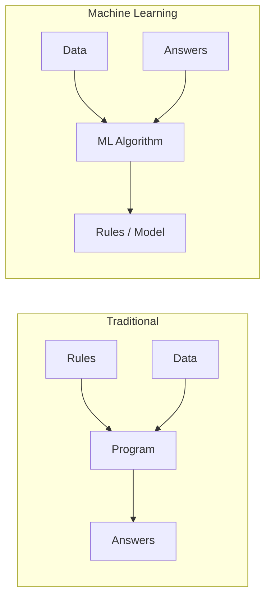
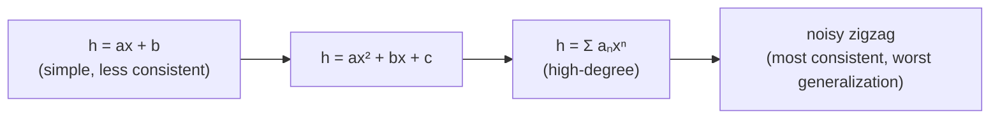
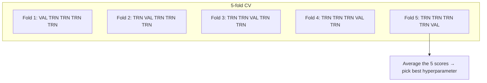
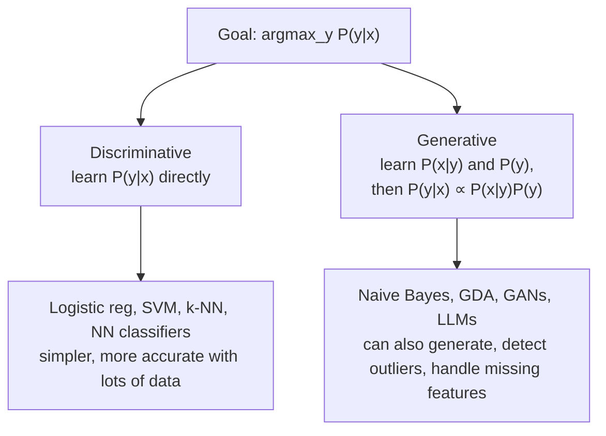
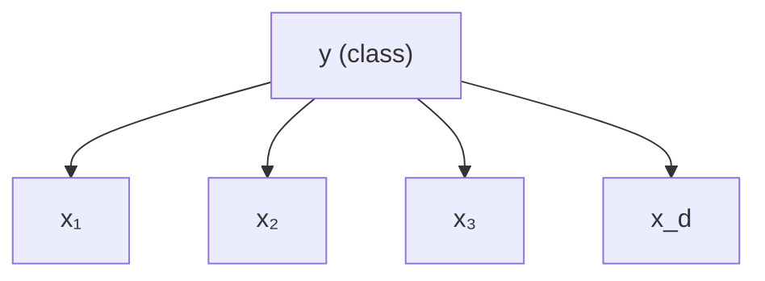
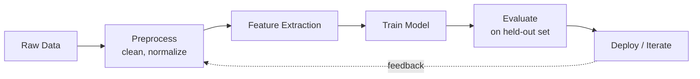
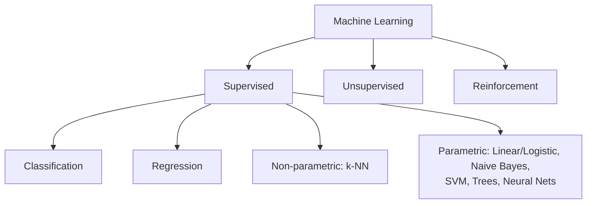

# 14 - Machine Learning

> **Course**: COMP341 Intro to AI | Koç University | Asst. Prof. Barış Akgün

## 1 What Is Machine Learning

Three complementary definitions:

- **Samuel (1959)**: computers that learn "without being explicitly programmed."
- **Oxford**: a computer that modifies its processing based on new information.
- **Jordan & Mitchell (2015)**: improving a *performance measure* on a *task* given *experience (data)*. — the most precise: it names task, metric, and data.

The core flip: traditional programming derives answers from hand-written rules; ML derives the rules from data.



You don't hand-craft every decision — you show examples and let optimization find the pattern (like teaching a child to recognize dogs by showing many dogs, not a rulebook).

> [!info]- Historical note — Arthur Samuel
> "AI" was coined in 1956, "machine learning" in 1959 by Samuel. He built a checkers program that learned by self-play and eventually beat him. Its TV demo reportedly raised IBM stock 15 points overnight. He also invented alpha-beta pruning.

## 2 Brief History

The field runs in **boom-bust cycles**, driven mostly by whether compute and data matched the algorithms' ambition. Deep learning's 2012 comeback wasn't a new idea — it was 1980s ideas (backprop, NNs) plus GPUs and big data.

> [!example]- Timeline of milestones
> | Year | Milestone |
> | :--- | :--- |
> | 1763 | Bayes' Theorem foundations |
> | 1805 | Least Squares |
> | 1896 | Linear Regression foundations |
> | 1913 | Markov Chains |
> | 1957 | Perceptron — first learning algorithm |
> | 1967 | Nearest Neighbors |
> | Late 1960s | Perceptron book kills NNs — *1st death* |
> | 1970 / 1986 | Backpropagation derived / popularized — *rebirth* |
> | 1989 | Reinforcement Learning |
> | 1995 | SVMs outperform NNs — *2nd death* |
> | 1997 | LSTM |
> | 2012 | Deep Learning wins ImageNet — *2nd rebirth* |
> | 2013 / 2016 | Deep RL: Atari / AlphaGo |
> | 2014 | GANs |
> | 2017 | Transformers |

Samuel's two checkers ideas were historically seminal: **rote learning** (memorize every board state — pure lookup, no generalization) and **self-learning** (tune the weights of an evaluation function `J(x) = Σ wᵢfᵢ(x)` by self-play — the first supervised/RL-style learning).

## 3 ML in the Agent Framework

Everything before ML — search, CSPs, Bayes nets — relied on a *human* supplying the knowledge (heuristics, constraints, CPTs). The agent executed a human-engineered procedure; it learned nothing.

ML asks: can the agent *acquire* that knowledge from data instead? For an agent with policy π (states → actions):

- learn a **model** of the environment (so we can plan without hand-crafting it),
- learn **heuristics / evaluation functions**,
- learn **π directly** from experience (imitation, RL),
- learn **features** from raw sensor input (e.g. pedestrians from pixels).

ML is needed when the environment is unknown, the designer can't anticipate every case, or the task is too complex for explicit rules (faces, language).

## 4 What Can Be Learned

- **Parameters** — model form is known, find the numbers (CPT entries, polynomial coefficients, NN weights). Most common; learning = optimization over a fixed family.
- **Structure** — learn the relationships themselves (Bayes net topology, HMM transitions). Harder.
- **Patterns (unsupervised)** — find structure with no labels (clustering, dimensionality reduction).

## 5 Types of Machine Learning

The coin example yields four problem types from one object:

| Question about a coin | ML type |
| :--- | :--- |
| What is its monetary value? | **Supervised** (classification / regression) |
| Which coins are similar? | **Unsupervised** (clustering) |
| How do I maximize my coins? | **Reinforcement learning** |
| Create a new coin. | **Generative models** |

### Supervised

Labeled input/output pairs `(xᵢ, yᵢ)`; learn `h` such that `h(x) ≈ f(x)` for new `x`, minimizing the loss between target `y` and prediction `ŷ`.

| Flavor | Output | Example |
| :--- | :--- | :--- |
| **Classification** | discrete class | coin → "1 TL"; email → spam/not |
| **Regression** | continuous value | coin → value; predict stock price |

### Unsupervised

Unlabeled data; find inherent structure. Tasks: **clustering**, **anomaly detection** (counterfeit coins), **dimensionality reduction / representation learning**, **density estimation**. The performance metric depends on your assumptions (e.g. clustering minimizes distance to cluster means).

### Reinforcement Learning

An agent takes actions, receives **rewards**, and learns a policy π mapping states → actions to maximize total reward. Unlike supervised learning, **there are no labeled correct actions** — only the overall outcome is scored. Can learn purely from interaction (a robot learning to walk gets reward for staying upright, not per-joint instructions).

## 6 Features and Representations

A **feature** is a measurable property of the thing you classify (for coins: diameter, weight, luster, color, edge). Good features are **informative** (correlated with the output) and **discriminative** (different classes get different values).

> Shape is useless for Turkish coins (all circular); **diameter** is excellent (1 kuruş ≈ 14 mm, 50 kuruş ≈ 21.5 mm, 1 TL ≈ 26 mm).

Each example is a **feature vector** `x = [x₁, …, x_d]`. Traditionally experts hand-craft features; deep learning replaces this with **feature learning** — the network extracts useful features from raw input automatically.

## 7 Supervised Learning: The Core Idea

Given training set `D = {(xᵢ, f(xᵢ))}`, find `h ≈ f`. `h` is **consistent** if `h(xᵢ) = f(xᵢ)` on all examples. Canonical illustration — **curve fitting**: a line, a quadratic, a high-degree polynomial, or a zigzag through every point. The zigzag is perfectly consistent but terrible — it memorized noise.

**Ockham's Razor**: among hypotheses consistent with the data, prefer the simplest. In practice, **maximize consistency *and* simplicity**.



## 8 Overfitting, Underfitting & the Bias-Variance Tradeoff

| | Cause | Train error | Test error |
| :--- | :--- | :--- | :--- |
| **Underfitting** (high bias) | model too simple to capture `f` | high | high |
| **Overfitting** (high variance) | model fits noise, oversensitive to the training set | ~0 | high |

Underfitting example: a line through U-shaped data — always wrong. Overfitting example: a degree-9 polynomial through 10 noisy points — wild oscillations.

Total error ≈ **Bias² + Variance + irreducible noise**. As complexity rises, bias falls and variance grows; the best model sits at the **sweet spot** between them.

**Three solutions** (each covered below): regularization (§13), cross-validation (§10), and the train-validate-test split (§10).

## 9 k-Nearest Neighbors (k-NN)

"A top contender for the easiest ML algorithm." No training phase — store the data, classify at query time.

- **1-NN**: predict the label of the single closest training point.
- **k-NN**: take the `k` closest, predict by **majority vote**.

> Intuition: to judge a mushroom, look at the `k` most similar mushrooms you've already classified.

> [!note]- Algorithm + Python
> ```text
> 1. Compute dᵢ = d(xᵢ, x) for every training point
> 2. Sort ascending by distance
> 3. Take the top k
> 4. h(x) = mode of their labels
> ```
> ```python
> import numpy as np
> from collections import Counter
>
> def knn_predict(X_train, y_train, x_query, k):
>     distances = [np.linalg.norm(xt - x_query) for xt in X_train]
>     idx = np.argsort(distances)[:k]
>     return Counter(y_train[i] for i in idx).most_common(1)[0][0]
> ```

**Distance metrics** matter: Euclidean (L2, most common), Manhattan (L1, robust to outliers), cosine (text/high-dim).

**Effect of k**: `k=1` → low bias, high variance (noisy, jagged boundaries, overfits); `k=n` → always predicts the majority class (high bias, underfits). The sweet spot is in between (use odd `k` to avoid ties). Larger `k` → smoother decision boundary.

k-NN is **non-parametric**: the model *is* the training data, so the parameter count grows with the dataset.

| Strength | Weakness |
| :--- | :--- |
| no training time | slow prediction (all distances) |
| handles multi-class | high memory (stores all data) |
| no distribution assumptions | suffers the curse of dimensionality; sensitive to irrelevant features |

## 10 Hyperparameters & Cross-Validation

A **hyperparameter** is a setting of the *algorithm*, not learned from data (k in k-NN, λ in ridge, learning rate / #layers in NNs). It must be chosen before training.

**The fundamental rule**: never evaluate on data you trained on, and never tune on data you'll use for the final score. Tuning `k` on the training set always picks `k=1` (zero training error) — meaningless for generalization.

**Train-Validate-Test split** (e.g. 70/15/15): learn parameters on train, tune hyperparameters on validation, report **once** on test. Never peek at the test set — peeking makes it part of model selection and destroys the unbiased estimate.

**k-fold cross-validation** removes dependence on one lucky split:



Each point validates exactly once; average the scores. Works with **any** ML method. (With deep learning, CV is usually too expensive — a single large validation split is used instead.)

## 11 Parametric vs Non-Parametric

| | Parametric | Non-parametric |
| :--- | :--- | :--- |
| Parameters | fixed count, independent of `n` | grows with the data |
| At prediction | only params needed (discard data) | needs the data (k-NN searches it) |
| Memory / speed | small / fast | large / slow |
| Flexibility | limited by model form | fits arbitrary functions |
| Examples | linear/logistic regression, NNs | k-NN, decision trees |

The name "non-parametric" is misleading — these methods *have* parameters; there's just no fixed number.

## 12 Linear Regression

Old, simple, still everywhere; the basis for much else.

$$\hat{y} = w_0 + w_1 f_1(x) + \dots + w_d f_d(x) = w^T f(x)$$

`w` are the weights to learn; `f(x) = [1, f₁(x), …]` is the feature vector (the prepended 1 carries the bias `w₀`). The model is linear **in w**, not necessarily in the raw input.

**Loss — sum of squared errors:**

$$J(D, w) = \sum_i (y_i - \hat{y}_i)^2 = \sum_i (y_i - w^T f(x_i))^2$$

Squared error penalizes big mistakes more, is differentiable everywhere, has a unique closed-form minimum, and corresponds to MLE under Gaussian noise.

**Closed-form (normal equations):** set `dJ/dw = 0` →

$$w^* = (X^T X)^{-1} X^T Y$$

where `X` is the `n × (d+1)` design matrix and `Y` the target vector.

**Nonlinear features**: since only `w` must be linear, `f(x)` can be anything — `[1, x, x²]` fits a parabola, `[1, x, sin x]` a sinusoid, `[1, x₁, x₂, x₁x₂]` adds interactions. The burden shifts to **feature engineering**. When the model is nonlinear *in w* (e.g. NNs), there's no closed form → use gradient descent.

## 13 Regularization

Many/flexible features let weights blow up, causing wild oscillations — overfitting. **Regularization** adds a penalty on weight size to the loss, forcing smoother models.

| Method | Penalty | Effect |
| :--- | :--- | :--- |
| **Ridge (L2)** | `λ wᵀw = λ‖w‖²` | shrinks weights; closed form `w* = (XᵀX + λI)⁻¹XᵀY` (also more stable/always invertible) |
| **Lasso (L1)** | `λ‖w‖₁` | **sparse** weights → automatic feature selection |
| **Elastic Net** | `λ₁‖w‖₁ + λ₂‖w‖²` | combines both |

`λ` is a hyperparameter chosen by cross-validation: `λ=0` is plain least squares; large `λ` is strong smoothing. The same "penalize complexity" idea recurs as Laplace smoothing (Naive Bayes) and weight decay (NNs).

## 14 Gradient Descent

When `J(w)` has no closed-form minimum, optimize iteratively. Move `w` opposite the gradient (steepest ascent):

$$w_{t+1} = w_t - \alpha \nabla J(w_t)$$

`α` (learning rate) is a hyperparameter. *Analogy*: blindfolded on a hill, always step downhill along the slope you feel underfoot.

> [!note]- Pseudocode
> ```python
> def gradient_descent(w, grad_J, alpha=0.01, max_iter=1000, tol=1e-6):
>     for _ in range(max_iter):
>         g = grad_J(w)
>         w_new = w - alpha * g
>         if np.linalg.norm(w_new - w) < tol:
>             break
>         w = w_new
>     return w
> ```
> **Stopping**: max iterations, `|w_{t+1} − w_t| < ε`, or negligible change in loss.

**Learning rate**: too large → overshoots/diverges; too small → crawls. Adaptive methods (Adam, RMSProp, AdaGrad) tune it per-parameter.

General regularized objective `J(D,w) = Σ ℓ_D(yᵢ, f(xᵢ,w)) + λ ℓ_w(w)` — gradient descent applies as long as both terms are differentiable.

| Variant | Gradient over | Property |
| :--- | :--- | :--- |
| Batch | whole dataset | stable, slow per step |
| Stochastic (SGD) | one random sample | noisy, fast, escapes local minima |
| Mini-batch | a batch (e.g. 32) | best of both — used in deep learning |

## 15 Logistic Regression

For binary classification we squash the real-valued `wᵀf(x)` into `[0,1]` with the **sigmoid**:

$$\sigma(x) = \frac{1}{1 + e^{-x}}, \qquad \sigma(0)=0.5,\quad \sigma'(x)=\sigma(x)(1-\sigma(x))$$

`σ(0)=0.5` is the decision boundary; `|w₁|` controls steepness. The model:

$$\hat{y} = \sigma(w^T f(x)) = P(y=1 \mid x), \qquad \text{predict class 1 if } \hat{y} > 0.5$$

**Loss — log-loss (binary cross-entropy):** squared error is non-convex here, so use

$$\ell(y_i, \hat{y}_i) = -y_i \log \hat{y}_i - (1-y_i)\log(1-\hat{y}_i)$$

It heavily punishes confident wrong predictions: if `y=1`, predicting 0.99 costs ≈0.01; predicting 0.01 costs ≈4.6. No closed form → gradient descent (add `λ‖w‖²` to regularize). Despite the name, this is a **classification** method.

## 16 Discriminative vs Generative

Goal: `argmax_y P(y|x)`.



Since `P(x)` is constant across classes, the generative rule reduces to comparing `P(x|y)·P(y)`. Discriminative wins on accuracy with abundant data; generative is more data-efficient and offers synthesis + anomaly detection.

## 17 Naive Bayes

We want the generative approach but `P(x₁,…,x_d | y)` is an intractably huge joint table. **Naive Bayes assumption**: features are **conditionally independent given the class**:

$$P(y \mid x) \propto P(y) \prod_{j} P(x_j \mid y)$$

This corresponds to a Bayes net with `y` as the root and all features as independent children:



"Naive" because features are rarely truly independent (adjacent pixels correlate), yet it works remarkably well — especially for text. **Learn just two things by counting:** the prior `P(y)` and each `P(xⱼ|y)`.

$$P(y=c) = \frac{\#(y=c)}{\#\text{total}}, \qquad P(x_j=v \mid y=c) = \frac{\#(x_j=v,\, y=c)}{\#(y=c)}$$

> [!example]- Worked example — classify (X₁=1, X₂=0)
> | X₁ | X₂ | Y | Count |
> | ---: | ---: | ---: | ---: |
> | 1 | 1 | 1 | 20 |
> | 1 | 0 | 1 | 3 |
> | 0 | 0 | 1 | 8 |
> | 1 | 0 | 0 | 12 |
> | 0 | 1 | 0 | 14 |
> | 0 | 0 | 0 | 1 |
>
> Total 58. Positives (Y=1) = 31, negatives = 27.
> ```text
> P(Y=1|1,0) ∝ (31/58)·(23/31)·(11/31)
> P(Y=0|1,0) ∝ (27/58)·(12/27)·(13/27)
> ```
> Compare the two (no need to divide by P(x), it's shared); predict the larger.

**Zero-probability problem**: if a feature value never co-occurred with a class, `P(xⱼ|y)=0` zeroes the whole product (e.g. "lottery" unseen in training spam → `P(spam | "lottery") = 0`). **Fix — Laplace smoothing**: add 1 to every count:

$$P(x_j=v \mid y=c) = \frac{\#(x_j=v, y=c) + 1}{\#(y=c) + |\text{values of } x_j|}$$

For **continuous features**, model `P(xⱼ|y) = N(μ_{jc}, σ²_{jc})` instead of a table. NB works despite the wrong assumption because classification only needs the correct **argmax**, not exact probabilities.

## 18 Parameter Estimation & MLE

The principled way to learn parameters. Given a distribution `P(x; w)` and i.i.d. data, find the `w` that makes the data most probable:

$$L(D,w) = \prod_i P(x_i; w) \quad\Rightarrow\quad w^* = \arg\max_w \sum_i \log P(x_i; w)$$

(We maximize the **log**-likelihood to avoid underflow.) Most ML loss functions are MLE in disguise:

- linear regression + Gaussian noise → least squares,
- logistic regression → log-loss,
- Naive Bayes → frequency counting.

For a class-conditional Gaussian `N(μ_y, Σ_y)`, MLE just gives the **sample mean and covariance** within each class.

## 19 Generative Models & LLMs

Generative models capture `P(x)` or `P(x|y)` and can **sample** new data: Gaussian Mixture Models (clustering/density), Bayes nets & HMMs, series forecasting (`P(xₜ | xₜ₋ₙ:ₜ₋₁)` for stock/weather prediction), VAEs and GANs.

**LLMs** are generative models of text sequences:

$$P(x_t \mid x_{t-w:t-1}, \theta)$$

where `xₜ` is the next **token** (≈word/sub-word), `xₜ₋w:ₜ₋₁` the context window, `θ` billions of weights. They simply predict the next-token distribution and sample repeatedly — hence "stochastic parrots." The surprise is that this simple objective, scaled to trillions of tokens, yields reasoning, coding, and translation. **Multi-modal** models extend the same principle to text + images + audio + video.

## 20 ML Pipelines & Best Practices



Inference reuses the same preprocess → extract → model path. **Tip**: if feature extraction is slow (e.g. audio spectrograms), cache features after the first pass.

> [!tip]- Diagnosing bad performance
> - Features not informative/discriminative → engineer better features
> - Data too noisy → preprocess
> - Wrong model → try another algorithm
> - Not enough data → collect more / augment
> - Overfitting (train good, test bad) → regularize, simplify, more data
> - Underfitting (train bad) → more complex model, more features
>
> **Never tune on the test set.**

**Metrics** (TP/TN/FP/FN = true/false pos/neg):

| Metric | Formula | Use when |
| :--- | :--- | :--- |
| Accuracy | (TP+TN)/Total | balanced classes |
| Precision | TP/(TP+FP) | false positives costly (flagging good email) |
| Recall | TP/(TP+FN) | false negatives costly (missing cancer) |
| F1 | 2PR/(P+R) | imbalanced; balance P & R |
| MSE/RMSE | mean (yᵢ−ŷᵢ)² | regression |

**Baselines** — always establish one first: random (if you can't beat it, give up), **most-frequent-class** (crucial when imbalanced — 99% non-spam gives 99% accuracy trivially), then simple ML (k-NN, trees, NB, linear), then strong baselines (SVM, Random Forest, Gradient Boosting). Tune hyperparameters for baselines too.

| What | How chosen |
| :--- | :--- |
| Parameters `w` | MLE / minimize training loss |
| Hyperparameters (k, λ, α) | cross-validation on validation set |
| Final score | reported once on test set |

## 21 Other Model Families

> [!abstract]- Overview (conceptual awareness expected; not in the math portion)
> **Tree-based** — *Decision Trees* recursively split the feature space (interpretable, overfit easily). *Random Forests* average many trees on random data/feature subsets (bagging). *Gradient Boosted Trees* (XGBoost, LightGBM) train trees sequentially to fix prior errors — SOTA on tabular data.
>
> **SVMs** — find the **maximum-margin hyperplane**; support vectors are the closest points. The **kernel trick** `K(xᵢ,xⱼ)=φ(xᵢ)ᵀφ(xⱼ)` gives nonlinear boundaries without computing φ. Dominant ~1995–2012.
>
> **Kernel methods** — broader family; `K` measures similarity (linear, polynomial, RBF).
>
> **Probabilistic graphical models** — Bayes nets, HMMs, CRFs (already covered); explicit independence structure.
>
> **Neural networks** — stacked linear layers + nonlinear activations, each learning more abstract features. Universal approximators; trained by **backpropagation** + gradient descent. Architectures: MLP (general), CNN (images), RNN/LSTM (sequences), **Transformer** (attention — dominant). 2012's AlexNet was old ideas at GPU scale.

## Summary



Concerns shared by **all** methods: bias-variance / over- vs under-fitting, regularization, hyperparameter tuning via CV, train/validate/test discipline, feature engineering vs learning, metrics, and baselines.

> [!note]- Quick reference formulas
> | Concept | Formula |
> |---|---|
> | Linear regression | `ŷ = wᵀf(x)` |
> | MSE loss | `J = Σ(yᵢ − ŷᵢ)²` |
> | Ridge loss | `J = Σ(yᵢ − ŷᵢ)² + λ‖w‖²` |
> | Closed form | `w* = (XᵀX)⁻¹XᵀY` |
> | Ridge closed form | `w* = (XᵀX + λI)⁻¹XᵀY` |
> | Gradient descent | `w ← w − α∇J(w)` |
> | Sigmoid | `σ(x) = 1/(1 + e⁻ˣ)` |
> | Log-loss | `ℓ = −y·log ŷ − (1−y)·log(1−ŷ)` |
> | Naive Bayes | `ŷ = argmax_y P(y)·Πⱼ P(xⱼ|y)` |
> | MLE | `w* = argmax_w Σ log P(xᵢ; w)` |
> | Bayes classification | `P(y|x) ∝ P(x|y)·P(y)` |
> | Precision / Recall / F1 | `TP/(TP+FP)` · `TP/(TP+FN)` · `2PR/(P+R)` |

*End of Lecture 14 — Machine Learning*
