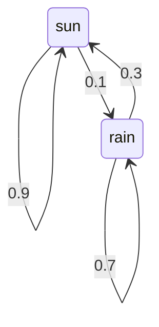
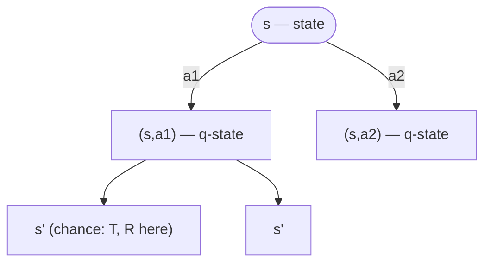
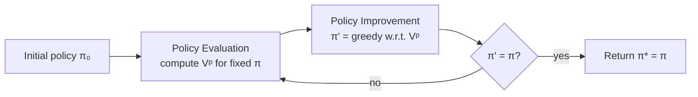

# 15 - Markov Decision Processes

> **Course**: COMP341 Intro to AI | Koç University
> **Topic**: Sequential decisions under action uncertainty

## 1 Why Not Just Search?

Classical search (BFS, DFS, A*) assumes a **deterministic** world: choose "North," go North. Many real problems are **stochastic** — outcomes are uncertain.

**Grid World** (our running example): an agent on a grid with walls, a goal (+1), and a trap (−1). The twist is **noisy movement**:

- 80% of the time you move in the intended direction,
- 10% drift left, 10% drift right,
- if a wall blocks the intended cell, you stay put.

Deterministic search is invalid here. You *could* run expectimax and re-plan each step, but that's expensive, revisits states, and faces an infinite tree. Instead we want a **policy** — a complete state→action map, computed once, so the agent acts immediately without re-planning. That is exactly what MDPs give us.

## 2 From Search to Sequential Decisions

A rational agent **maximizes expected utility**. For sequential decisions, utility comes from **rewards**, and the goal is to **maximize expected cumulative reward over time** (e.g. +1 per dirt vacuumed, +1 per passenger delivered, +1 for winning a game).

Decision networks handled single/unrelated decisions; **MDPs handle sequential decisions** where each action affects the next state.

## 3 Markov Chains → MDPs

A **Markov Chain** has states, a transition model, and an initial distribution — and you have **no control**; it just evolves.



Now imagine a "weather machine" letting you *act* on the chain: actions cost energy (negative reward) but can keep it sunny (positive reward). A Markov Chain **plus actions and rewards** is an MDP.

## 4 Formal Definition

An MDP is the tuple **(S, A, T, R, γ)** plus a start state:

| Component | Symbol | Meaning |
| :--- | :--- | :--- |
| States | S | all states the agent can occupy |
| Actions | A | all available actions |
| Transition | T(s,a,s') = P(s'\|s,a) | probability of reaching s' from s via a |
| Reward | R(s,a,s') | reward for that transition |
| Discount | γ ∈ [0,1] | how much future rewards are worth now |

Optionally **terminal states** end the episode. The reward can be written `R(s,a,s')`, `R(s,a)`, `R(s)`, or `R(s')` — all equivalent, just different bookkeeping.

Each MDP state projects an **expectimax-like tree**:



A **q-state (s, a)** is the situation after committing to `a` but before nature picks the outcome — hence "q-values."

## 5 The Markov Property

> The future is independent of the past, given the present.

$$P(S_{t+1} \mid S_t, A_t, S_{t-1}, \dots, S_0) = P(S_{t+1} \mid S_t, A_t)$$

It doesn't matter *how* you reached `s` — only the current state and action predict the next state (just like a search successor function). This makes the problem tractable: you only need to know where you are now, not your whole history.

## 6 Policies

In deterministic search the solution is a **plan** (a fixed action sequence) — fragile here, since one drift breaks it. In MDPs the solution is a **policy** `π: S → A`, an action for **every** state.

- *Deterministic* policy: "in s, always do a." *Stochastic*: "in s, do a with probability p."
- The **optimal policy π\*** maximizes expected cumulative discounted reward from any state.

A policy makes the agent a **reflex agent**: look up the current state, execute the action — even in states it never expected to reach.

> [!example]- Living reward reshapes the optimal policy
> With reward `R(s)` on non-terminal states:
> - **−0.01**: reach the goal safely, no excessive risk.
> - **−0.03**: take faster, riskier paths near the trap.
> - **−0.4**: existence is so costly the agent prefers the trap to long paths.
> - **−2.0**: jump into the nearest terminal immediately, even the trap.
>
> Small reward changes → qualitatively different behavior. Reward design is critical.

## 7 Utility & the Solution Horizon

How to score a state sequence `s₀, s₁, …`? Summing raw rewards diverges for infinite sequences; averaging loses temporal structure. The standard choice is the **discounted sum**:

$$U([r_0, r_1, r_2, \dots]) = r_0 + \gamma r_1 + \gamma^2 r_2 + \cdots$$

| Horizon | Policy | Notes |
| :--- | :--- | :--- |
| **Finite** (T steps) | **non-stationary** — action depends on time left | like depth-limited search |
| **Infinite** | **stationary** — π\*(s) depends only on s | needs γ<1; the standard MDP setting |

## 8 Discounting

Each step into the future multiplies reward by another γ.

**Why discount?** Sooner rewards are more valuable and more certain (time value of money), and discounting makes algorithms converge. For γ<1 even infinite sequences are finite:

$$\sum_{t=0}^{\infty} \gamma^t R_{max} = \frac{R_{max}}{1-\gamma}$$

> [!example]- Example (γ = 0.5)
> ```text
> U([1,2,3]) = 1 + 0.5·2 + 0.25·3 = 2.75
> U([3,2,1]) = 3 + 0.5·2 + 0.25·1 = 4.25
> ```
> Bigger rewards sooner win.

**Effect of γ**: near 0 → myopic (only immediate reward); near 1 → far-sighted; γ=1 only valid with a finite horizon or guaranteed terminal states. Small γ = shorter effective horizon and a preference for shorter solutions.

**Three ways to keep utility finite**: finite horizon, discounting (γ<1), or **absorbing states** (every policy eventually terminates).

## 9 Optimal Quantities V\*, Q\*, π\*

- **V\*(s)** — expected discounted reward starting in `s` and acting optimally. A **long-term** quantity, not the immediate reward: states near the goal have high V\*, near traps low/negative; terminals have V\* = R.
- **Q\*(s,a)** — same, but take action `a` first, then act optimally.
- **π\*(s)** — the optimal action, recovered trivially from Q: `π*(s) = argmax_a Q*(s,a)`.

They're mutually recursive:

$$V^*(s) = \max_a Q^*(s,a), \qquad Q^*(s,a) = \sum_{s'} P(s'\mid s,a)\,[R(s,a,s') + \gamma V^*(s')]$$

This circularity is exactly what the Bellman equations resolve.

## 10 The Bellman Equations

The heart of MDP theory — they express the recursive structure of the optimal value:

$$V^*(s) = \max_a \sum_{s'} P(s'\mid s,a)\,[R(s,a,s') + \gamma V^*(s')]$$

> In words: **value = best action's (immediate reward + discounted future value).**

> [!note]- Derivation via trajectories
> For trajectory `σ = (s₀, s₁, …)` following π:
> ```text
> U(σ) = r₀ + γr₁ + γ²r₂ + … = r₀ + γ·U(σ')
> ```
> Taking expectations gives the **fixed-policy** Bellman equation:
> ```text
> Vᵖ(s) = Σ_{s'} P(s'|s, π(s)) · [R(s, π(s), s') + γ·Vᵖ(s')]
> ```
> Replacing the fixed action with a `max` over actions yields the optimal equation above.

Because the equation is **recursive** (V\* of a state depends on V\* of neighbors), we can solve it by starting with arbitrary values and repeatedly applying the update — that's **Value Iteration**.

For a **fixed** policy there's no `max` (the action is fixed by π), making the system linear — used in Policy Evaluation:

$$V^\pi(s) = \sum_{s'} P(s'\mid s,\pi(s))\,[R(s,\pi(s),s') + \gamma V^\pi(s')]$$

## 11 Value Iteration

Initialize `V₀(s)=0`, then sweep all states applying the Bellman update until convergence; extract the policy at the end.

$$V_{k+1}(s) = \max_a \sum_{s'} P(s'\mid s,a)\,[R(s,a,s') + \gamma V_k(s')]$$

> [!note]- Pseudocode
> ```python
> def value_iteration(states, actions, T, R, gamma, eps=1e-6):
>     V = {s: 0.0 for s in states}
>     while True:
>         V_new, delta = {}, 0
>         for s in states:
>             V_new[s] = max(
>                 sum(T(s,a,sp) * (R(s,a,sp) + gamma*V[sp]) for sp in states)
>                 for a in actions)
>             delta = max(delta, abs(V_new[s] - V[s]))
>         V = V_new
>         if delta < eps * (1 - gamma) / gamma:
>             break
>     return V
>
> def policy_extraction(states, actions, T, R, gamma, V):
>     return {s: max(actions,
>             key=lambda a: sum(T(s,a,sp)*(R(s,a,sp)+gamma*V[sp]) for sp in states))
>             for s in states}
> ```

- **Convergence** (theorem): `V_k → V*`. Each update is a γ-contraction, so by the Banach fixed-point theorem it converges to the unique fixed point. Stop when `max_s |V_{k+1}(s) − V_k(s)| < ε(1−γ)/γ`.
- **Complexity**: `O(|S|² |A|)` per iteration (each state × each action × sum over next states).
- **Key observation**: the **policy converges before the values** — the argmax stabilizes while values still wiggle in the 4th decimal. This motivates Policy Iteration.

## 12 Worked Example — One Step of Value Iteration

A 2×2 grid; the terminal corner (call it `s22`) has value 1.0. Using the per-state form `V_{t+1}(s) = R(s) + γ·max_a Σ P(s'|s,a)·V_t(s')`, with γ=0.5, R=−0.04 on non-terminals, and all non-terminal `V₀=0.1`:

> [!example]- Computing V₁ for each state
> **s21** (terminal reachable via UP):
> ```text
> UP:    0.1·0.1 + 0.1·0.1 + 0.8·1.0 = 0.82   ← best
> DOWN:  0.1·0.1 + 0.9·0.1 + 0.0·1.0 = 0.10
> LEFT:  0.8·0.1 + 0.1·0.1 + 0.1·1.0 = 0.19
> RIGHT: 0.0·0.1 + 0.9·0.1 + 0.1·1.0 = 0.19
> V₁(s21) = −0.04 + 0.5·0.82 = 0.37
> ```
> **s11** (isolated corner — all actions bounce among 0.1 states):
> ```text
> every action ≈ 0.1
> V₁(s11) = −0.04 + 0.5·0.1 = 0.01
> ```
> **s12** (terminal reachable via RIGHT):
> ```text
> RIGHT ≈ 0.1·0.1 + 0.1·0.1 + 0.8·1.0 = 0.82   ← best
> V₁(s12) = −0.04 + 0.5·0.82 = 0.37
> ```

```text
V₀:            V₁:            V₅:
0.1 │ 0.1      0.37 │ +1.0     0.376 │ +1.0
0.1 │ 1.0      0.01 │ 0.37     0.12  │ 0.376
```

**Key observation**: values **propagate outward** from the terminal — adjacent states improve first, distant ones take many iterations (like light spreading from a source).

## 13 Policy Extraction

Given V\* (or a good estimate), recover the policy by **one-step lookahead**:

$$\pi^*(s) = \arg\max_a \sum_{s'} P(s'\mid s,a)\,[R(s,a,s') + \gamma V^*(s')]$$

> [!example]- Why not just walk toward the highest-value neighbor?
> With γ=0.99, R=−0.01, for a state near the trap (−1.0):
> ```text
> UP:   0.8·0.95 + 0.1·0.79 + 0.1·(−1.0) = 0.739
> LEFT: 0.8·0.79 + 0.1·0.81 + 0.1·0.95   = 0.808  ← best
> ```
> LEFT wins even though UP points toward higher-value cells, because the 10% drift risk toward the −1.0 trap outweighs it. Stochastic actions force the full expectation; states near the trap point **away** from it.

## 14 Policy Iteration

Value Iteration wastes work recomputing the `max` every sweep, though the policy stabilizes early. Policy Iteration alternates two phases until the policy stops changing:



**Phase 1 — Policy Evaluation** (fixed π, no max → linear system):

$$V^\pi(s) = \sum_{s'} P(s'\mid s,\pi(s))\,[R(s,\pi(s),s') + \gamma V^\pi(s')]$$

- *Iteratively*: `O(|S|²)` per pass (one action per state).
- *Linear solve*: `(I − γP)V = R` → `V = (I − γP)⁻¹R`, exact but `O(|S|³)`.

**Phase 2 — Policy Improvement** (greedy extraction): `π_{t+1}(s) = argmax_a Σ P(s'|s,a)[R + γVᵖ(s')]`. Guaranteed at least as good (Policy Improvement Theorem).

There are `|A|^|S|` deterministic policies; each improvement step finds a strictly better one (or confirms optimality), so it terminates in far fewer steps than Value Iteration's small numerical updates.

## 15 Value vs Policy Iteration

| Aspect | Value Iteration | Policy Iteration |
| :--- | :--- | :--- |
| Update | Bellman with `max` over actions | alternate evaluation + improvement |
| Per-iteration cost | `O(\|S\|²\|A\|)` | eval `O(\|S\|²)`–`O(\|S\|³)`; improve `O(\|S\|²\|A\|)` |
| # iterations | more (values converge slowly) | fewer (policy converges fast) |
| Policy | implicit (argmax of V) | tracked explicitly |
| Implementation | simpler | slightly more complex |

Both are **dynamic-programming** algorithms computing the same thing. The only difference: whether you **plug in a fixed action** (evaluation) or **max over actions** (value iteration / improvement).

## 16 Summary & Big Picture

| Goal | Algorithm |
| :--- | :--- |
| Optimal values V\* | Value Iteration **or** Policy Iteration |
| Values for a fixed π | Policy Evaluation |
| Extract π from V | Policy Extraction (greedy one-step lookahead) |

All are Bellman-update variants — fixed action vs max.

> [!warning]- Common misconceptions
> - **"Value Iteration is BFS on the MDP."** No — it sweeps *all* states every iteration and handles cycles + stochastic transitions.
> - **"The optimal policy always heads to the highest-value neighbor."** No — stochastic drift can make that risky (see §13).
> - **"Policy Iteration always beats Value Iteration."** Depends — fewer outer iterations but costlier each (especially the linear solve).
> - **"γ=1 is fine."** Only with guaranteed terminal states; otherwise utility diverges.

> [!abstract]- Beyond this lecture
> **Reinforcement Learning** (unknown T, R — learn from experience), **asynchronous value iteration** (prioritized sweeping), **POMDPs** (state not directly observable — Bayesian filtering), **policy search** (optimize π_θ by gradients), **inverse RL** (recover rewards from demonstrations), **demonstration-seeded policy iteration**.

> [!note]- Quick reference card
> ```text
> MDP = (S, A, T, R, γ)
>
> Bellman optimality:
>   V*(s)   = max_a Σ_{s'} T(s,a,s')[R(s,a,s') + γV*(s')]
>   Q*(s,a) =       Σ_{s'} T(s,a,s')[R(s,a,s') + γV*(s')]
>   V*(s)   = max_a Q*(s,a)
>   π*(s)   = argmax_a Q*(s,a)
>
> Fixed-policy value:
>   Vᵖ(s)   = Σ_{s'} T(s,π(s),s')[R(s,π(s),s') + γVᵖ(s')]
>
> Value Iteration update:  V_{k+1}(s) = max_a Σ T[R + γV_k(s')]
>   complexity O(|S|²|A|); converge when max_s|V_{k+1}−V_k| < ε(1−γ)/γ
>
> Policy Iteration: evaluate Vᵖ → improve π' = argmax_a ... → repeat until π'=π
>
> Discount: γ=0 myopic; γ=1 far-sighted (needs terminals); ΣγᵗR_max = R_max/(1−γ)
> ```

*End of Lecture 15 — Markov Decision Processes*
