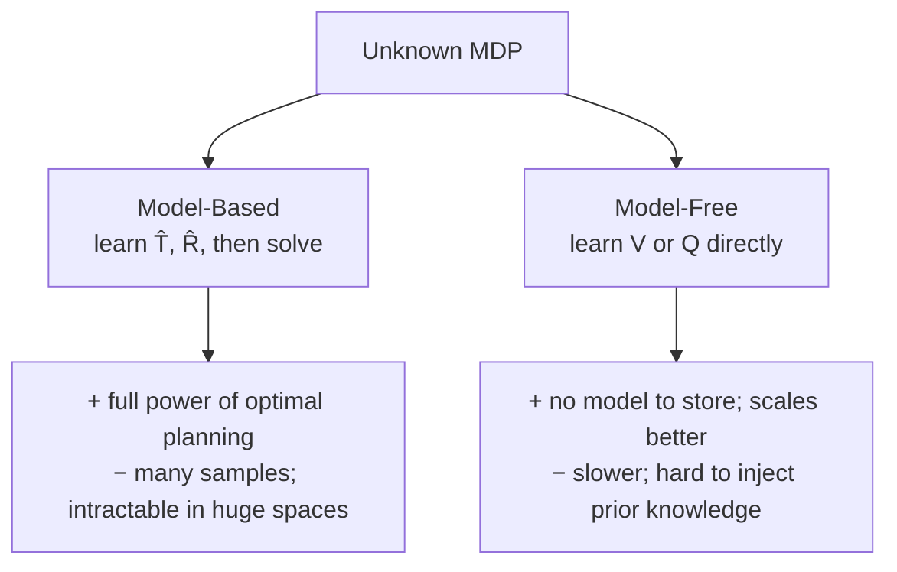
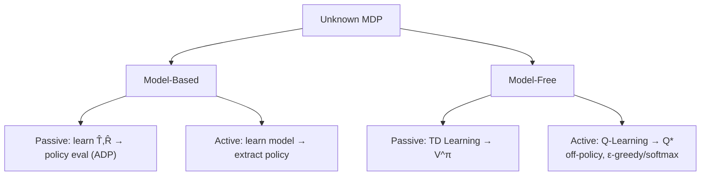

# 16 - Reinforcement Learning

> **Course**: COMP341 Intro to AI | Koç University | Asst. Prof. Barış Akgün
> **Prerequisites**: MDPs, Value/Policy Iteration, Bellman equations

## 1 From MDPs to RL

In an MDP you know everything — S, A, T, R, γ — and solve **offline** with Value/Policy Iteration, handing the agent a finished π\* before it acts. But that assumes you know T and R, which often fails: a spider robot on ice (physics too complex), ad targeting (unknown reward landscape), grasping novel objects (changing dynamics).

**Reinforcement Learning** is what you do when you can't pre-compute. The agent is dropped into an unknown environment and learns T and/or R by acting and observing. The MDP framework is unchanged — the agent just *discovers* it from experience.

| Offline (MDP) | Online (RL) |
| :--- | :--- |
| T and R known | T and/or R unknown |
| compute policy, then act | learn while acting |
| no risk during planning | agent may fail and get bad rewards |
| Value / Policy Iteration | TD Learning, Q-Learning, Policy Gradient |

## 2 Why RL

**Biological inspiration**: animals aren't born knowing physics — a baby learns gravity by falling; a teenager re-learns motor control as the body changes; the injured re-learn movement. Trial and error guided by reward (pain = bad, food = good) *is* RL. Reward is just another sensor input — but the agent must recognize it as reward.

**Practical necessity**: often the model can't be reliably estimated, or only one of T / R is known. RL can also run **in simulation** (model implicit in the simulator) or on **logged data** (offline/batch RL).

## 3 Model-Based vs Model-Free



**Model-Based** — count transitions to estimate `P̂(s'|s,a) = C(s,a,s') / Σ C(s,a,·)`, record observed rewards, then run Value/Policy Iteration on the learned MDP.

> [!example]- Model-based estimate from episodes
> Observing a grid world: B→C twice (east) ⇒ `T(B,east,C) ≈ 1.00`; C→D three times and C→A once ⇒ `T(C,east,D)=0.75`, `T(C,east,A)=0.25`.

**Model-Free** — skip the model; learn the value/Q-function directly from sampled transitions. We only ultimately need the *policy*, so a good `Q(s,a)` is enough.

> **Expected-age analogy**: to find the average age without `P(A)`, just collect samples and average. Model-based learns `P(A)` first; model-free averages the samples directly. Both work because samples appear with the right frequencies.

## 4 Passive RL — Policy Evaluation

A simpler subproblem: you're **given a fixed policy π** (no choice of actions) and must compute `V^π(s)`. You know π; you don't know T or R; you learn by actually running π in the world (not offline planning).

### Direct Utility Estimation

Run π for many episodes; for each visited state record the return `G_t = r_t + γr_{t+1} + …`, then average across visits.

```text
for each episode (run π to terminal):
    for each state s visited at time t:
        record G_t for s
V(s) = average of recorded returns for s
```

> [!example]- Direct evaluation (γ=1)
> Grid A–E with ±10 terminals. After 4 episodes: V(A)=−10, V(B)=+8, V(C)=+4, V(D)=+10, V(E)=−2.

By the law of large numbers it converges, **but** it ignores MDP structure. If B and E both lead to C, their values are linked — yet direct evaluation learns each state separately, wasting information and taking far longer.

### Temporal Difference (TD) Learning

TD fixes that by using the **Bellman structure**: every transition `(s → s', r)` is a noisy sample of what `V(s)` should be:

$$\text{sample} = r + \gamma V(s'), \qquad V(s) \leftarrow V(s) + \alpha\,[\underbrace{r + \gamma V(s') - V(s)}_{\text{TD error}}]$$

The **TD error** measures how far the current estimate is from the one-step lookahead. The name: you take the *difference* between value estimates at successive times, propagating signal backward.

> [!note]- TD(0) pseudocode
> ```text
> Initialize V(s) = 0;  set learning rate α
> for each episode:
>     s = start
>     while s not terminal:
>         a = π(s)
>         r, s' = execute(a)
>         V(s) ← V(s) + α·(r + γ·V(s') − V(s))
>         s = s'
> ```

> [!example]- TD updates (γ=1, α=0.5)
> Start V(B)=V(C)=V(D)=0.
> ```text
> B→C, r=−2:  sample = −2 + V(C) = −2;  V(B) ← 0 + 0.5(−2) = −1
> C→D, r=−2:  sample = −2 + V(D) = −2;  V(C) ← 0 + 0.5(−2) = −1
> ```
> As V(D) rises toward the +10 terminal, that signal **propagates back** through V(C) then V(B) automatically — far more efficient than direct evaluation.

**Learning rate**: α must decay (e.g. `α_t = 1/t`) for convergence — too fast stops learning early, too slow oscillates. In practice a small fixed α is common.

## 5 From Values to Q-Values

Suppose you have `V^π`. Can you improve the policy? Policy extraction needs T and R:

$$\pi^*(s) = \arg\max_a \sum_{s'} P(s'\mid s,a)\,[R(s,a,s') + \gamma V^*(s')]$$

— which you don't have. You know *how good* states are, not *which action gets you there*. **Fix: learn Q directly.**

$$Q^*(s,a) = \sum_{s'} P(s'\mid s,a)\,[R(s,a,s') + \gamma \max_{a'} Q^*(s',a')]$$

Then `π*(s) = argmax_a Q*(s,a)` — trivial and model-free. **Q-value iteration** iterates this Bellman equation offline (needs T, R); the model-free twist replaces the sum over s' with a **sample average**.

## 6 Active RL & Q-Learning

Now you **choose** actions and seek the optimal policy, with unknown T and R — observing `(s, a, r, s')` transitions and learning Q\*.

**Q-Learning** approximates Q-value iteration with samples. Each transition:

$$\text{sample} = r + \gamma \max_{a'} Q(s',a'), \qquad Q(s,a) \leftarrow Q(s,a) + \alpha\,[\text{sample} - Q(s,a)]$$

The `max_{a'}` reflects the Bellman *optimality* equation. You step α toward the new estimate and keep the rest of the old one.

> [!note]- Q-Learning pseudocode
> ```python
> Q[s,a] = 0  for all s,a   # terminals = 0
> for each episode:
>     s = initial_state()
>     while s not terminal:
>         a = select_action(s, Q)        # e.g. ε-greedy
>         r, s' = execute_action(s, a)
>         y = r + γ * max_a' Q[s',a']    # 0 if s' terminal
>         Q[s,a] += α * (y - Q[s,a])
>         s = s'
>     # decay ε and α over time
> ```

> [!example]- 1D grid: S1–S2–S3–S4(+10), reward −1/step, γ=0.9, α=0.5
> ```text
> S3 →Right→ S4:  y = −1 + 0.9·0 = −1;   Q(S3,R) ← 0 + 0.5(−1) = −0.5
> S2 →Right→ S3:  y = −1 + 0.9·max(0,−0.5) = −1;  Q(S2,R) ← −0.5
> ```
> Over many episodes the +10 signal climbs back: Q(S3,R) rises, then Q(S2,R) follows. Reward **propagates backward** from terminals — the essence of Q-learning.

**Off-policy** — the most important property. The **behavior** policy collecting data (e.g. ε-greedy) can differ entirely from the **target** policy being learned (greedy w.r.t. Q), because the update always uses `max_{a'}`.

> [!note]- Convergence guarantee
> Q-learning converges to Q\* even while acting suboptimally, **provided** every (s,a) is visited infinitely often and the learning rate satisfies `Σα = ∞`, `Σα² < ∞` (and isn't decayed too fast). It's a stochastic approximation to the Bellman optimality operator.

## 7 Exploration vs Exploitation

Pure exploitation gets stuck on a locally good policy; pure exploration never cashes in. You must balance gathering information against using it. *(Favorite restaurant vs. trying a new place.)*

| Method | Idea | Regret |
| :--- | :--- | :--- |
| ε-greedy (fixed ε) | random with prob. ε, else greedy | high |
| ε-greedy + decay | less random over time | medium |
| Softmax (Boltzmann) | prefer promising actions | medium |
| Exploration functions | actively seek unvisited states | low |
| UCB / Thompson | statistically principled | optimal (Multi-Armed Bandits) |

**ε-greedy** gives the soft policy `π(a|s) = 1 − ε + ε/m` for the greedy action, `ε/m` otherwise. Problem with fixed ε: the agent keeps exploring (and risking) even after learning. **Fix: decay ε** (start high, anneal toward 0).

**Softmax** samples `P(a|s) = e^{Q(s,a)/τ} / Σ e^{Q(s,a')/τ}` — temperature τ→∞ uniform, τ→0 greedy. Explores *promising* actions preferentially, but needs tuning τ.

**Exploration functions** add an optimistic bonus for rarely-visited states:

$$f(u, n) = u + k/n \quad\text{or}\quad f(u,n) = \begin{cases} R^+ & n < N_e \\ u & \text{otherwise} \end{cases}$$

$$Q(s,a) \leftarrow Q(s,a) + \alpha\,[R(s,a,s') + \gamma \max_{a'} f(Q(s',a'), N(s',a')) - Q(s,a)]$$

The agent treats the unknown as rewarding, so it explores; as visit counts grow, the bonus fades. Crucially the bonus **propagates back** — states leading to unexplored regions also look attractive.

**Regret** = cumulative `Σ_t [V*(s_t) − V_actual(s_t)]`, the total cost of early mistakes. Both ε-greedy and exploration functions reach optimal, but ε-greedy has higher regret because it explores blindly. (See Multi-Armed Bandits / UCB.)

## 8 Approximate Q-Learning

Tabular Q-learning stores one value per (s,a) — impossible at scale (chess ~10⁴⁷, Go ~10¹⁷⁰, Atari pixels, continuous spaces), and most states are never even visited.

**Key insight**: many states share structure (two Pacman states with a ghost 3 cells away are similar). Describe each state by a **feature vector** `f(s) = [f₁, …, fₙ]` (distance to closest ghost, distance to closest dot, #ghosts, in-a-tunnel?, …); you can also featurize `(s,a)`.

**Linear Q-function**: approximate with a weighted sum of features —

$$Q_w(s,a) = w_1 f_1(s,a) + \dots + w_n f_n(s,a) = w \cdot f(s,a)$$

Now you learn only `n` weights regardless of state count, and knowledge **generalizes** ("close to a ghost is bad" applies to every unvisited such state). Downside: the linear form may be too simple, and states sharing features but differing in value get the same estimate.

**Update** (online least squares / gradient descent on squared TD error):

$$\text{error} = [r + \gamma \max_{a'} Q_w(s',a')] - Q_w(s,a), \qquad w \leftarrow w + \alpha \cdot \text{error} \cdot f(s,a)$$

Intuition: unexpectedly good (error > 0) → raise weights of active features so similar situations look better; unexpectedly bad → lower them.

> [!abstract]- Deep Q-Networks (DQN) — brief
> Replace `w·f(s,a)` with a neural net `Q_θ(s,a)`; update `θ ← θ + α·error·∇_θ Q_θ`. TD + neural nets is unstable, so DeepMind's 2015 Atari DQN added **experience replay** (sample random minibatches from a buffer to break correlations) and a **target network** (a frozen copy for computing targets, updated periodically). *(Not on the exam slides.)*

## 9 Policy Search

You don't need accurate Q-values — only the **correct ordering** at each state. Q(s,Left)=7, Q(s,Right)=0.3 gives the right action even if the true values are 100 and 1; but Q(s,Left)=5, Q(s,Right)=6 picks wrong despite being "close."

**Policy search** optimizes the policy directly: parameterize `π_θ(a|s)`, define expected reward `J(θ)`, and hill-climb:

$$\theta \leftarrow \theta + \alpha \nabla_\theta J(\theta)$$

This is **Policy Gradient** (REINFORCE, PPO, A3C). In practice: start from a Q-learning solution, then fine-tune feature weights on *actual reward* rather than Q-accuracy — because "good enough for a good policy" is weaker than "accurately approximates V\*/Q\*."

## 10 Summary



**Key update rules:**

| Setting | Update |
| :--- | :--- |
| TD(0) — passive, values | `V(s) ← V(s) + α[r + γV(s') − V(s)]` |
| Q-Learning — active, Q-values | `Q(s,a) ← Q(s,a) + α[r + γ·max_{a'}Q(s',a') − Q(s,a)]` |
| Approximate (linear) | `w ← w + α[r + γ·max_{a'}Q_w(s',a') − Q_w(s,a)]·f(s,a)` |

**Q-learning properties**: converges to Q\* given enough exploration and proper α decay; off-policy; sample-inefficient for large spaces; needs no model.

**Model-based vs model-free** — problem-dependent. Model-based when a reliable model exists or can be learned cheaply (leverage planning); model-free when the space is huge or the model unreliable (deep RL). Modern systems often mix both.

> [!abstract]- Beyond this course
> **SARSA** — on-policy alternative using the action actually taken: `Q(s,a) ← Q(s,a) + α[r + γ·Q(s',a') − Q(s,a)]`; converges to a safer (not strictly optimal) policy under ε-greedy. Also: **Policy Gradient (REINFORCE)**, **Actor-Critic**, **Multi-Armed Bandits**, **model-based deep RL** (AlphaZero = MCTS + learned model).

*End of Lecture 16 — Reinforcement Learning*
